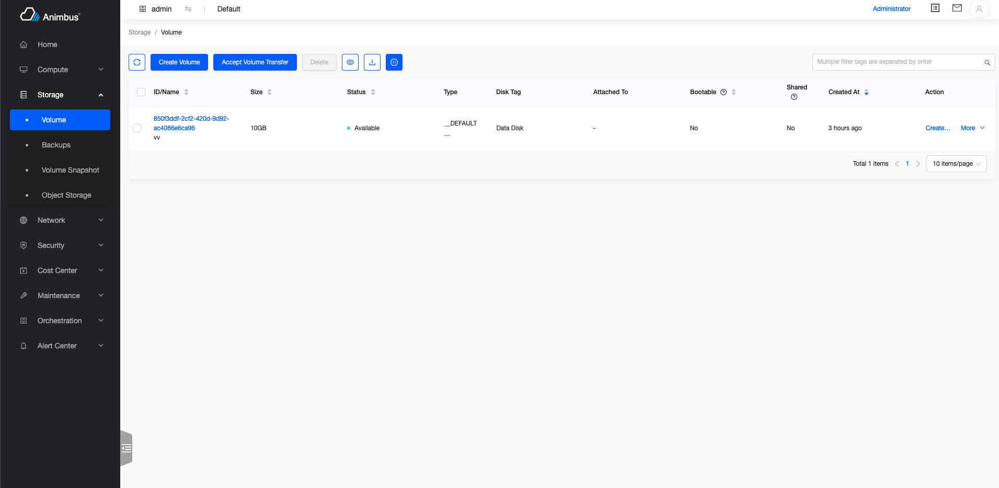
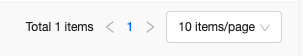
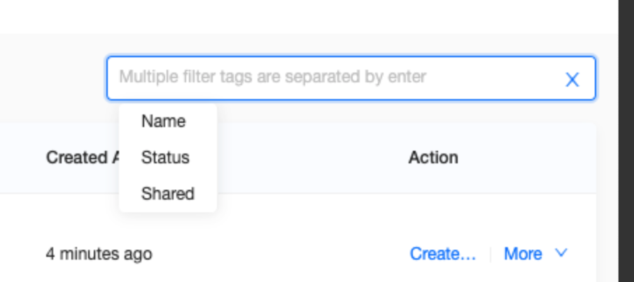
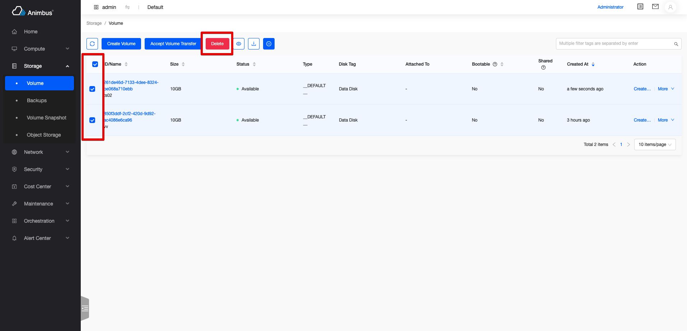
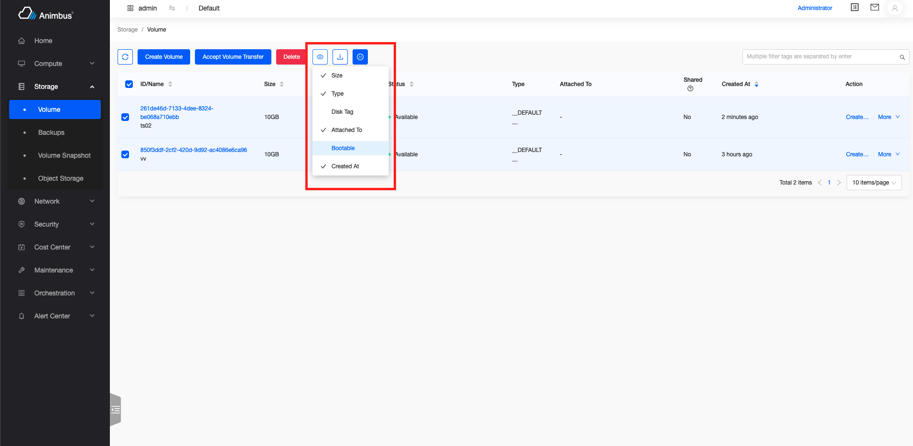
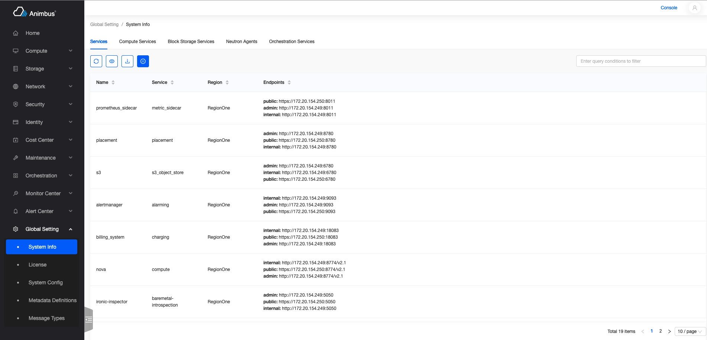

English | [Chinese](../../zh/develop/3-1-BaseList-introduction.md)

# Application

- The base class of each resource list page

  

- Support data paging

  

- Support search

  

- Support manual refresh of data

  

- Support data download

  

- Support batch operation

  

- With automatic data refresh function (automatically refresh the list data every 60 seconds, if the user does not operate, no automatic refresh after 30 minutes, the automatic refresh function can be paused)

  

- Configurable list header

  

- Each resource list page can be completed by copy function

# BaseList code file

- `src/containers/List/index.jsx`

# BaseList Introduction to properties and function definitions

- The resource list inherits from the BaseList component
- Only need to copy some functions to complete the development of the page
- Properties and functions are divided into the following four types,
  - The poprs and functions that usually need to be overridden mainly include:
    - Page permissions
    - Resource name of the page
    - The configuration of the columns of the table
    - Search term for table
    - Operation items of the table, etc.
    - `store` corresponding to the table
  - Functions and properties for on-demand overridden, mainly include:
    - Resource data paging uses front-end paging or back-end paging
    - Resource data sorting uses front-end sorting or back-end sorting
  - Functions and properties that do not need to be overridden, mainly include:
    - Whether the current page is a management platform page
    - Whether the current page is the resource list in the details page
  - The basic functions in the base class mainly include:
    - Render the page
    - Handling download
    - Handling automatic refresh
    - Hide/show some table columns
    - Handling search
    - Handling data request and display after the change of pagination information
  - See below for a more detailed and comprehensive introduction

## Properties and functions that usually need to be overridden

- `policy`:
  - The function must be overridden (Fill in the policy that complies with the openstack rules here)
  - The permission corresponding to the page, if the permission verification fails, data cannot be requested.
  - Take the volume `src/pages/storage/containers/Volume/index.jsx` as an example

    ```javascript
    get policy() {
      return 'volume:get_all';
    }
    ```

- `aliasPolicy`:
  - The function can be overridden (Fill in the custom policy with module prefix here)
  - The permission corresponding to the page, if the permission verification fails, data cannot be requested.
  - Take the volume `src/pages/storage/containers/Volume/index.jsx` as an example

    ```javascript
    get aliasPolicy() {
      return 'cinder:volume:get_all';
    }
    ```

- `name`
  - The function must be overridden
  - The name corresponding to the page resource.
  - Take the volume `src/pages/storage/containers/Volume/index.jsx` as an example

    ```javascript
    get name() {
      return t('volumes');
    }
    ```

- `actionConfigs`
  - Various operations to configure resources
    - Main button operations, such as: create
    - Batch operation
    - Operation of each row of data
    - The configuration is defined in the actions directory of the resource
    - Take the keypair `src/pages/compute/containers/Keypair/index.jsx` as an example

      ```javascript
      import actionConfigs from './actions';
      get actionConfigs() {
        return actionConfigs;
      }
      ```

- `searchFilters`
  - Configure search terms for resources
  - Support string-based search
  - Support selected search, such as: state-based search
  - Support multiple search conditions that need to be met
  - Returns an array of configurations, each configuration represents a search condition
  - Each configuration needs to meet the following conditions:
    - `label`, Required item, search title
    - `name`, Required item, the parameter `Key` corresponding to the search item
    - `options`, Optional
      - If the `options` attribute is not set, it means that the search is based on the input string, such as: search for names
      - If you set the `options` property, you need to select from `options` in the page
        - The format of `options`:
          - `key`: required item, the value corresponding to `option`
          - `label`: required item, the text corresponding to `option`, which is the content seen on the page
  - Take the volume `src/pages/storage/containers/Volume/index.jsx` as an example

    ```javascript
    get searchFilters() {
      return [
        {
          label: t('Name'),
          name: 'name',
        },
        {
          label: t('Status'),
          name: 'status',
          options: ['available', 'in-use', 'error'].map((it) => ({
            key: it,
            label: volumeStatus[it],
          })),
        },
        {
          label: t('Shared'),
          name: 'multiattach',
          options: yesNoOptions,
        },];
    }
    ```

- `getColumns`
  - Back to the configuration information list of the list table
  - The settings of each configuration item:
    - `title`, Required item, the title of the header
    - `dataIndex`, Required item, the key value of the corresponding back-end data
    - `hidden`, Optional, whether the column can be hidden, the default value is `false`
    - `sorter`, Whether the column can be sorted, it can be sorted by default
    - `stringify`, Optional. When downloading to `csv`, the content displayed in the data in this column, because some columns have additional styles or UI processing, which will cause problems with the result of the string conversion of this column, you need to write at this time The function
    - `render`, Optional, the default is to display the content based on `dataIndex`, using this attribute, the table content can be rendered based on the result of `render`
    - `valueRender`, Optional, use existing functions to automatically process data
      - `sinceTime`, Processing time, displayed as "XX hours ago"
      - `keepTime`, To display the remaining time
      - `yesNo`, Process the `Boolean` value and display it as "Yes" or "No"
      - `GBValue`, Processing size, displayed as "XXXGB"
      - `noValue`, When there is no value, it is displayed as "-"
      - `bytes`, Processing size
      - `uppercase`, capital
      - `formatSize`, Processing size, such as "2.32 GB", "56.68 MB"
      - `toLocalTime`, Processing time, such as "2021-06-17 04:13:07"
      - `toLocalTimeMoment`, Processing time, such as "2021-06-17 04:13:07"
    - `linkPrefix`, Optional, when `dataIndex=name`, the `linkPrefix` attribute is used to process the prefix of the link corresponding to the name
  -Take the mirror `src/pages/compute/containers/Image/Image.jsx` as an example
    - The table contains columns: ID/name, project ID/name (displayed in the management platform), description, usage type, type, status, visibility, hard disk format, capacity, created in

    ```javascript
    getColumns = () => [
      {
        title: t('ID/Name'),
        dataIndex: 'name',
        routeName: this.getRouteName('imageDetail'),
      },
      {
        title: t('Project ID/Name'),
        dataIndex: 'project_name',
        hidden: !this.isAdminPage && this.tab !== 'all',
        sorter: false,
      },
      {
        title: t('Description'),
        dataIndex: 'description',
        isHideable: true,
        sorter: false,
      },
      {
        title: t('Use Type'),
        dataIndex: 'usage_type',
        isHideable: true,
        render: (value) => imageUsage[value] || value,
        sorter: false,
      },
      {
        title: t('Type'),
        dataIndex: 'os_distro',
        isHideable: true,
        render: (value) => <ImageType type={value} title={value} />,
        width: 80,
        sorter: false,
      },
      {
        title: t('Status'),
        dataIndex: 'status',
        render: (value) => imageStatus[value] || value,
      },
      {
        title: t('Visibility'),
        dataIndex: 'visibility',
        render: (value) => imageVisibility[value] || value,
        sorter: false,
      },
      {
        title: t('Disk Format'),
        dataIndex: 'disk_format',
        isHideable: true,
        render: (value) => imageFormats[value] || value,
      },
      {
        title: t('Size'),
        dataIndex: 'size',
        isHideable: true,
        valueRender: 'formatSize',
      },
      {
        title: t('Created At'),
        dataIndex: 'created_at',
        isHideable: true,
        valueRender: 'sinceTime',
      },
    ];
    ```

- `init`
  - The function to configure the Store. In this function, the Store used to process data requests and the Store used to download data are configured
  - Usually a singleton Store is used, but for the list page under some detail pages, use `new XXXStore()`
  - `this.store` and `this.downloadStore` can be configured in `init`
    - `this.store` is used to process list data
    - `this.downloadStore` is used to process download data
    - If you use the front-end page, only configure `this.store`, because all the data is obtained at once, and the downloaded data is equal to the data in the list, that is, at this time, `this.downloadStore = this.store`
      - Take the project `src/pages/identity/containers/Project/index.jsx` as an example

        ```javascript
        init() {
          this.store = globalProjectStore;
        }
        ```

    - If you use back-end paging, you need to configure `this.store` and `this.downloadStore` separately
      - Take the router `src/pages/network/containers/Router/index.jsx` as an example

        ```javascript
        init() {
          this.store = new RouterStore();
          this.downloadStore = new RouterStore();
        }
        ```

## Properties and functions for on-demand overridden

- `alsoRefreshDetail`
  - When the list data in the detail page is refreshed, do you need to refresh the detail data synchronously?
  - Default synchronous refresh, if you don't need to refresh synchronously, override this function

    ```javascript
    get alsoRefreshDetail() {
      return false;
    }
    ```

- `list`
  - Data in the store of the page object
  - The default value is `this.store.list`
- `rowKey`
  - Key for unique identification of list data
  - The default value is `id`
  - Take the key Keypair `src/pages/compute/containers/Keypair/index.jsx` as an example

    ```javascript
    get rowKey() {
      return 'name';
    }
    ```

- `hasTab`
  - Whether the list page is the list page under Tab
  - The default value is `false`
  - The height of the table will be adjusted according to the changed value
  - Take `src/pages/configuration/containers/SystemInfo/Catalog.jsx` as an example

    ```javascript
    get hasTab() {
      return true;
    }
    ```

    

- `hideCustom`
  - Whether to display the header configuration icon
  - The default value is `true`
  - Take `src/pages/configuration/containers/Setting/index.jsx` as an example

    ```javascript
    get hideCustom() {
      return 'name';
    }
    ```

- `hideSearch`
  - Whether to show the search box
  - Default Display
  - Take resource arrangement-stack-detail page-log `src/pages/heat/containers/Stack/Detail/Event.jsx` as an example

    ```javascript
    get hideSearch() {
      return true;
    }
    ```

- `hideRefresh`
  - Whether to show the automatic refresh button
  - Default Display
  - If not displayed, the list does not have the function of automatically refreshing data
- `hideDownload`
  - Whether to show the download button
  - Default Display
- `checkEndpoint`
  - Do you need to detect endpoints
  - Not required by default
  - Some services may not be deployed and require secondary verification. Once the test is not deployed, the "not open" style page will be displayed
  - Take VPN `src/pages/network/containers/VPN/index.jsx` as an example

    ```javascript
    get checkEndpoint() {
      return true;
    }
    ```

- `endpoint`
  - Used when `checkEndpoint` is `true`
  - Take VPN`src/pages/network/containers/VPN/index.jsx` as an example

    ```javascript
    get endpoint() {
      return vpnEndpoint();
    }
    ```

- `isFilterByBackend`
  - Whether to page by the backend
  - The default value is `false`, that is, using front-end paging
  - When using front-end paging, all data is obtained from the back-end at one time, and then the data is displayed according to the page number and the number of single pages in the page
  - When using back-end paging, request the corresponding amount of data from the back-end in the number of pages and single pages
  - Take the router `src/pages/network/containers/Router/index.jsx` as an example

    ```javascript
    get isFilterByBackend() {
      return true;
    }
    ```

- `isSortByBackend`
  - Whether to be sorted by the backend
  - The default value is `false`, that is, using front-end sorting
  - When using front-end sorting, sort based on the size of the data in the list (customizable sorting function)
    - If you use front-end paging + front-end sorting, you can sort based on all data
    - If you use back-end paging + front-end sorting, you can only sort data based on the current page
  - When using back-end paging, request data from the back-end according to the sort item and sort direction set in the list
  - Take the router `src/pages/network/containers/Router/index.jsx` as an example

    ```javascript
    get isSortByBackend() {
      return true;
    }
    ```

  - When `isSortByBackend` is set to `true`, it is usually necessary to rewrite the `updateParamsSortPage` function in the corresponding `store`
  - Take `src/stores/neutron/router.js` as an example

    ```javascript
    updateParamsSortPage = (params, sortKey, sortOrder) => {
      if (sortKey && sortOrder) {
        params.sort_key = sortKey;
        params.sort_dir = sortOrder === 'descend' ? 'desc' : 'asc';
      }
    };
    ```

- `adminPageHasProjectFilter`
  - Does the search item of the management platform contain the search based on the project ID?
  - The default value is `false`
  - Take the instance `src/pages/compute/containers/Instance/index.jsx` as an example

    ```javascript
    get adminPageHasProjectFilter() {
      return true;
    }
    ```

- `transitionStatusList`
  - The corresponding state value list when the data is in the transition state
  - The default value is an empty list of `[]`
  - When the data is in a transitional state, the automatic refresh of the page will speed up and become once every 30 seconds
  - The default value is `false`
  - Take the volume `src/pages/storage/containers/Volume/index.jsx` as an example

    ```javascript
    const volumeTransitionStatuses = [
      'creating',
      'extending',
      'downloading',
      'attaching',
      'detaching',
      'deleting',
      'backing-up',
      'restoring-backup',
      'awaiting-transfer',
      'uploading',
      'rollbacking',
      'retyping',
    ];
    get transitionStatusList() {
      return volumeTransitionStatuses;
    }
    ```

- `fetchDataByAllProjects`
  - When the management platform requests data, whether it is with the `all_projects` parameter
  - The default value is `true`
  - Take the volume type `src/pages/storage/containers/VolumeType/VolumeType/index.jsx` as an example

    ```javascript
    get fetchDataByAllProjects() {
      return false;
    }
    ```

- `fetchDataByCurrentProject`
  - Whether to include the `project_id` parameter when the console requests data
  - The default value is `false`
  - Take floating ip `src/pages/network/containers/FloatingIp/index.jsx` as an example

    ```javascript
    get fetchDataByCurrentProject() {
      return true;
    }
    ```

- `defaultSortKey`
  - When using backend sorting, the default sort Key
  - Take the router `src/pages/network/containers/Router/index.jsx` as an example

    ```javascript
    get defaultSortKey() {
      return 'status';
    }
    ```

- `clearListUnmount`
  - When the page is switched, do you need the list data in the current store?
  - Generally speaking, the resource list page uses `GlobalXXStore`, which is a singleton store. When the page is switched, the list data will not be cleared. When returning to the page, the previous data will be displayed first, and then the page will automatically refresh to obtain the new data
  - The default value is `false`, The data is not cleared when the page is switched
- `ableAutoFresh`
  - Whether to refresh automatically
  - The default value is `true`
- `projectFilterKey`
  - When requested, the key value corresponding to the project
  - The default value is `project_id`
  - Take the image `src/pages/compute/containers/Image/Image.jsx` as an example

    ```javascript
    get projectFilterKey() {
      return 'owner';
    }
    ```

- `getCheckboxProps`
  - Whether the data in the list can be selected, and batch operations can be performed after selection
  - Both can be selected by default
  - Take the instance `src/pages/compute/containers/Instance/index.jsx` as an example
    - Bare metal instances cannot be selected

    ```javascript
    getCheckboxProps(record) {
      return {
        disabled: isIronicInstance(record),
        name: record.name,
      };
    }
    ```

- `getData`
  - Functions for processing data requests
  - By default, use the `store.fetchList` or `store.fetchListByPage` method to get data from the server
  - It is not recommended to copy this function
- `fetchDataByPage`
  - When using back-end paging, the function to process data requests
  - Use the `store.fetchListByPage` method to fetch data by default
  - It is not recommended to copy this function
- `fetchData`
  - When using front-end paging, the function to process data requests
  - Use the `store.fetchList` method to get data by default
  - It is not recommended to copy this function
- `updateFetchParamsByPage`
  - When using back-end paging, a function to adjust request parameters based on the base class
  - If the default parameters of the base class cannot meet the request, it is recommended to copy the function and synchronously modify the `listDidFetch` method in the corresponding `store` to complete the data request
- `updateFetchParams`
  - When using front-end paging, the function to adjust request parameters based on the base class
  - If the default parameters of the base class cannot meet the request, it is recommended to copy the function and synchronously modify the `listDidFetch` method in the corresponding `store` to complete the data request
- `updateHints`
  - Tips on the form

## Properties and functions that do not need to be overridden

- `inDetailPage`
  - Identifies whether the current page is a list page under the details page
- `location`
  - Page routing information
- `isAdminPage`
  - Is the current page a "management platform" page
- `hasAdminRole`
  - Whether the logged-in user role has an administrator role
- `getRoutePath`
  - Function to generate page URL
  - For example, it is necessary to provide a jump function to the associated resources of the list page. Using this function, you can jump to the corresponding address of the console in the console, and jump to the corresponding address of the management platform in the management platform.
- `params`
  - Parameter information carried by the route
  - Generally used to generate the parameters of the page request API
- `routing`
  - Routing information corresponding to the page
- `isLoading`
  - Whether the current page is updating data, the loading style will be displayed when updating
- `endpointError`
  - Determine whether Endpoint is valid
- `hintHeight`
  - The height of the prompt in the page
- `tableTopHeight`
  - The height occupied above the table
  - Based on prompt, Tab calculation
- `tableHeight`
  - Table height
- `currentProjectId`
  - Project ID to which the currently logged-in user belongs
- `defaultSortOrder`
  - When using backend sorting, the default sorting direction is descending `descend`
- `itemInTransitionFunction`
  - Determine whether there is data in the transition state, if there is data in the transition state, the time interval for automatically refreshing the data is changed from 60 seconds to 30 seconds
- `primaryActions`
  - Main button operation list
- `batchActions`
  - Batch operation list
- `itemActions`
  - List of operations corresponding to each row of data

## Basic functions in the base class

- It is recommended to check the code understanding, `src/containers/List/index.jsx`
