English | [简体中文](../../zh/develop/3-10-FormItem-introduction.md)

# Usage

- Configuration of each form item in the form
- Generally only need to configure a little amount of parameters such as `type`
- `Form` component will verify the input value base on `formItem` configuration
- When verify failed, `Form` will not allowed to click `confirm` or `next`

# How to use

- Each form item contains universal configuration
  - `name`, `key` of form item, required and unique. The value of the form is saved in `form.values[name]` after verification.
  - `label`, the label on the left of form item.
  - `required`, optional, the default is `false`, when `true` means the form item value must be input.
  - `hidden`, whether to hidden the form item, default is `false`.
  - `onChange`, set the handler to handle after the form item value change.
  - `extra`, the information under form item.
    - Take create network as an example `src/pages/network/containers/Network/actions/CreateNetwork.jsx` :

      ```javascript
      {
        name: 'mtu',
        label: t('MTU'),
        type: 'input-number',
        min: 68,
        max: 9000,
        extra: t('Minimum value is 68 for IPv4, and 1280 for IPv6.'),
      }
      ```

      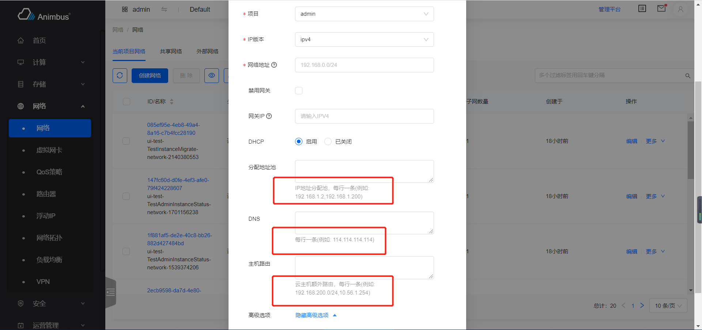

  - `tip`, the `?` icon at the right side of label, hover to see `tip`.
    - Take create instance as an example `src/pages/compute/containers/Instance/actions/StepCreate/BaseStep/index.jsx` :

      ```javascript
      {
        name: 'availableZone',
        label: t('Available Zone'),
        type: 'select',
        placeholder: t('Please select'),
        isWrappedValue: true,
        required: true,
        options: this.availableZones,
        tip: t(
          'Availability zone refers to a physical area where power and network are independent of each other in the same area. In the same region, the availability zone and the availability zone can communicate with each other in the intranet, and the available zones can achieve fault isolation.'
        ),
      }
      ```

      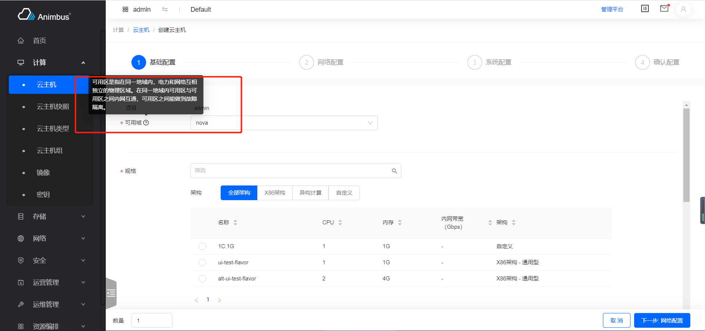

  - `validator`, validate whether the value of form item matchs requirements
    - Return `Promise`
    - Take create port as an example `src/pages/compute/containers/BareMetalNode/Detail/Port/actions/Create.jsx` :

      ```javascript
      export const macAddressValidate = (rule, value) => {
        if (isMacAddress(value.toUpperCase())) {
          return Promise.resolve(true);
        }
        return Promise.reject(new Error(`${t('Invalid: ')}${macAddressMessage}`));
      };
      {
        name: 'address',
        label: t('MAC Address'),
        required: true,
        type: 'input',
        validator: macAddressValidate,
      }
      ```

  - `component`, directly use component to render instead of component configured in `type`
    - Take resize instance as an example `src/pages/compute/containers/Instance/actions/Resize.jsx` :
      - Direct display `FlavorSelectTable` component

      ```javascript
      {
        name: 'newFlavor',
        label: t('Flavor'),
        component: (
          <FlavorSelectTable flavor={flavor} onChange={this.onFlavorChange} />
        ),
        required: true,
        wrapperCol: {
          xs: {
            span: 24,
          },
          sm: {
            span: 18,
          },
        },
      }
      ```

  - `labelCol`, adjust the layout of the form title, default use of the label layout defined under `form`
    - Take manage quota as an example `src/pages/identity/containers/Project/actions/QuotaManager.jsx` :

      ```javascript
      {
        name: 'instances',
        label: t('instance'),
        type: 'input-number',
        labelCol: { span: 12 },
        colNum: 2,
        validator: this.checkMin,
      }
      ```

      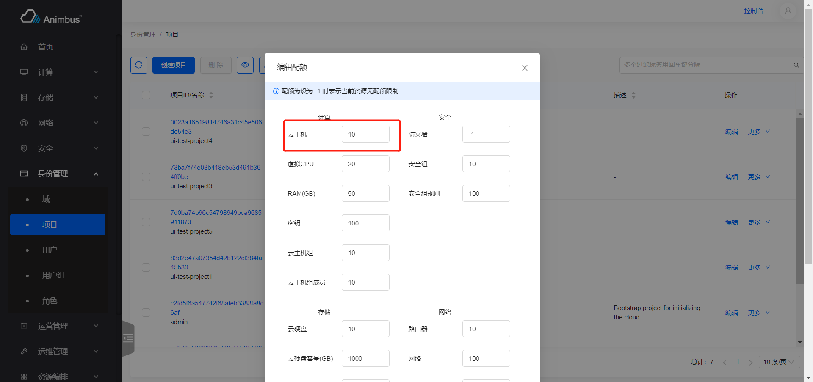

  - `wrapperCol`, adjust the layout of the right side of the form, default use of the layout defined under
    - Take resize instance as an example `src/pages/compute/containers/Instance/actions/Resize.jsx` :
      - Direct display `FlavorSelectTable` component

      ```javascript
      {
        name: 'newFlavor',
        label: t('Flavor'),
        component: (
          <FlavorSelectTable flavor={flavor} onChange={this.onFlavorChange} />
        ),
        required: true,
        wrapperCol: {
          xs: {
            span: 24,
          },
          sm: {
            span: 18,
          },
        },
      }
      ```

      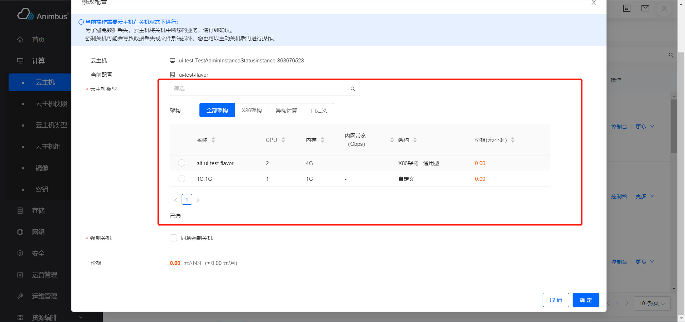

  - `style`, define the style of the form
    - Take create port as an example `src/pages/network/containers/VirtualAdapter/actions/Create.jsx`

      ```javascript
      {
        name: 'ipv6',
        label: 'IPv6',
        type: 'label',
        style: { marginBottom: 24 },
        content: (
          <span>
            {t('The selected VPC/subnet does not have IPv6 enabled.')}{' '}
            <Button type="link">
              {t('To open')} <FormOutlined />
            </Button>{' '}
          </span>
        ),
        hidden: true,
      }
      ```

  - `dependencies`, dependencies, array. after the value in the dependency changed, the verification of the current form is triggered.
    - Take change password of instance as an example `src/pages/compute/containers/Instance/actions/ChangePassword.jsx` :
      - `Confirm Password` verification, depending on the password input

      ```javascript
      {
        name: 'confirmPassword',
        label: t('Confirm Password'),
        type: 'input-password',
        dependencies: ['password'],
        required: true,
        otherRule: getPasswordOtherRule('confirmPassword', 'instance'),
      },
      ```

  - `otherRule`, Additional verification rules

- Based on its own `type`, each form has an independent configuration item, currently supported `type` are:
  - `label`
    - Used for show content
    - `iconType` attribute, can show the resource corresponding icon

      ```javascript
      const iconTypeMap = {
        instance: <DesktopOutlined />,
        router: <BorderOuterOutlined />,
        externalNetwork: <GlobalOutlined />,
        network: <GlobalOutlined />,
        firewall: <SecurityScanOutlined />,
        volume: <InboxOutlined />,
        gateway: <GatewayOutlined />,
        user: <UserOutlined />,
        snapshot: <CameraOutlined />,
        backup: <SaveOutlined />,
        keypair: <KeyOutlined />,
        image: ImageIcon,
        aggregate: <ClusterOutlined />,
        metadata: <TagOutlined />,
        flavor: <HddOutlined />,
        host: <CloudServerOutlined />,
      };
      ```

      - Take attach volume as an example `src/pages/compute/containers/Instance/actions/AttachVolume.jsx` :

        ```javascript
        {
          name: 'instance',
          label: t('Instance'),
          type: 'label',
          iconType: 'instance',
        },
        ```

        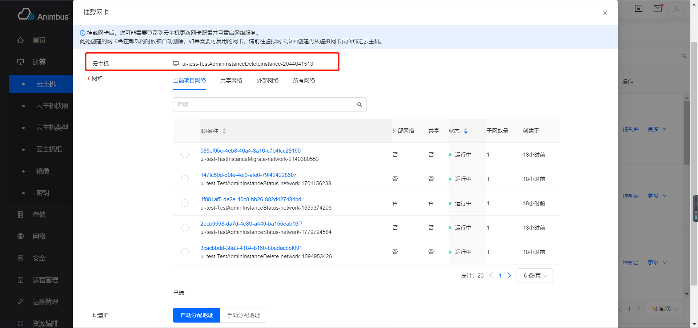

    - `content` attribute, default is base on `name` to show, if has `content`, will show things in `content`
      - `content` can be string / ReactNode
      - Take modify qos as an example `src/pages/network/containers/VirtualAdapter/actions/ModifyQoS.jsx` :

        ```javascript
        {
          name: 'name',
          label: t('Current QoS policy name'),
          type: 'label',
          content: <div>{qosPolicy.name || t('Not yet bound')}</div>,
          hidden: !enableQosPolicy,
        }
        ```

  - `input`
    - input
    - Take edit image as an example `src/pages/compute/containers/Image/actions/Edit.jsx` :
      - input system version

      ```javascript
      {
        name: 'os_version',
        label: t('OS Version'),
        type: 'input',
        required: true,
      },
      ```

      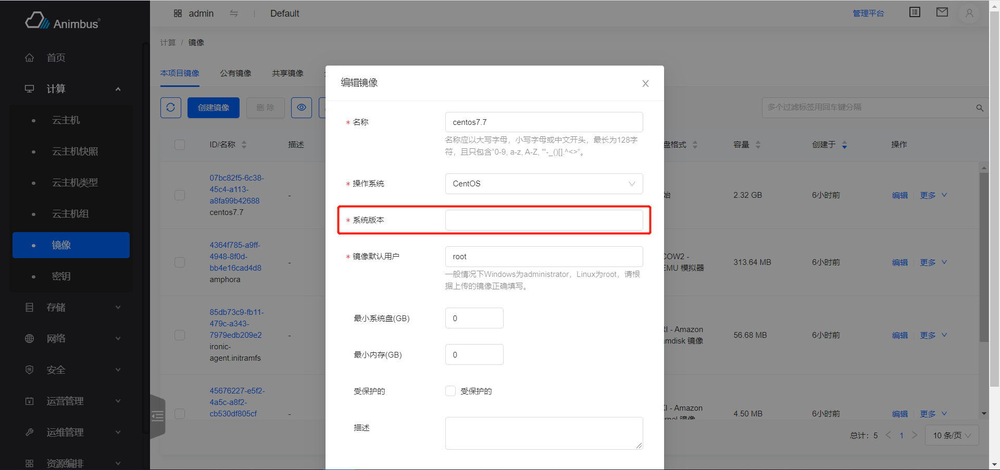

  - `select`
    - selector
    - `options`, required, `option` array, each `option` has following attributes:
      - `value`, value
      - `label`, text to show
    - Take select az when create instance as an example `src/pages/compute/containers/Instance/actions/StepCreate/BaseStep/index.jsx` :

      ```javascript
      get availableZones() {
        return (globalAvailabilityZoneStore.list.data || [])
          .filter((it) => it.zoneState.available)
          .map((it) => ({
            value: it.zoneName,
            label: it.zoneName,
          }));
      }

      {
        name: 'availableZone',
        label: t('Available Zone'),
        type: 'select',
        placeholder: t('Please select'),
        isWrappedValue: true,
        required: true,
        options: this.availableZones,
        tip: t(
          'Availability zone refers to a physical area where power and network are independent of each other in the same area. In the same region, the availability zone and the availability zone can communicate with each other in the intranet, and the available zones can achieve fault isolation.'
        ),
      },
      ```

      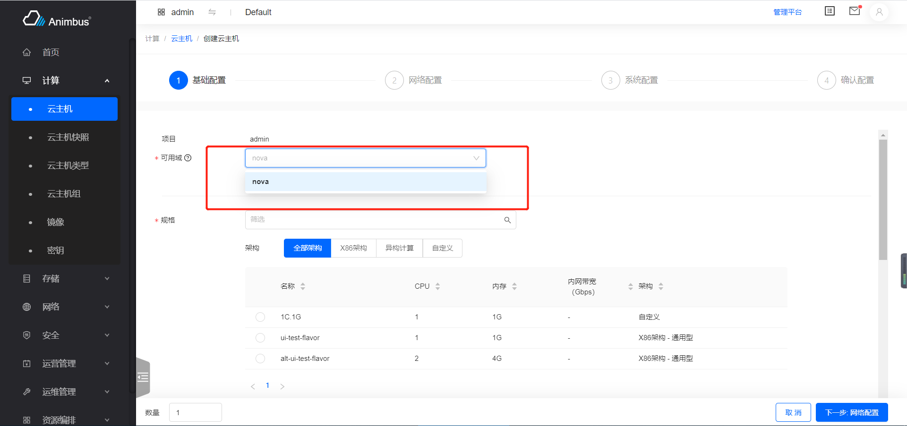

    - `isWrappedValue`, indicates whether to include `option` information in the form item value
      - Default `false`, value is the value of selected `option`
      - If true, value is the `option`

  - `divider`
    - Horizontal separator
    - Take create instance as an example `src/pages/compute/containers/Instance/actions/StepCreate/BaseStep/index.jsx`

      ```javascript
      {
        type: 'divider',
      }
      ```

      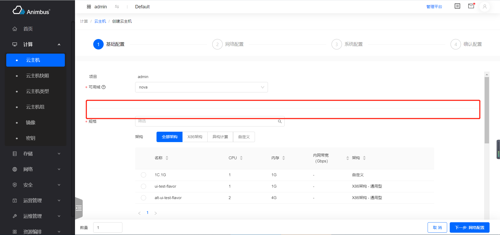

  - `radio`
    - radio
    - `options`, required, `option` array, each `option` has following attributes:
      - `value`, value
      - `label`, text to show
    - Take choose login type when create instance as an example `src/pages/compute/containers/Instance/actions/StepCreate/SystemStep/index.jsx` :

      ```javascript
      get loginTypes() {
        return [
          {
            label: t('Keypair'),
            value: 'keypair',
            disabled: this.isWindowsImage,
          },
          {
            label: t('Password'),
            value: 'password',
          },
        ];
      }

      {
        name: 'loginType',
        label: t('Login Type'),
        type: 'radio',
        options: this.loginTypes,
        isWrappedValue: true,
      },
      ```

      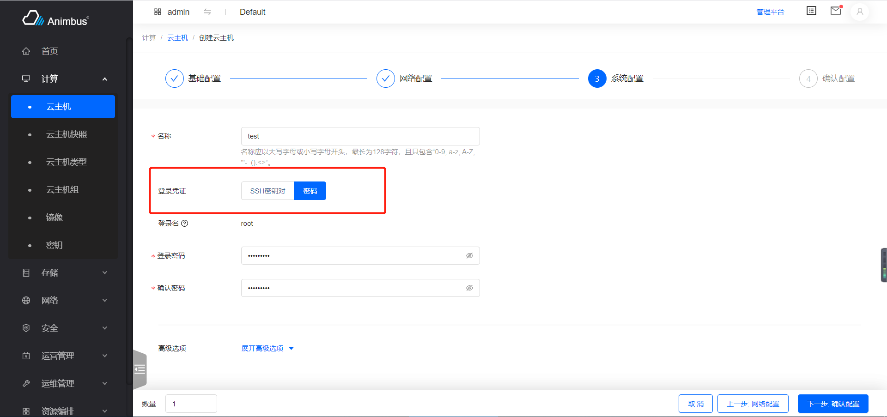

    - `isWrappedValue`, indicates whether to include `option` information in the form item value
      - Default `false`, value is the value of selected `option`
      - If true, value is the `option`

  - `select-table`
    - Table with selected actions
    - `isMulti`, whether is multi, default is `false`
    - `data`, data source, using when front end paging
    - `columns`, table columns configuration, the same as `BaseList`
    - `filterParams`, search configuration
    - `pageSize`, items number per page, default `5`
    - `disabledFunc`, to configure which item can not be selected
    - `selectedLabel`, the label at the bottom of the table, default is `selected`
    - `header`, the content above the table
    - `backendPageStore`, when backend paging, the data corresponding `store`
    - `backendPageFunc`, when backend paging, the function to fetch data, default is `store.fetchListByPage`.
    - `backendPageDataKey`, when backend paging, the key of data in `store`, default is `list`.
    - `extraParams`, when backend paging, the extra params when sending request.
    - `isSortByBack`, whether sort by backend, default is `false`.
    - `defaultSortKey`, when using backend paging, default sort key.
    - `defaultSortOrder`, when using backend paging, default sort order.
    - `initValue`, initial value.
    - `rowKey`, the `id` of each column.
    - `onRow`, the handler to handle row click, deafult will select row when click.
    - `tabs`, tab-type table
    - `defaultTabValue`, when is tab-type tab, default `tab`
    - `onTabChange`, when is tab-type tab, handler to handle tab change
    - Take choose security group when create instance as an example `src/pages/compute/containers/Instance/actions/StepCreate/NetworkStep/index.jsx` :
      - The table has a tip on the left of label.
      - Use backend paging & has extra params
      - Is multi
      - Has extra content on the top of table
      - Need to override `onRow` to avoid click `see rules` button then selected

      ```javascript
      {
        name: 'securityGroup',
        label: t('Security Group'),
        type: 'select-table',
        tip: t(
          'Each instance belongs to at least one security group, which needs to be specified when it is created. Instances in the same security group can communicate with each other on the network, and instances in different security groups are disconnected from the internal network by default.'
        ),
        backendPageStore: this.securityGroupStore,
        extraParams: { project_id: this.currentProjectId },
        required: true,
        isMulti: true,
        header: (
          <div style={{ marginBottom: 8 }}>
            {t(
              'The security group is similar to the firewall function and is used to set up network access control. '
            )}
            {t(' You can go to the console to ')}
            <Link to="/network/security-group">
              {t('create a new security group')}&gt;{' '}
            </Link>
            {t(
              'Note: The security group you use will act on all virtual adapters of the instance.'
            )}
          </div>
        ),
        filterParams: securityGroupFilter,
        columns: securityGroupColumns,
        onRow: () => {},
      },
      ```

      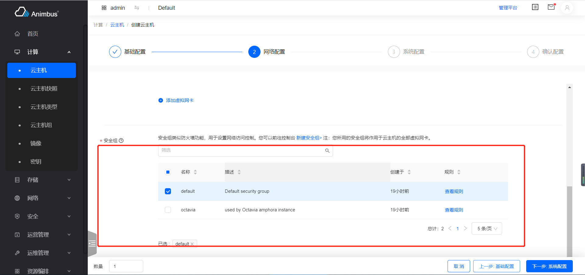

    - Take create volume as an example `src/pages/storage/containers/Volume/actions/Create/index.jsx` :
      - This is a table with tab, default to show the first tab, when switching tab, data source will change
      - Data is acquired by the front end paging, just directly configure the `data`
      - Not multi selected
      - Configure selected label to `Image`

      ```javascript
      {
        name: 'image',
        label: t('Operating System'),
        type: 'select-table',
        data: this.images,
        required: sourceTypesIsImage,
        isMulti: false,
        hidden: !sourceTypesIsImage,
        filterParams: [
          {
            label: t('Name'),
            name: 'name',
          },
        ],
        columns: getImageColumns(this),
        tabs: this.systemTabs,
        defaultTabValue: this.systemTabs[0].value,
        selectedLabel: t('Image'),
        onTabChange: this.onImageTabChange,
      }
      ```

      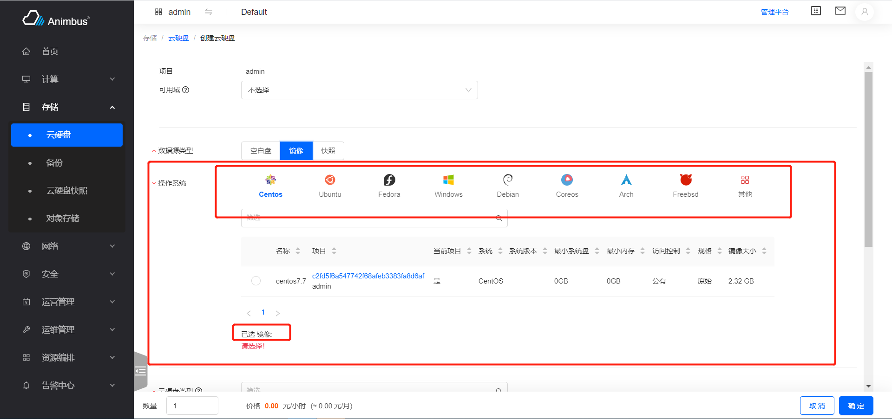

  - `input-number`
    - Number input
    - `min`, min number
    - `max`, max number
    - Take set MTU when create network as an example `src/pages/network/containers/Network/actions/CreateNetwork.jsx` :
      - set min & max

      ```javascript
      {
        name: 'mtu',
        label: t('MTU'),
        type: 'input-number',
        min: 68,
        max: 9000,
        extra: t('Minimum value is 68 for IPv4, and 1280 for IPv6.'),
      },
      ```

      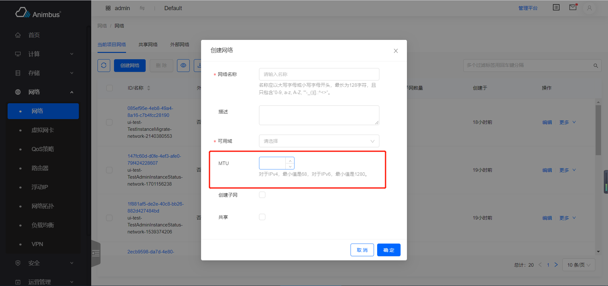

  - `input-int`
    - Integer input
    - `min`, min
    - `max`, max
    - Take set min disk when create image as an example `src/pages/compute/containers/Image/actions/Create.jsx` :
      - set min & max

      ```javascript
      {
        name: 'min_disk',
        label: t('Min System Disk(GB)'),
        type: 'input-int',
        min: 0,
        max: 500,
      }
      ```

      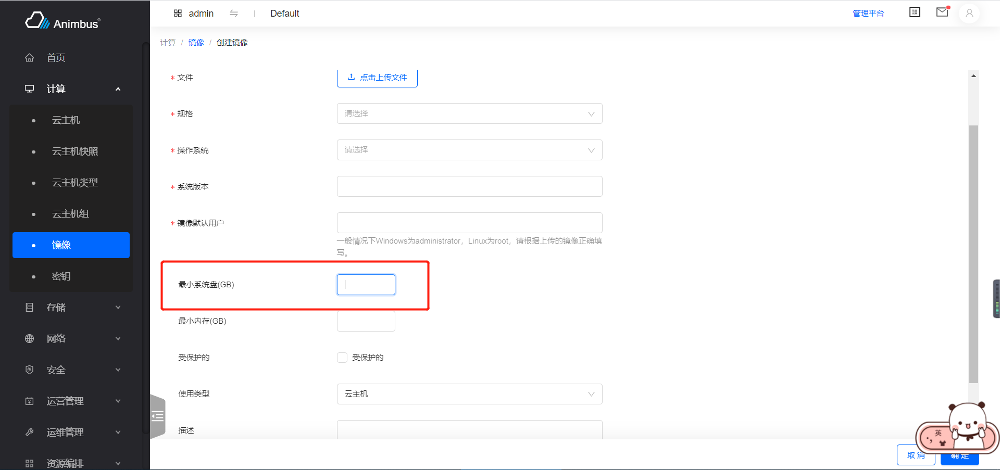

  - `instance-volume`
    - Insatnce volume configuration component
    - `options`, volume types options
    - `minSize`, volume size input min
    - Take configure system disk when create instance as an example `src/pages/compute/containers/Instance/actions/StepCreate/BaseStep/index.jsx` :

      ```javascript
      {
        name: 'systemDisk',
        label: t('System Disk'),
        type: 'instance-volume',
        options: this.volumeTypes,
        required: !this.sourceTypeIsVolume,
        hidden: this.sourceTypeIsVolume,
        validator: this.checkSystemDisk,
        minSize: this.getSystemDiskMinSize(),
        extra: t('Disk size is limited by the min disk of flavor, image, etc.'),
        onChange: this.onSystemDiskChange,
      }
      ```

      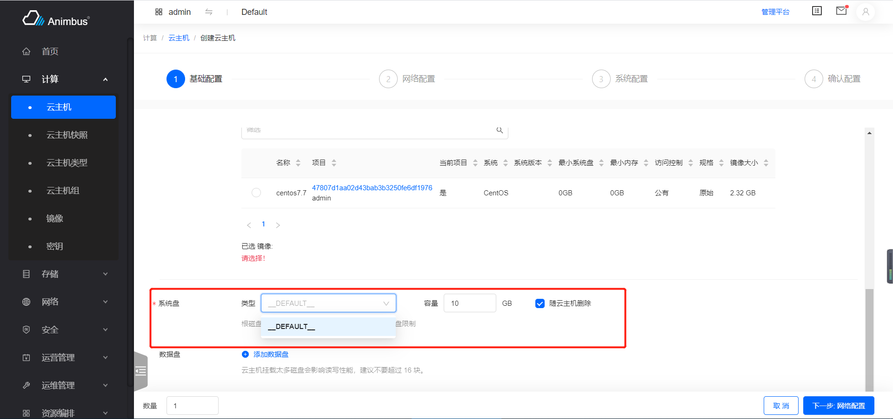

  - `input-password`
    - password input
    - Take set password when create instance as an example `src/pages/compute/containers/Instance/actions/StepCreate/SystemStep/index.jsx`
      - input password, confirm password, and verify password, ensure the consistency of the two input data

      ```javascript
      {
        name: 'password',
        label: t('Login Password'),
        type: 'input-password',
        required: isPassword,
        hidden: !isPassword,
        otherRule: getPasswordOtherRule('password', 'instance'),
      },
      {
        name: 'confirmPassword',
        label: t('Confirm Password'),
        type: 'input-password',
        required: isPassword,
        hidden: !isPassword,
        otherRule: getPasswordOtherRule('confirmPassword', 'instance'),
      },
      ```

      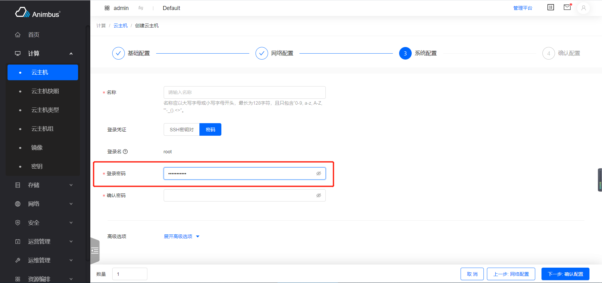

  - `input-name`
    - Name input box with format verification
    - `placeholder`, placeholder for input
    - `isFile`, verify name in file format
    - `isKeypair`, verify name with key-pair support
    - `isStack`, verify name with stack supported
    - `isImage`, verify name with image support
    - `isInstance`, verify name with instance support
    - Take set name when create instance as an example `src/pages/compute/containers/Instance/actions/StepCreate/SystemStep/index.jsx` :

      ```javascript
      {
        name: 'name',
        label: t('Name'),
        type: 'input-name',
        placeholder: t('Please input name'),
        required: true,
        isInstance: true,
      }
      ```

      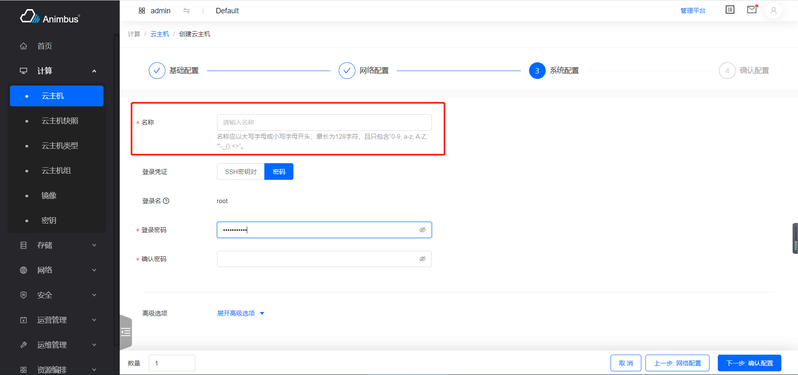

  - `port-range`
    - Port input with Verification
    - Take set source port when create security group rule as an example `src/pages/network/containers/SecurityGroup/Detail/Rule/actions/Create.jsx` :

      ```javascript
      {
        name: 'sourcePort',
        label: t('Source Port/Port Range'),
        type: 'port-range',
        required: showSourcePort,
        hidden: !showSourcePort,
      }
      ```

      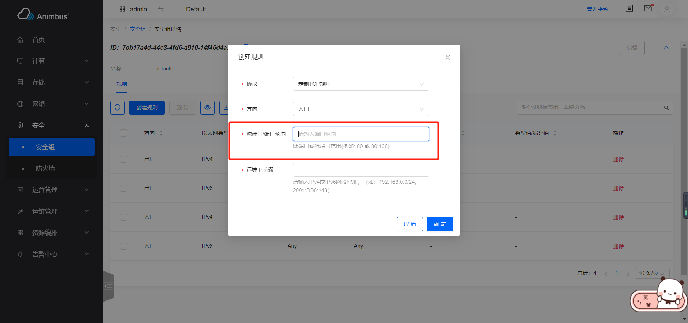

  - `more`
    - Hide / show more configuration items
    - Take create instance as an example `src/pages/compute/containers/Instance/actions/StepCreate/SystemStep/index.jsx` :

      ```javascript
      {
        name: 'more',
        label: t('Advanced Options'),
        type: 'more',
      }
      ```

      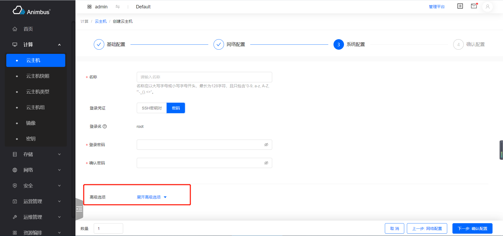

  - `textarea`
    - textarea
    - Take set description when edit volume as an example `src/pages/storage/containers/Volume/actions/Edit.jsx` :

      ```javascript
      {
        name: 'description',
        label: t('Description'),
        type: 'textarea',
      }
      ```

      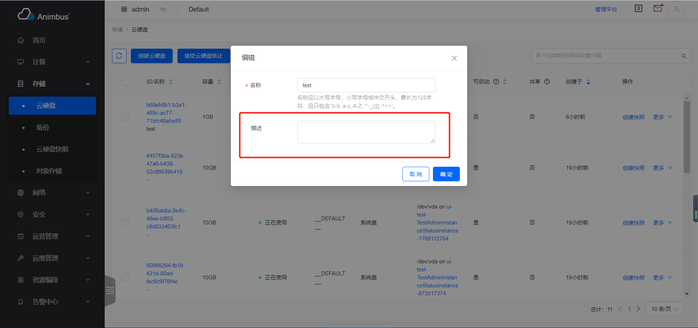

  - `upload`
    - file upload
    - Take upload image as an example `src/pages/compute/containers/Image/actions/Create.jsx` :

      ```javascript
      {
        name: 'file',
        label: t('File'),
        type: 'upload',
        required: true,
      }
      ```

      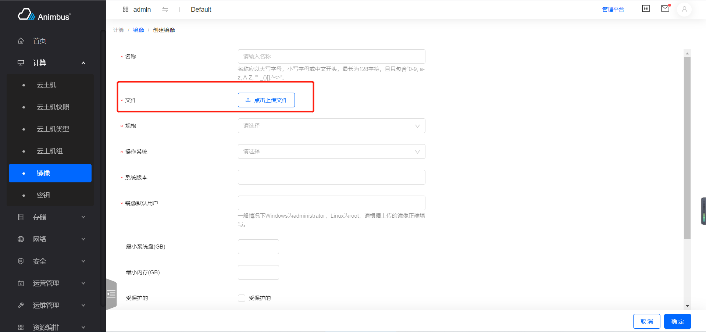

  - `add-select`
    - Can added, delete an entry form item
    - `minCount`, min entry count
    - `maxCount`, max entry count
    - `itemComponent`, click this component to add each entry
    - `defaultItemValue`, the default value of new entry
    - `addText`, the text on the right side of add item button component
    - `addTextTips`, if has `maxCount`, the text will update with count
    - Take set data disk when create instance as an example `src/pages/compute/containers/Instance/actions/StepCreate/BaseStep/index.jsx` :
      - can set unlimited number of data disk

      ```javascript
      {
        name: 'dataDisk',
        label: t('Data Disk'),
        type: 'add-select',
        options: this.volumeTypes,
        defaultItemValue: this.defaultVolumeType,
        itemComponent: InstanceVolume,
        minCount: 0,
        addTextTips: t('Data Disks'),
        addText: t('Add Data Disks'),
        extra: t(
          'Too many disks mounted on the instance will affect the read and write performance. It is recommended not to exceed 16 disks.'
        ),
        onChange: this.onDataDiskChange,
      },
      ```

      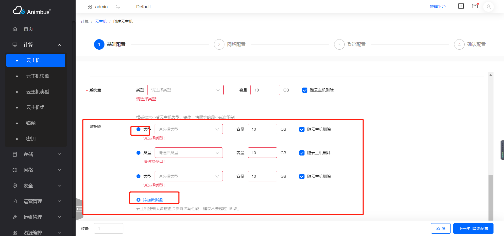

  - `ip-input`
    - IP input with verification
    - `version`, ip version, default is `4`, also can be `6`
    - Take attach interface to instance set ip as an example `src/pages/compute/containers/Instance/actions/AttachInterface.jsx`

      ```javascript
      {
        name: 'ip',
        label: t('Given IP'),
        type: 'ip-input',
        required: ipType === 1,
        hidden: ipType !== 1,
        version,
        // defaultIp,
        validator: this.checkIP,
        extra: t('Please make sure this IP address be available.'),
      }
      ```

      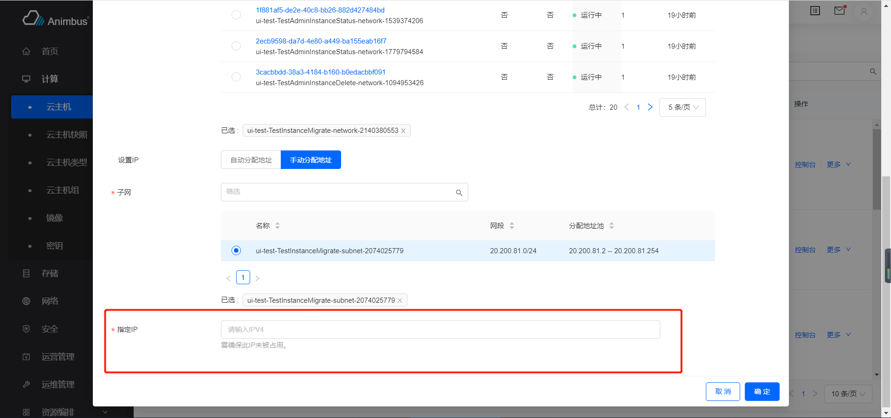

  - `member-allocator`
    - Member allocator used in load balancer
    - Take set member in lb as an example `src/pages/network/containers/LoadBalancers/StepCreateComponents/MemberStep/index.jsx` :

      ```javascript
      {
        name: 'extMembers',
        type: 'member-allocator',
        isLoading: this.store.list.isLoading,
        ports: this.state.ports,
      }
      ```

      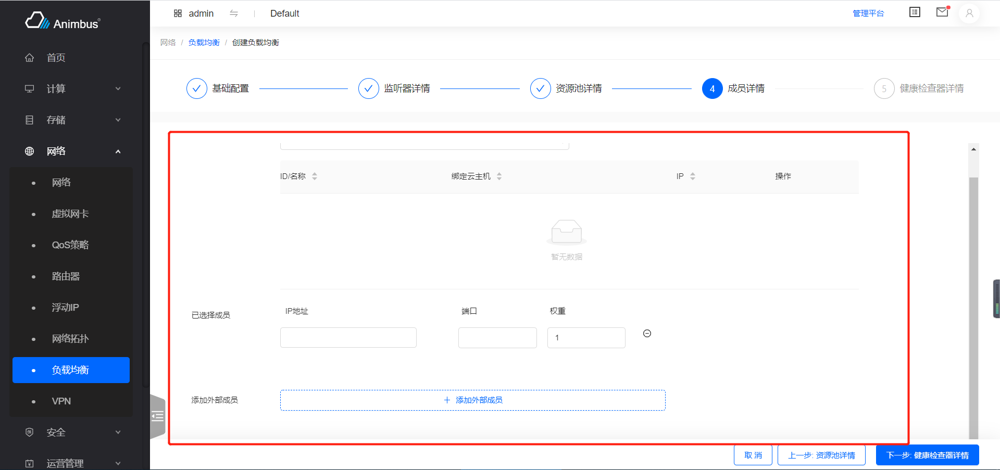

  - `descriptions`
    - A form item to show types of information
    - `title`, title of right content
    - `onClick`, the jump button behind title
    - `items`, configuration of each information to display, array.
      - `label`, information display on the left side of the item
      - `value`, information display on the right side of the item
      - `span`, layout of label and value
    - Take create instance confirm as an example `src/pages/compute/containers/Instance/actions/StepCreate/ConfirmStep/index.jsx` :

      ```javascript
      {
        name: 'confirm-config',
        label: t('Config Overview'),
        type: 'descriptions',
        title: t('Base Config'),
        onClick: () => {
          this.goStep(0);
        },
        items: [
          {
            label: t('Start Source'),
            value: context.source.label,
          },
          {
            label: t('System Disk'),
            value: this.getSystemDisk(),
          },
          {
            label: t('Available Zone'),
            value: context.availableZone.label,
          },
          {
            label: t('Start Source Name'),
            value: this.getSourceValue(),
          },
          {
            label: t('Data Disk'),
            value: this.getDataDisk(),
          },
          {
            label: t('Project'),
            value: context.project,
          },
          {
            label: t('Flavor'),
            value: this.getFlavor(),
          },
        ],
      }
      ```

      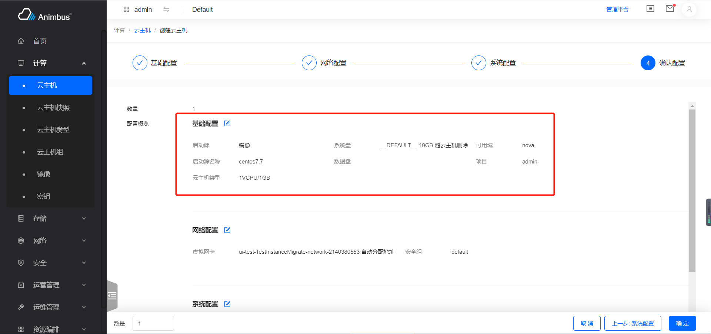

  - `slider-input`
    - Input + Slider linkage form item
    - `min`, min value
    - `max`, max value
    - `description`, description under slider
    - Take set size when create volume as an example `src/pages/storage/containers/Volume/actions/Create/index.jsx` :

      ```javascript
      {
        name: 'size',
        label: t('Capacity (GB)'),
        type: 'slider-input',
        max: this.maxSize,
        min: minSize,
        description: `${minSize}GB-${this.maxSize}GB`,
        required: this.quotaIsLimit,
        hidden: !this.quotaIsLimit,
        onChange: this.onChangeSize,
      },
      ```

      

  - `title`
    - Show title
    - Take set params when create stack as an example `src/pages/heat/containers/Stack/actions/Create/Parameter.jsx` :

      ```javascript
      {
        label: t('Fill In The Parameters'),
        type: 'title',
      }
      ```

      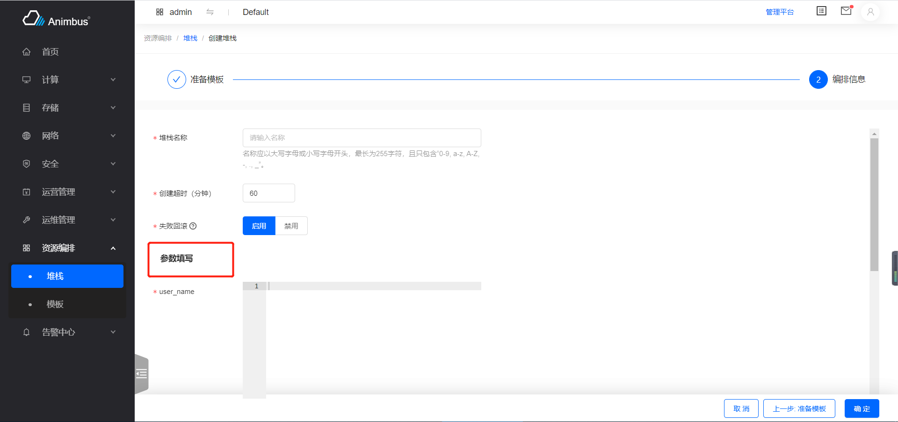

  - `switch`
    - switch form item
    - Take set port security when create port as an example `src/pages/network/containers/VirtualAdapter/actions/Create.jsx` :

      ```javascript
      {
        name: 'port_security_enabled',
        label: t('Port Security'),
        type: 'switch',
        tip: t(
          'Disabling port security will turn off the security group policy protection and anti-spoofing protection on the port. General applicable scenarios: NFV or operation and maintenance Debug.'
        ),
        onChange: (e) => {
          this.setState({
            port_security_enabled: e,
          });
        },
      }
      ```

      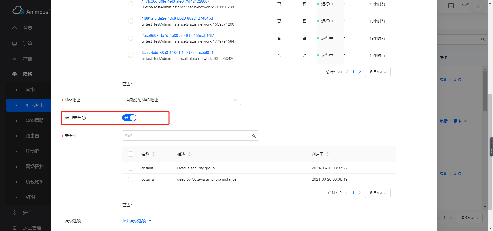

  - `check`
    - checkbox
    - `content`, words on the right side of the box
    - Take whether to force shutdown instance when resizing instance as an example `src/pages/compute/containers/Instance/actions/Resize.jsx` :

      ```javascript
      {
        name: 'option',
        label: t('Forced Shutdown'),
        type: 'check',
        content: t('Agree to force shutdown'),
        required: true,
      },
      ```

      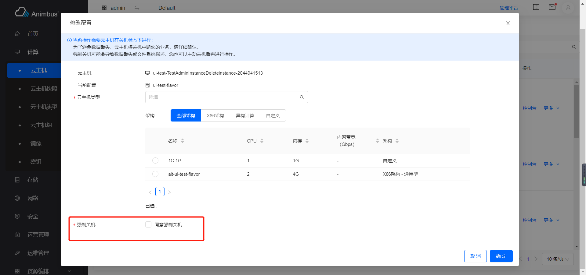

  - `transfer`
    - transfer form item
    - `leftTableColumns`, list configuration of left table
    - `rightTableColumns`, List configuration of right table
    - `dataSource`, data source for choose
    - `showSearch`, whether to show search input
    - `oriTargetKeys`, default selected
    - `disabled`, whether to disable select data in left table, default is `false`
    - Take edit system role as an example `src/pages/identity/containers/User/actions/SystemRole.jsx` :
      - Left is the project name list
      - Right is the project name and role list of project

      ```javascript
      {
        name: 'select_project',
        type: 'transfer',
        label: t('Project'),
        leftTableColumns: this.leftUserTable,
        rightTableColumns: this.rightUserTable,
        dataSource: this.projectList
          ? this.projectList.filter((it) => it.domain_id === domainDefault)
          : [],
        disabled: false,
        showSearch: true,
        oriTargetKeys: projectRoles ? Object.keys(projectRoles) : [],
      }
      ```

      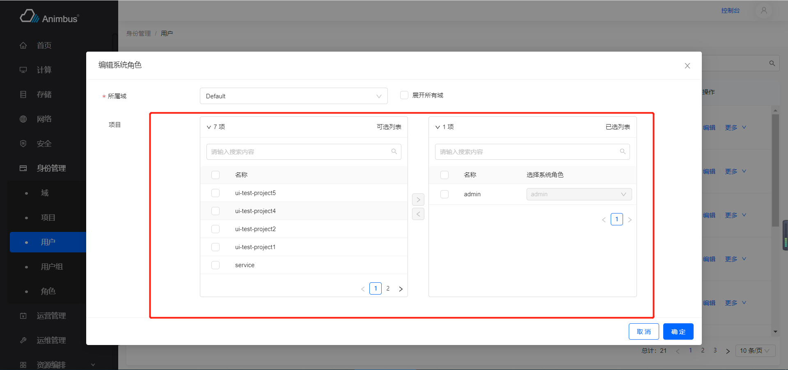

  - `check-group`
    - checkbox group
    - `options`, each checkbox's configuration
      - `label`, label for checkbox
      - `value`, value for checkbox
    - Take edit metadata as an example `src/pages/configuration/containers/Metadata/actions/Edit.jsx` :
      - Configure whether is `public` or `protected`

      ```javascript
      {
        name: 'options',
        label: t('Options'),
        type: 'check-group',
        options: [
          { label: t('Public'), value: 'isPublic' },
          { label: t('Protected'), value: 'isProtected' },
        ],
      }
      ```

      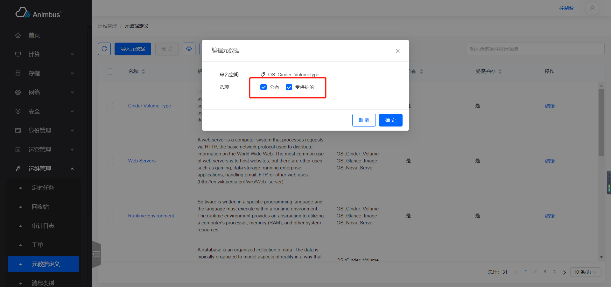

  - `textarea-from-file`
    - Textarea with read file feature
    - After selected file, will read the contents of the file into the textarea
    - Take set public-key information when create key-pare as an example `src/pages/compute/containers/Keypair/actions/Create.jsx` :

      ```javascript
      {
        name: 'public_key',
        label: t('Public Key'),
        type: 'textarea-from-file',
        hidden: isCreate,
        required: !isCreate,
      }
      ```

      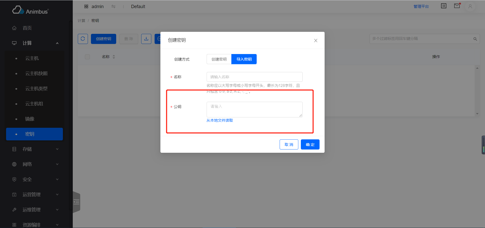

  - `ip-distributer`
    - IP distributer
    - `subnets`, subnets can be selected
    - can auto allocate ip, or manual input IP
    - can add multi ip
    - Take create port as an example `src/pages/network/containers/VirtualAdapter/actions/Create.jsx` :

      ```javascript
      {
        name: 'fixed_ips',
        label: t('Owned Subnet'),
        type: 'ip-distributer',
        subnets: subnetDetails,
        hidden: !network_id,
        required: true,
      }
      ```

      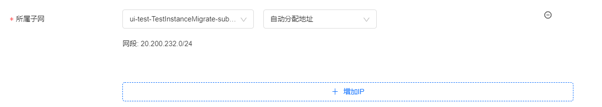

  - `mac-address`
    - Mac address input
    - Support auto allocate, manual input
    - Take set mac address when edit port as an example `src/pages/network/containers/VirtualAdapter/actions/Edit.jsx`:

      ```javascript
      {
        name: 'mac_address',
        label: t('Mac Address'),
        wrapperCol: { span: 16 },
        type: 'mac-address',
        required: true,
      }
      ```

      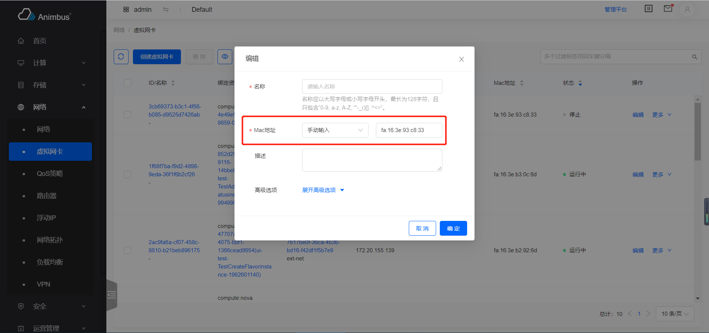

  - `network-select-table`
    - network selector
    - Display current project network, shared network, admin network(if is admin) in tabs.
    - Take set network when create port as an example `src/pages/network/containers/VirtualAdapter/actions/Create.jsx` :

      ```javascript
      {
        name: 'network_id',
        label: t('Owned Network'),
        type: 'network-select-table',
        onChange: this.handleOwnedNetworkChange,
        required: true,
      },
      ```

      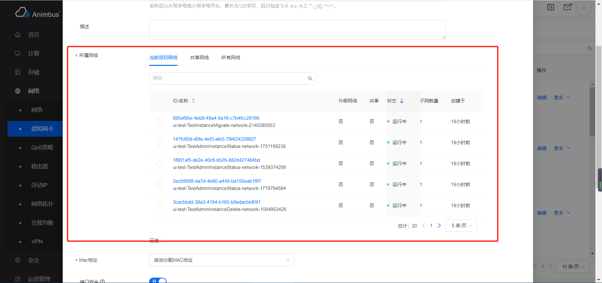

  - `volume-select-table`
    - volume selector
    - Display volumes that can be used or is shared in tabs.
    - `disabledFunc`, which volume can not be selected
    - Take attach volume as an example `src/pages/compute/containers/Instance/actions/AttachVolume.jsx` :

      ```javascript
      {
        name: 'volume',
        label: t('Volume'),
        type: 'volume-select-table',
        tip: multiTip,
        isMulti: false,
        required: true,
        serverId: this.item.id,
        disabledFunc: (record) => {
          const diskFormat = _get(
            record,
            'origin_data.volume_image_metadata.disk_format'
          );
          return diskFormat === 'iso';
        },
      }
      ```

      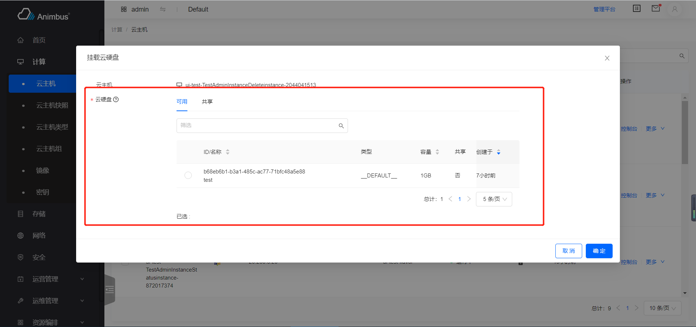

  - `tab-select-table`
    - select table with tabs
    - `isMulti`, whether is multi select
    - Take choose qos when allocate fip as an example `src/pages/network/containers/FloatingIp/actions/Allocate.jsx` :
      - There is current project qos & shared qos & all qos(if is admin)

      ```javascript
      {
        name: 'qos_policy_id',
        label: t('QoS Policy'),
        type: 'tab-select-table',
        tabs: getQoSPolicyTabs.call(this),
        isMulti: false,
        tip: t('Choosing a QoS policy can limit bandwidth and DSCP'),
        onChange: this.onQosChange,
      }
      ```

      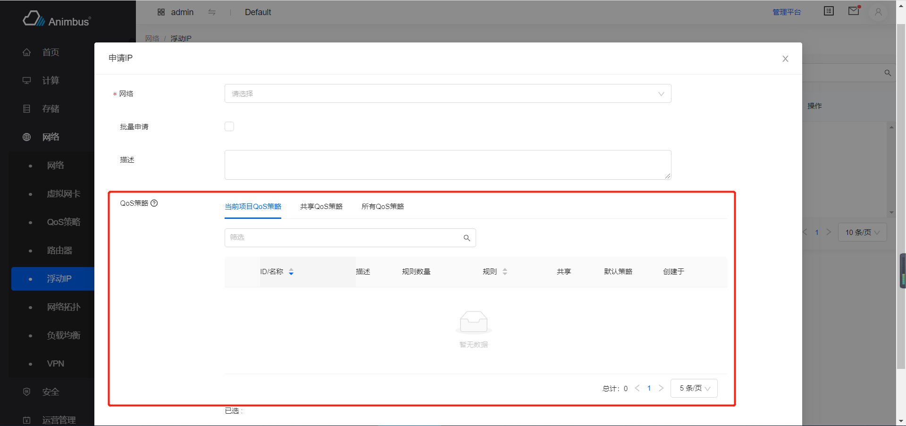

  - `metadata-transfer`
    - metadata transfer form item
    - Take edit image metadata as an example `src/pages/compute/containers/Image/actions/ManageMetadata.jsx` :

      ```javascript
      {
        name: 'systems',
        label: t('Metadata'),
        type: 'metadata-transfer',
        metadata: this.metadata,
        validator: (rule, value) => {
          if (this.hasNoValue(value)) {
            return Promise.reject(t('Please input value'));
          }
          return Promise.resolve();
        },
      }
      ```

      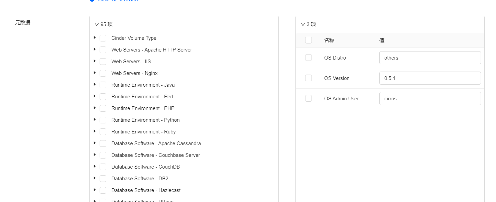

  - `aceEditor`
    - aceEditor
    - Take edit profile when create port as an example `src/pages/network/containers/VirtualAdapter/actions/Create.jsx` :

      ```javascript
      {
        name: 'bindingProfile',
        label: t('Binding Profile'),
        type: 'aceEditor',
        hidden: !more,
        mode: 'json',
        wrapEnabled: true,
        tabSize: 2,
        width: '100%',
        height: '200px',
        setOptions: {
          enableBasicAutocompletion: true,
          enableLiveAutocompletion: true,
          enableSnippets: true,
        },
        validator: (item, value) => {
          if (value !== undefined && value !== '') {
            try {
              JSON.parse(value);
              return Promise.resolve(true);
            } catch (e) {
              return Promise.reject(new Error(t('Illegal JSON scheme')));
            }
          }
          return Promise.resolve(true);
        },
      }
      ```

      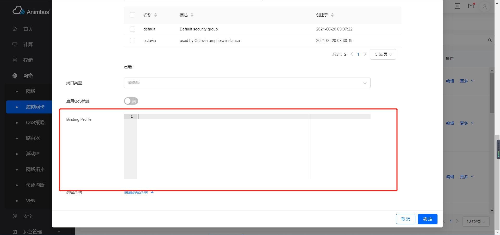

  - `input-json`
    - input value in type of json
    - Take edit params when create stack as an example `src/resources/stack.js` :

      ```javascript
      export const getFormItemType = (type) => {
        switch (type) {
          case 'number':
            return {
              type: 'input-number',
            };
          case 'json':
            return {
              type: 'input-json',
            };
          case 'boolean':
            return {
              type: 'radio',
              options: yesNoOptions,
            };
          default:
            return {
              type: 'input',
            };
        }
      };
      ```

      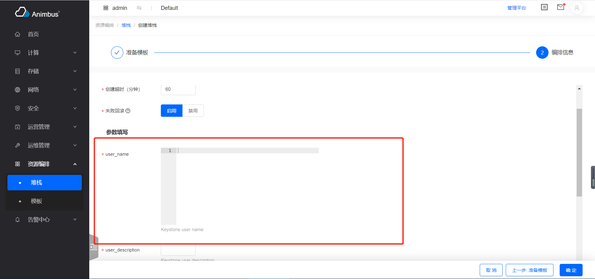
