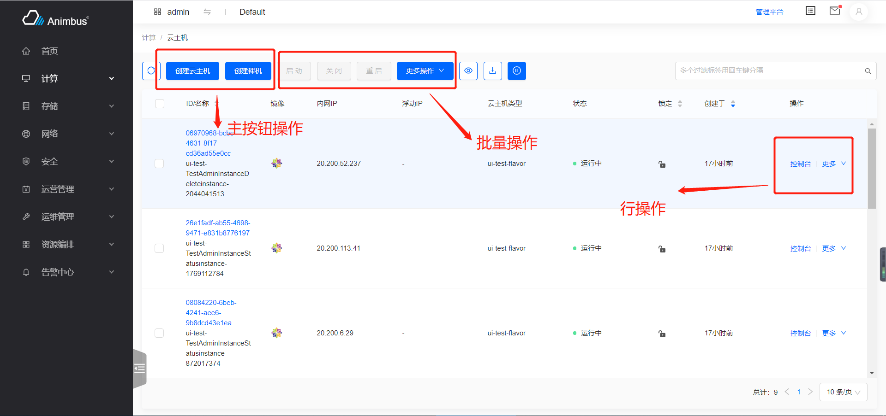
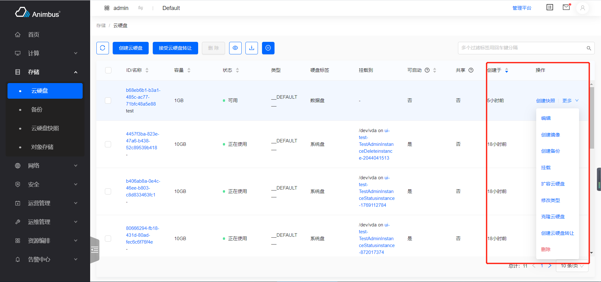
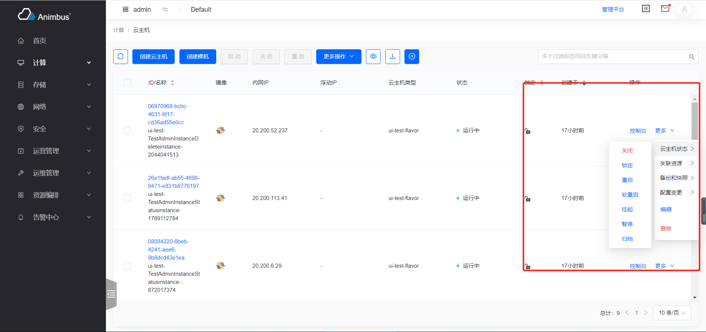

English | [简体中文](../../zh/develop/3-11-Action-introduction.md)

# Usage

- Configure all the actions corresponding to resources

  

- After writing the corresponding configuration, the action button will be displayed in the corresponding position of resource list page.

# Code location

- `pages/xxxx/containers/XXXX/actions/index.jsx`

# How to use

- Return an object, includes `primaryAction`, `batchAction`, `rowAction`
- Take network as an example `src/pages/network/containers/Network/actions/index.jsx` :
  - The primary action is `CreateNetwork`
  - The batch action is `DeleteAction`
  - The row actions are `Edit`, `CreateSubnet`, `DeleteAction`

  ```javascript
  import CreateNetwork from './CreateNetwork';
  import CreateSubnet from './CreateSubnet';
  import DeleteAction from './Delete';
  import Edit from './Edit';

  const actionConfigs = {
    rowActions: {
      firstAction: Edit,
      moreActions: [
        {
          action: CreateSubnet,
        },
        {
          action: DeleteAction,
        },
      ],
    },
    batchActions: [DeleteAction],
    primaryActions: [CreateNetwork],
  };

  export default actionConfigs;
  ```

- Configure the `actionConfigs` in the resource list page.
  - Take network as an example `src/pages/network/containers/Network/ProjectNetwork.jsx` :

    ```javascript
    import actionConfigs from './actions';
    get actionConfigs() {
      return actionConfigs;
    }
    ```

## `primaryActions` button configuration

- Return a list of components
- If there is no primary button, you can set it to `null` or` [] `
- If it is not operational(For example, insufficient permissions), it will automatically hide

## `batchActions` button configuration

- Return a list of components
- If there is no batch button, you can set it to `null` or` [] `
- If it is not operational(For example, insufficient permissions), it will automatically hide

## `rowActions` button configuration

- Return an object, includes the components that `firstAction`/`moreActions` correspond to.
- It can return `{}`
- `firstAction` is the first action button in row.
  - If not operational, will be disabled.
  - It can be a component.
  - It can be `null`,
    - Take `SystemInfo - network` as an example `src/pages/configuration/containers/SystemInfo/NeutronAgent/actions/index.jsx` :

      ```javascript
      import Enable from './Enable';
      import Disable from './Disable';

      const actionConfigs = {
        rowActions: {
          firstAction: null,
          moreActions: [
            {
              action: Enable,
            },
            {
              action: Disable,
            },
          ],
        },
        batchActions: [],
        primaryActions: [],
      };

      export default actionConfigs;
      ```

- `moreActions`
  - The component under `more` action button
  - Action list
  - If the action is not operational, it will be hidden
  - Supports two types of configurations, corresponding to different display schemes
    - Each item is an object include `action` attribute

      

    - Each item is an object include `title`, `actions` attributes

      

      - Take instance actions as an example `src/pages/compute/containers/Instance/actions/index.jsx` :

        ```javascript
        const statusActions = [
          StartAction,
          StopAction,
          LockAction,
          UnlockAction,
          RebootAction,
          SoftRebootAction,
          SuspendAction,
          ResumeAction,
          PauseAction,
          UnpauseAction,
          Shelve,
          Unshelve,
        ];
        const actionConfigs = {
          rowActions: {
            firstAction: Console,
            moreActions: [
              {
                title: t('Instance Status'),
                actions: statusActions,
              },...}}
        ```
