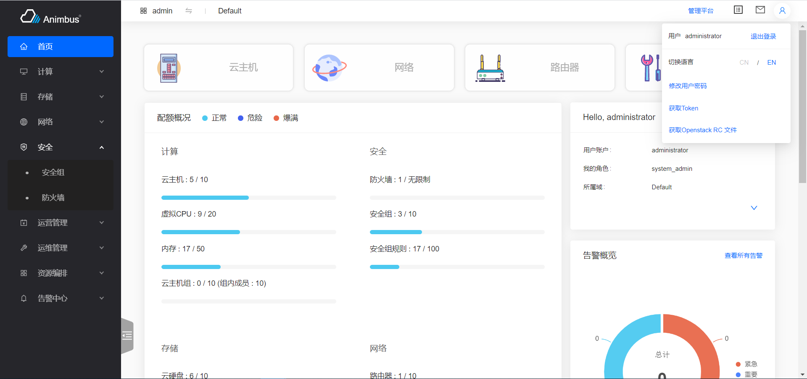
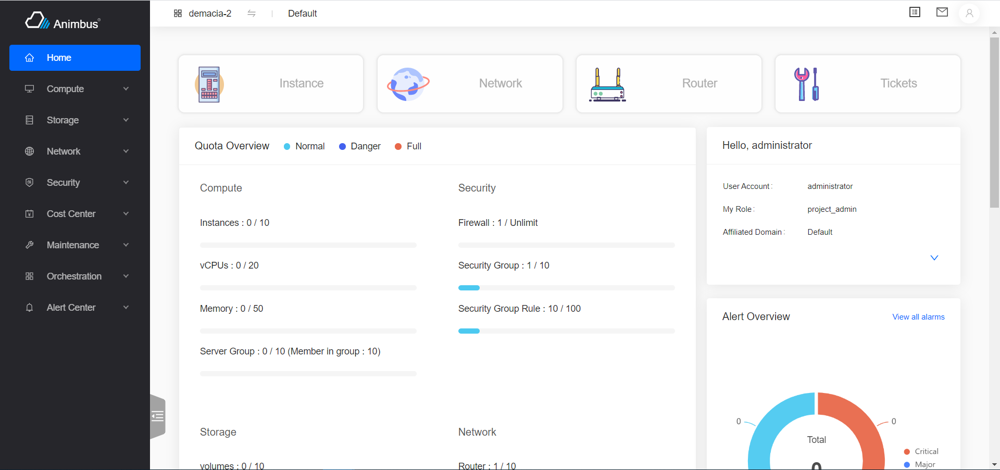

English | [简体中文](../../zh/develop/3-14-I18n-introduction.md)

# Usage

- Framework supports internationalization, default support in English, Chinese

  

  

# Code location

- `src/locales/index.js`
- English: `src/locales/en.json`
- Chinese: `src/locales/zh.json`

# How to use

- The strings that need to be displayed internationally in the code are all in English, after using cli to complete string collection, generally, there is no need to update `en.json`, only need to modify the corresponding Chinese in `zh.json` to complete the internationalization operation
- Use function `t` to translate the string
  - Take `instance` as an example, Corresponding international writing is `t('instance')`
  - Note that English is case relevant
  - Function `T` supports strings with parameters
    - Params use `{}` to mark, for example :

      ```javascript
      confirmContext = () =>
        t('Are you sure to { action }?', {
          action: this.actionName || this.title,
        });
      ```

- Collect

  ```shell
  yarn run i18n
  ```

  - After collect, `en.json` and `zh.json` will automatically update.

- Update Chinese
  - After collect, just update directly in `zh.json`.
