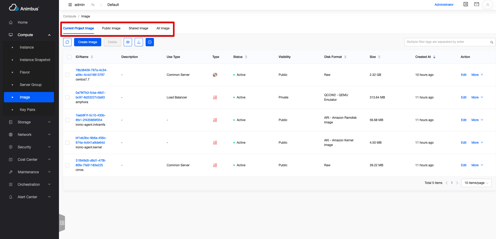

English | [Chinese](../../zh/develop/3-2-BaseTabList-introduction.md)

# Application

- The base class of each switchable list page

  

- Support automatic processing of data display when switching

# BaseTabList Code file

- `src/containers/TabList/index.jsx`

# BaseTabList Introduction to attribute and function definitions

- The resource list with Tab switch inherits from BaseTabList
- Only need to copy some functions to complete the development of the page
- Attributes and functions are divided into the following four types,
  - The attributes and functions that need to be overridden mainly include:
    - `Tab` configuration in the page
  - Functions and attributes for on-demand overridden, mainly include:
    - Permission configuration in the page
  - Functions and attributes that do not need to be overridden, mainly include:
    - Whether the current page is a management platform page
  - The basic functions in the base class mainly include:
    - Render the page
    - Handle routing changes when switching tabs
  - See below for a more detailed and comprehensive introduction

## Properties and functions that need to be overridden

- `tabs`:
  - Need to replicate the function
  - Used to configure the tab in the page
  - Configuration items of each Tab:
    - `title`, the title on the Tab tag
    - `key`, the unique identifier of each Tab
    - `component`, the component corresponding to each Tab is basically a resource list component inherited from `BaseList`
  - Return to the list of Tab configuration
  - The page displays the first `component` in the Tab list by default
  - Take image `src/pages/compute/containers/Image/index.jsx` as an example

    ```javascript
    get tabs() {
      const tabs = [
        {
          title: t('Current Project Image'),
          key: 'project',
          component: Image,
        },
        {
          title: t('Public Image'),
          key: 'public',
          component: Image,
        },
        {
          title: t('Shared Image'),
          key: 'shared',
          component: Image,
        },
      ];
      if (this.hasAdminRole) {
        tabs.push({
          title: t('All Image'),
          key: 'all',
          component: Image,
        });
      }
      return tabs;
    }
    ```

## Properties and functions for on-demand overridden

- The attributes and functions involved in the following generally do not need to be configured
  - Currently it is only used on the VPN page (`src/pages/network/containers/VPN/index.jsx`). This page uses these configurations to determine permissions and displays when the determination fails.
- `name`
  - The full name of the entire Tab page
  - Take the vpn `src/pages/network/containers/VPN/index.jsx` as an example

    ```javascript
    get name() {
      return t('VPN');
    }
    ```

- `checkEndpoint`
  - Do you need to verify the endpoint of the service corresponding to the page
  - The default value is `false`
  - Take the vpn `src/pages/network/containers/VPN/index.jsx` as an example

    ```javascript
    get checkEndpoint() {
      return true;
    }
    ```

- `endpoint`
  - The endpoint of the service corresponding to this page
  - Only useful when `checkEndpoint=true`
  - Take the vpn `src/pages/network/containers/VPN/index.jsx` as an example

    ```javascript
    get endpoint() {
      return vpnEndpoint();
    }
    ```

## Properties and functions that do not need to be overridden
- `location`
  - Page routing information
- `isAdminPage`
  - Is the current page a "management platform" page
- `hasAdminRole`
  - Whether the logged-in user role has an administrator role
- `getRoutePath`
  - Function to generate page URL
  - For example, it is necessary to provide a jump function for the associated resources of the list page. Using this function, you can jump to the corresponding address of the console in the console, and jump to the corresponding address of the management platform in the management platform.

## Basic functions in the base class

- It is recommended to check the code understanding, `src/containers/TabList/index.jsx`
