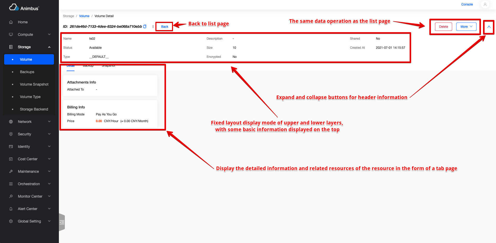

English | [Chinese](../../zh/develop/3-3-BaseDetail-introduction.md)

# Application



- The base class of each resource detail page
- Support return to list page
- Support data operations consistent with the list page
- Support the display and folding of the header of the detail page
- Support basic information and related resource information displayed in tab form
- Support up and down display schemes
- Need to copy some functions to complete the development of the page

# BaseDetail Code file

- `src/containers/TabDetail/index.jsx`

# BaseDetail Introduction to attribute and function definitions

- Resource details are inherited from BaseDetail component
- Code location: `pages/xxxx/containers/XXXX/Detail/index.jsx`
- Need to copy some functions to complete the development of the page
- Attributes and functions are divided into the following four types,
  - The attributes and functions that usually need to be overridden mainly include:
    - Details page permissions
    - Resource name of the detail page
    - List page corresponding to the detail page
    - Operation configuration of the detail page
    - Information configuration at the top of the detail page
    - Tab page configuration at the bottom of the detail page
    - The `store` corresponding to the details page
  - Functions and attributes for on-demand overridden, mainly include:
    - Data corresponding to details page operations
    - Parameters for obtaining detailed data
    - Function to get detailed data
  - Functions and attributes that do not need to be overridden, mainly include:
    - Whether the current page is a management platform page
  - The basic functions in the base class mainly include:
    - Render the page
    - Automatic refresh of detailed data when the data on the list page below changes
    - Collapse/expand header information
  - See below for a more detailed and comprehensive introduction

## Properties and functions that usually need to be overridden

- `policy`:
  - The function must be overridden (Fill in the policy that complies with the openstack rules here)
  - The permission corresponding to the page, if the permission verification fails, data cannot be requested.
  - Take the volume `src/pages/storage/containers/Volume/Detail/index.jsx` as an example

    ```javascript
    get policy() {
      return 'volume:get';
    }
    ```

- `aliasPolicy`:
  - The function can be overridden (Fill in the custom policy with module prefix here)
  - The permission corresponding to the page, if the permission verification fails, data cannot be requested.
  - Take the volume `src/pages/storage/containers/Volume/Detail/index.jsx` as an example

    ```javascript
    get aliasPolicy() {
      return 'cinder:volume:get';
    }
    ```

- `name`
  - The function must be overridden
  - The name corresponding to the page resource.
  - Take the volume `src/pages/storage/containers/Volume/Detail/index.jsx` as an example

    ```javascript
    get name() {
      return t('volume');
    }
    ```

- `listUrl`
  - The resource list page corresponding to the detail page
  - Take the volume `src/pages/storage/containers/Volume/Detail/index.jsx` as an example

    ```javascript
    get listUrl() {
      return this.getRoutePath('volume');
    }
    ```

- `actionConfigs`
  - Various operations to configure resources
    - Operations on data
    - The configuration is defined in the actions directory of the resource
    - Generally, you can directly use the configuration consistent with the resource list page
    - Take the keypair `src/pages/compute/containers/Keypair/Detail/index.jsx` as an example

      ```javascript
      import actionConfigs from '../actions';
      get actionConfigs() {
        return actionConfigs;
      }
      ```

- `detailInfos`
  - Information at the top of the details page
  - Is a configuration list
  - Per configuration
    - `title`, required item, title
    - `dataIndex`, required item, corresponding to the Key of the data
    - `render`, optional, the default is to display content based on `dataIndex`, using this attribute, table content can be rendered based on the result of `render`
    - `valueRender`, optional, generate show data based on `dataIndex` and `valueRender`
      - `sinceTime`, processing time, showed as "XX hours ago"
      - `keepTime`, show the remaining time
      - `yesNo`, handle the `Boolean` value and display it as "yes" or "no"
      - `GBValue`, processing size, displayed as "XXXGB"
      - `noValue`, when there is no value, it is displayed as "-"
      - `bytes`, processing size
      - `uppercase`, uppercase
      - `formatSize`, processing size, such as "2.32 GB", "56.68 MB"
      - `toLocalTime`, processing time, shown as "2021-06-17 04:13:07"
      - `toLocalTimeMoment`, processing time, shown as "2021-06-17 04:13:07"
  - Take the volume `src/pages/storage/containers/Volume/Detail/index.jsx` as an example

    ```javascript
    get detailInfos() {
      return [
        {
            title: t('Name'),
            dataIndex: 'name',
        },
        {
            title: t('Description'),
            dataIndex: 'description',
        },
        {
            title: t('Shared'),
            dataIndex: 'multiattach',
            valueRender: 'yesNo',
        },
        {
            title: t('Status'),
            dataIndex: 'status',
            render: (value) => volumeStatus[value] || value,
        },
        {
            title: t('Size'),
            dataIndex: 'size',
        },
        {
            title: t('Created At'),
            dataIndex: 'created_at',
            valueRender: 'toLocalTime',
        },
        {
            title: t('Type'),
            dataIndex: 'volume_type',
        },
        {
            title: t('Encrypted'),
            dataIndex: 'encrypted',
            valueRender: 'yesNo',
        },
      ];
    }
    ```

- `tabs`
  - Tab configuration at the bottom of the details page
  - Configuration items of each Tab:
    - `title`, the title on the Tab tag
    - `key`, the unique identifier of each Tab
    - `component`, the component corresponding to each Tab is basically a resource list component inherited from `BaseList`
  - Return to the list of Tab configuration
  - The page displays the first `component` in the Tab list by default
  - Usually, the basic information is inherited from the `BaseDetail` class
  - Usually, the resource list page in the detail page can directly reuse the resource list, and you only need to synchronize the parameter request in the next list page.
    - Take the backup list of volume details `src/pages/storage/containers/Backup/index.jsx` as an example

      ```javascript
      updateFetchParamsByPage = (params) => {
        if (this.inDetailPage) {
          const { id, ...rest } = params;
          return {
            volume_id: id,
            ...rest,
          };
        }
        return params;
      };
      ```

  - Take the volume `src/pages/storage/containers/Volume/Detail/index.jsx` as an example

    ```javascript
    get tabs() {
      const tabs = [
      {
        title: t('Detail'),
        key: 'base',
        component: BaseDetail,
      },
      {
        title: t('Backup'),
        key: 'backup',
        component: Backup,
      },
      {
        title: t('Snapshot'),
        key: 'snapshot',
        component: Snapshot,
      },
      ];
      return tabs;
    }
    ```

- `init`
  - The function to configure the Store, in this function to configure the Store used to process data requests
  - Generally used is the form of `new XXXStore()`
  - Take the volume `src/pages/storage/containers/Volume/Detail/index.jsx` as an example

    ```javascript
    init() {
      this.store = new VolumeStore();
    }
    ```

## Properties and functions for on-demand overridden

- `fetchData`
  - Function to get data in the details page
  - It is not recommended to rewrite this method
  - Use `this.store.fetchDetail` to get data by default
- `updateFetchParams`
  - Update the parameters of the data request
  - Generally used with `detailDidFetch` in the store
  - Take the instance `src/pages/compute/containers/Instance/Detail/index.jsx` as an example

    ```javascript
    updateFetchParams = (params) => ({
      ...params,
      isRecycleBinDetail: this.isRecycleBinDetail,
    });
    ```

## Properties and functions that do not need to be overridden

- `params`
  - The parameter information of the route
  - Generally used to generate the parameters of the page request API
- `id`
  - `id` in routing information
- `isAdminPage`
  - Is the current page a "management platform" page
- `getRoutePath`
  - Function to generate page URL
  - For example, it is necessary to provide a jump function to the associated resource. Using this function, you can jump to the corresponding address of the console in the console, and jump to the corresponding address of the management platform in the management platform.
- `routing`
  - Routing information corresponding to the page
- `isLoading`
  - Whether the current page is updating data, the loading style will be displayed when updating
- `tab`
  - Currently displayed information on the lower Tab page
- `detailData`
  - Data information displayed on the page
  - From `this.store.detail`

## Basic functions in the base class

- It is recommended to check the code understanding, `src/containers/TabDetail/index.jsx`
