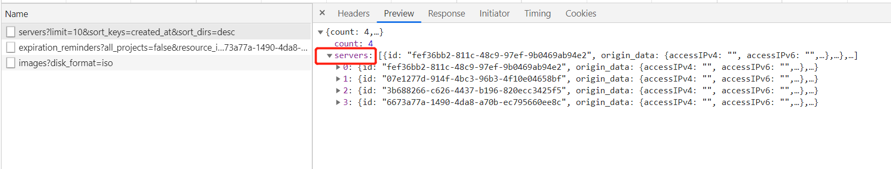

English | [Chinese](../../zh/develop/3-5-BaseStore-introduction.md)

# Application

- Processing of data requests
- Support to obtain all data
- Support paging to get data
- Support various request processing for data (PUT, POST, GET, PATCH, DELETE, HEAD, etc.)

# BaseStore Code file

- `src/stores/base.js`

# BaseStore Introduction to attribute and function definitions

- The Store of resource data inherits from the BaseStore class
- Code location: `src/stores/xxx/xxx.js`, such as the store corresponding to the cloud host in `src/stores/nova/instance.js`
- Only need to copy some functions to complete the data request operation
- Attributes and functions are divided into the following four types,
  - The attributes and functions that usually need to be overridden mainly include:
    - Properties and functions related to generating url
  - Functions and attributes for on-demand overridden, mainly include:
    - List data reprocessing
    - Reprocessing of detailed data
    - Handling of request parameters
    - URL processing
  - Functions and attributes that do not need to be overridden, mainly include:
    - Clear data
    - Processing of project information when encapsulating data
  - The basic functions in the base class mainly include:
    - Marker for processing paging data
  - See below for a more detailed and comprehensive introduction

## Noun description

- Front end paging
  - Get all list data from the backend at once
  - The front-end displays data based on the total amount of data obtained, the current number of pages configured in the page, and the number of pages per page (`BaseList` component processing)
- Backend paging
  - Request data from the backend with the current page number and the number of pages
- Front-end sorting
  - When using front-end paging, sort all data according to the set sorting information
  - When using backend paging, sort the data in the current page according to the set sort information
- Backend sorting
  - Request data from the backend with current page number, number of pages, and current sort information
  - There is no such combination of front-end paging + back-end sorting

## Properties and functions that usually need to be overridden

- `module`:
  - The function must be overridden
  - Resource corresponding module
  - This function is used to generate the requested url
  - Take the instance `src/stores/nova/instance.js` as an example

    ```javascript
    get module() {
        return 'servers';
    }
    ```

- `apiVersion`
  - The function must be overridden
  - The api prefix corresponding to the resource
  - Because all requests need to be forwarded by the server, the prefix of the api needs to be generated based on the information in the profile
  - Take the instance `src/stores/nova/instance.js` as an example

    ```javascript
    get apiVersion() {
      return novaBase();
    }
    ```

- `responseKey`
  - The function must be overridden
  - Used to generate the key returned by the data, the created key, etc.
  - Take the instance `src/stores/nova/instance.js` as an example

    ```javascript
    get responseKey() {
      return 'server';
    }
    ```

    

## Properties and functions for on-demand overridden

- `listDidFetch`
  - Functions used for secondary processing of list data
  - After requesting other APIs, data can be integrated
  - Filterable data
  - When requesting a snapshot list of a specified cloud disk, you can filter the data again based on the parameters in `filters`
    - Take snapshot of volume `src/stores/cinder/snapshot.js` as an example

      ```javascript
      async listDidFetch(items, allProjects, filters) {
        if (items.length === 0) {
          return items;
        }
        const { id } = filters;
        const data = id ? items.filter((it) => it.volume_id === id) : items;
        return data;
      }
      ```

  - If you need to display encrypted information, you need to initiate an additional request to integrate the data
    - Take volume type `src/stores/cinder/volume-type.js` as an example

      ```javascript
      async listDidFetch(items, allProjects, filters) {
        const { showEncryption } = filters;
        if (items.length === 0) {
          return items;
        }
        if (!showEncryption) {
          return items;
        }
        const promiseList = items.map((i) =>
          request.get(`${this.getDetailUrl({ id: i.id })}/encryption`)
        );
        const encryptionList = await Promise.all(promiseList);
        const result = items.map((i) => {
          const { id } = i;
          const encryption = encryptionList.find((e) => e.volume_type_id === id);
          return {
            ...i,
            encryption,
          };
        });
        return result;
      }
      ```

- `detailDidFetch`
  - Function used for secondary processing of detailed data
  - After requesting other APIs, data can be integrated
  - Take the snapshot of volume `src/stores/cinder/snapshot.js` as an example

    ```javascript
    async detailDidFetch(item) {
      const { volume_id } = item;
      const volumeUrl = `${cinderBase()}/${
        globals.user.project.id
      }/volumes/${volume_id}`;
      const { volume } = await request.get(volumeUrl);
      item.volume = volume;
      return item;
    }
    ```

- `listResponseKey`
  - Return of list data Key
  - The default value is `${this.responseKey}s`
  - Take the snapshot of volume `src/stores/cinder/snapshot.js` as an example

    ```javascript
    get responseKey() {
      return 'snapshot';
    }

    get listResponseKey() {
      return 'volume_snapshots';
    }
    ```

- `getListUrl`
  - Url used for request data
  - When the front-end page requests list data (that is, get all the data at once), the first use of `this.getListDetailUrl()`
  - When the back-end page requests list data, the priority is `this.getListPageUrl()`> `this.getListDetailUrl()`> `this.getListUrl()`
  - The default is

    ```javascript
    getListUrl = () => `${this.apiVersion}/${this.module}`;
    ```

  - Take the log `src/stores/heat/event.js` of Heat's stack as an example

    ```javascript
    getListUrl = ({ id, name }) =>
      `${this.apiVersion}/${this.module}/${name}/${id}/events`;
    ```

- `getListDetailUrl`
  - Url used for request data
  - When the front-end page requests list data (that is, get all the data at once), the first use of `this.getListDetailUrl()`
  - When the back-end page requests list data, the priority is `this.getListPageUrl()`> `this.getListDetailUrl()`> `this.getListUrl()`
  - The default is

    ```javascript
    getListDetailUrl = () => '';
    ```

  - Take the volume `src/stores/cinder/volume.js` as an example

    ```javascript
    getListDetailUrl = () => `${skylineBase()}/extension/volumes`;
    ```

- `getListPageUrl`
  - The url used by the backend paging data
  - When the back-end page requests list data, the priority is `this.getListPageUrl()`> `this.getListDetailUrl()`> `this.getListUrl()`
  - The default value is 

    ```javascript
    getListPageUrl = () => '';
    ```

  - Take the volume `src/stores/cinder/volume.js` as an example

    ```javascript
    getListPageUrl = () => `${skylineBase()}/extension/volumes`;
    ```

- `getDetailUrl`
  - The url corresponding to the detailed data
  - Use rest style API, so the url is also the url corresponding to put, delete, patch
  - The default value is 

    ```javascript
    getDetailUrl = ({ id }) => `${this.getListUrl()}/${id}`;
    ```

  - Take the stack `src/stores/heat/stack.js` as an example

    ```javascript
    getDetailUrl = ({ id, name }) => `${this.getListUrl()}/${name}/${id}`;
    ```

- `needGetProject`
  - Whether the data returned by the server needs to be processed for the project information
  - Generally, the data returned by the Openstack API is only `project_id` information. According to the requirements of the page display, the project name needs to be displayed on the management platform
  - The default value is `true`
  - Take the metadata `src/stores/glance/metadata.js` as an example

    ```javascript
    get needGetProject() {
      return false;
    }
    ```

- `mapper`
  - Perform secondary processing on the list and detailed data returned by the server
  - Generally for more convenient display of data usage in the resource list and resource details
  - The default value is 

    ```javascript
    get mapper() {
      return (data) => data;
    }
    ```

  - Take the volume `src/stores/cinder/volume.js` as an example

    ```javascript
    get mapper() {
      return (volume) => ({
        ...volume,
        disk_tag: isOsDisk(volume) ? 'os_disk' : 'data_disk',
        description: volume.description || (volume.origin_data || {}).description,
      });
    }
    ```

- `mapperBeforeFetchProject`
  - Before processing the project information, perform secondary processing on the list and detailed data returned by the server
  - Generally used to process the item information in the returned data
  - The default value is 

    ```javascript
    get mapperBeforeFetchProject() {
      return (data) => data;
    }
    ```

  - Take the image `src/stores/glance/image.js` as an example

    ```javascript
    get mapperBeforeFetchProject() {
      return (data, filters, isDetail) => {
        if (isDetail) {
          return {
            ...data,
            project_id: data.owner,
          };
        }
        return {
          ...data,
          project_id: data.owner,
          project_name: data.owner_project_name || data.project_name,
        };
      };
    }
    ```

- `paramsFunc`
  - When the front-end paging request (ie `fetchList`), update the request parameters
  - The default is to filter the parameters when using `fetchList` from the resource list code (`pages/xxxx/xxx/index.jsx`)
  - The default value is

    ```javascript
    get paramsFunc() {
      if (this.filterByApi) {
        return (params) => params;
      }
      return (params) => {
        const reservedKeys = [
          'all_data',
          'all_projects',
          'device_id',
          'network_id',
          'floating_network_id',
          'start_at_gt',
          'start_at_lt',
          'binary',
          'fixed_ip_address',
          'device_owner',
          'project_id',
          'type',
          'sort',
          'security_group_id',
          'id',
          'security_group_id',
          'owner_id',
          'status',
          'fingerprint',
          'resource_types',
          'floating_ip_address',
          'uuid',
          'loadbalancer_id',
          'ikepolicy_id',
          'ipsecpolicy_id',
          'endpoint_id',
          'peer_ep_group_id',
          'local_ep_group_id',
          'vpnservice_id',
        ];
        const newParams = {};
        Object.keys(params).forEach((key) => {
          if (reservedKeys.indexOf(key) >= 0) {
            newParams[key] = params[key];
          }
        });
        return newParams;
      };
    }
    ```

  - Take the volume `src/stores/cinder/volume.js` as an example

    ```javascript
    get paramsFunc() {
      return (params) => {
        const { serverId, ...rest } = params;
        return rest;
      };
    }
    ```

- `paramsFuncPage`
  - When the back-end paging request (ie `fetchListByPage`), update the request parameters
  - The default is to filter the parameters when using `fetchListByPage` from the resource list code (`pages/xxxx/xxx/index.jsx`)
  - The default value is

    ```javascript
    get paramsFuncPage() {
      return (params) => {
        const { current, ...rest } = params;
        return rest;
      };
    }
    ```

  - Take the volume type `src/stores/cinder/volume-type.js` as an example

    ```javascript
    get paramsFuncPage() {
      return (params) => {
        const { current, showEncryption, ...rest } = params;
        return rest;
      };
    }
    ```

- `fetchListByLimit`
  - When the front-end page requests all data, whether to initiate multiple requests based on `limit`, and finally achieve all data acquisition
  - The Openstack API returns 1000 data by default. For some resource data, you need to use this configuration to get all the data.
  - The default value is `false`
  - Take the image `src/stores/glance/image.js` as an example

    ```javascript
    get fetchListByLimit() {
      return true;
    }
    ```

- `markerKey`
  - The source of the marker when the back-end page requests data
  - Because the request to Openstack is forwarded by the backend, the URL that should be used for the next page of data spliced ​​by Openstack returned by the list data is not directly used, but the `marker` is parsed based on the returned data.
  - The default value is `id`
  - Usually does not need to be replicated
  - Take the keypair `src/stores/nova/keypair.js` as an example

    ```javascript
    get markerKey() {
      return 'keypair.name';
    }
    ```

- `requestListByMarker`
  - When backend paging, use `marker` to request the data under paging
  - Usually does not need to be replicated
  - The default value is 

    ```javascript
    async requestListByMarker(url, params, limit, marker) {
      const newParams = {
        ...params,
        limit,
      };
      if (marker) {
        newParams.marker = marker;
      }
      return request.get(url, newParams);
    }
    ```

  - Take the server group `src/stores/nova/server-group.js` as an example

    ```javascript
    async requestListByMarker(url, params, limit, marker) {
      const newParams = {
        ...params,
        limit,
      };
      if (marker) {
        newParams.offset = marker;
      }
      return request.get(url, newParams);
    }
    ```

- `requestListAllByLimit`
  - When `this.fetchListByLimit=true`, the front-end paging uses this method to get all data
  - Usually does not need to be replicated
- `updateUrl`
  - The url of the update list data request
  - Uncommonly used
- `updateParamsSortPage`
  - When using back-end sorting, the processing of sorting parameters
  - When using back-end sorting, the corresponding request parameters will be automatically generated in the resource list code `pages/xxx/XXX/index.jsx`. Store often needs to sort these parameters again, otherwise it will not meet the API parameter requirements
  - Take the volume `src/stores/cinder/volume.js` as an example

    ```javascript
    updateParamsSortPage = (params, sortKey, sortOrder) => {
      if (sortKey && sortOrder) {
        params.sort_keys = sortKey;
        params.sort_dirs = sortOrder === 'descend' ? 'desc' : 'asc';
      }
    };
    ```

- `listFilterByProject`
  - Does the list data need to be filtered based on project information
  - Some Openstack resources under the `admin` authority (such as `neutron`) will return the data of all projects by default, so when the resources are displayed in the console, the data will be filtered according to the configuration
  - The default value is `false`
  - Take the vpn `src/stores/neutron/vpn-service.js` as an example

    ```javascript
    get listFilterByProject() {
      return true;
    }
    ```

- `fetchList`
  - The list page under `pages` usually uses `this.store.fetchList` to get the front-end paging data
  - It is not recommended to copy this function, if you need to reprocess the data, it is recommended to use `listDidFetch`
  - This function will update the relevant data in the `this.list` property, and the resource list component under `pages` is also based on `this.list` for data display
- `fetchListByPage`
  - List pages under `pages` usually use `this.store.fetchList` to get back-end paging data
  - It is not recommended to copy this function, if you need to reprocess the data, it is recommended to use `listDidFetch`
  - This function will update the relevant data in the `this.list` property, and the resource list component under `pages` is also based on `this.list` for data display
- `getCountForPage`
  - Get the total amount of list data
  - Usually rewriteable in back-end paging
- `getDetailParams`
  - Parameters when requesting update details
  - The default value is 

    ```javascript
    getDetailParams = () => undefined;
    ```

- `fetchDetail`
  - The detail page under `pages` usually uses `this.store.fetchDetail` to get detailed data
  - Usually does not need to be replicated
  - Data reprocessing is usually to rewrite `mapper` or `detailDidFetch`
- `create`
  - Create resources
  - Use `POST` api
  - Usually does not need to be replicated
  - Use `this.submitting` to ensure that the page is in the `loading` state when the request is sent
- `edit`
  - Update resources
  - Use `PUT` api
  - Usually does not need to be replicated
  - Use `this.submitting` to ensure that the page is in the `loading` state when the request is sent
- `patch`
  - Update resources
  - Use `PATCH` api
  - Usually does not need to be replicated
  - Use `this.submitting` to ensure that the page is in the `loading` state when the request is sent
- `delete`
  - Delete resources
  - Use `DELETE` api
  - Usually does not need to be replicated
  - Use `this.submitting` to ensure that the page is in the `loading` state when the request is sent

## Properties and functions that do not need to be overridden

- `submitting`
  - For data creation and data update
  - Change `this.isSubmitting` according to the response of the request, the corresponding Form, list page, etc. will display the Loading status
- `currentProject`
  - Project ID of the current user login
- `itemInCurrentProject`
  - Does the data belong to the project logged in by the current user
- `listDidFetchProject`
  - Add item information to list data
- `requestListAll`
  - Front-end paging to get all data
- `requestListByPage`
  - Back-end pagination of all current page data
- `pureFetchList`
  - List data request function
  - Return the original data without processing the returned data from the API
- `parseMarker`
  - When using back-end paging, parse out the `marker` from the returned data, which is used when requesting the previous and next pages of data
- `updateMarker`
  - Update `markers` of `list`
  - `list.markers` is an array, each element corresponds to the `marker` of the `subscript+1` page
- `getMarker`
  - Get the `marker` corresponding to the specified page
- `getListDataFromResult`
  - Get the list data from the return value of the API
  - Use `this.listResponseKey` to get
- `setSelectRowKeys`
  - The selected record of the data item in the resource list component list under `pages`
- `clearData`
  - Clear `list` data

## Basic functions in the base class

- It is recommended to check the code understanding,`src/stores/base.js`
