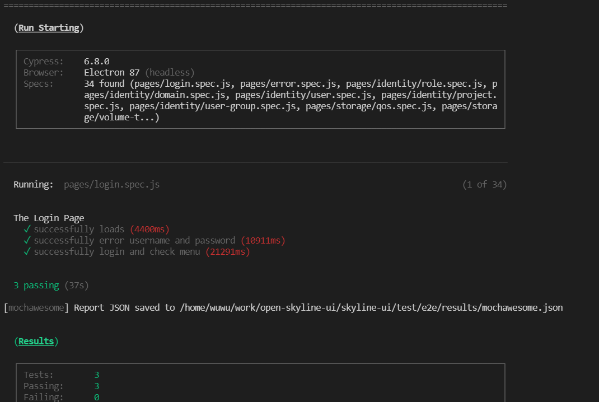
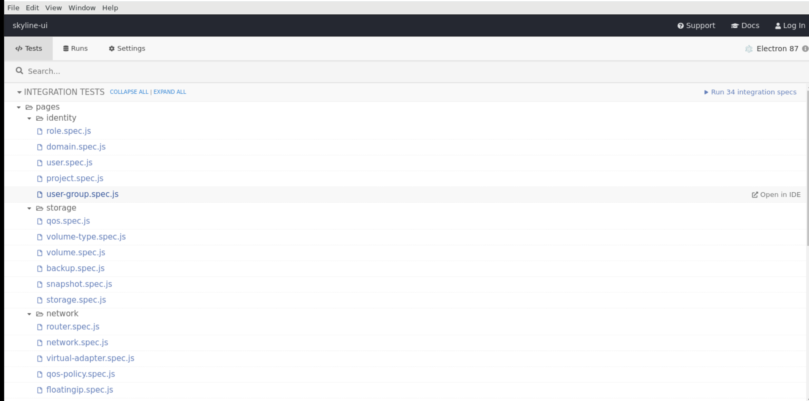
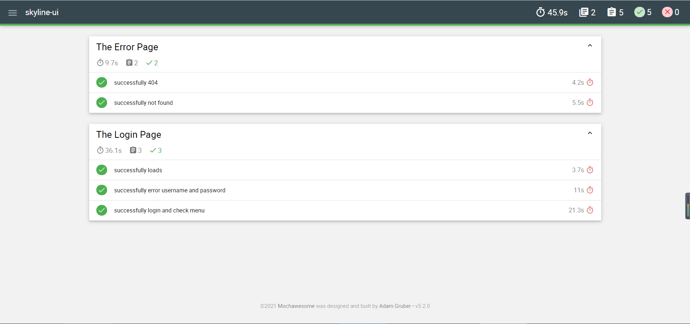

English | [简体中文](../../zh/test/1-ready-to-work.md)

# Two kinds of tests

We provide two test methods

- E2E test
  - Focus on function point testing
  - Can provide code coverage data
  - User `Cypress` frame
  - Test results are saved in a static page for easy preview
- Unit test
  - Focus on basic function testing
  - User `Jest` frame

# E2E test

## Set up E2E test environment

E2E test environment has been successfully built in Centos and wsl2 of Windows

- node environment
  - requirement in package.json: `"node": ">=10.22.0"`
  - verify nodejs version

    ```shell
    node -v
    ```

- yarn
  - install yarn

    ```shell
    npm install -g yarn
    ```

- Install dependencies
  - Execute in the project root directory, which is the same level as `package.json`, and wait patiently for the installation to complete

    ```shell
    yarn install
    ```

- Install system dependencies
  - `Ubuntu/Debian`

    ```shell
    sudo apt-get install libgtk2.0-0 libgtk-3-0 libgbm-dev libnotify-dev libgconf-2-4 libnss3 libxss1 libasound2 libxtst6 xauth xvfb
    ```

  - `CentOS`

    ```shell
    yum install -y xorg-x11-server-Xvfb gtk2-devel gtk3-devel libnotify-devel GConf2 nss libXScrnSaver alsa-lib
    ```

- Adjust the access path, account and other information
  - E2E configuration files are stored in `test/e2e/config/config.yaml`, Configured in it:
    - `baseUrl`, test access path
    - `env`, environment variable
      - `switchToAdminProject`, Switch to the `admin` project after logging in
      - `username`, User name to access the console, a user with console operation permissions is required
      - `password`, Password to access the console
      - `usernameAdmin`, The user name to access the management platform, a user with the operation authority of the management platform is required
      - `passwordAdmin`, Password to access the management platform
    - `testFiles`, Test files list
  - The configuration change can be completed by directly modifying the corresponding value in `config.yaml`
  - You can also complete configuration changes through `local_config.yaml`
    - Copy `test/e2e/config/config.yaml` to `test/e2e/config/local_config.yaml`
    - Modify the corresponding variables in `local_config.yaml`
    - For the value of the variable, the priority is: `local_config.yaml`> `config.yaml`

## Command line run E2E

```shell
yarn run test:e2e
```



## GUI running E2E

```shell
yarn run test:e2e:open
```

Cypress provide GUI




## E2E test results

After the test run is over, visit `test/e2e/report/merge-report.html` to view



## E2E Code coverage test results

After the test run is over, visit `coverage/lcov-report/index.html` to view

> Note: Code coverage, the front-end package corresponding to `baseUrl` that needs E2E access, is  `dist` package with a detectable code coverage version

```shell
yarn run build:test
```

The file packaged in the above way is a front-end package with testable code coverage

Below, the nginx configuration for front-end access to the front-end package with code coverage function is given

```nginx
server {
  listen 0.0.0.0:8088 default_server;

  root /path/to/skyline-console/dist;
  index index.html;
  server_name _;
  location / {
    try_files $uri $uri/ /index.html;
  }

  location /api {
    proxy_pass http://<backend_address>;
  }
}
```

# Unit test

## Command line run unit tests

```shell
yarn run test:unit
```

## Unit test results

You can view the running results directly in the command line console


