English | [简体中文](../../zh/test/3-1-E2E-form-operation.md)

Because of the consistency of the front-end framework, when we write related use cases for form operations, select elements and operate, we often find that there is a strong regularity, so we have written corresponding Cypress functions for most of the form operations. It greatly reduces the difficulty of writing test cases. The following will give a detailed description of the main form operation functions.

> Note: The functions written are based on the principle that the operation of a form item can be completed completely

## Click the button operation

- `closeNotice`
  - Close the prompt message of successful operation in the upper right corner

  

- `waitFormLoading`
  - Wait for the form request to complete
  - After the form is filled in and verified, click the confirm  button to initiate a corresponding request to the server. At this time, the confirm  button of the form item will be in the state of `Loading`
  - Using this function, instead of `cy.wait(seconds)`, can more effectively ensure that the synchronization request has been processed completely, thereby ensuring the prerequisites for subsequent use cases

  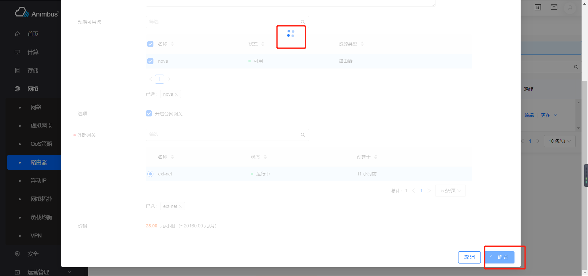

- `clickFormActionSubmitButton`
  - Click the confirm button of the confirm  form and wait for the request to complete

  

- `clickModalActionSubmitButton`
  - Click the confirm button in the pop-up form and wait for the request to complete

  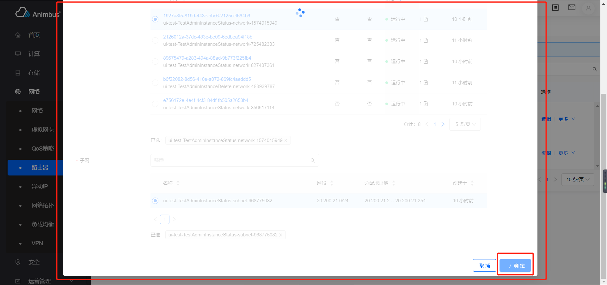

- `clickModalActionCancelButton`
  - Click the cancel button of the pop-up form
- `clickConfirmActionSubmitButton`
  - Click the confirmation button of the confirmation form, wait for the request to complete, and close the prompt message that the request is successful
  - Parameter `waitTime`, the waiting time after closing the prompt message

  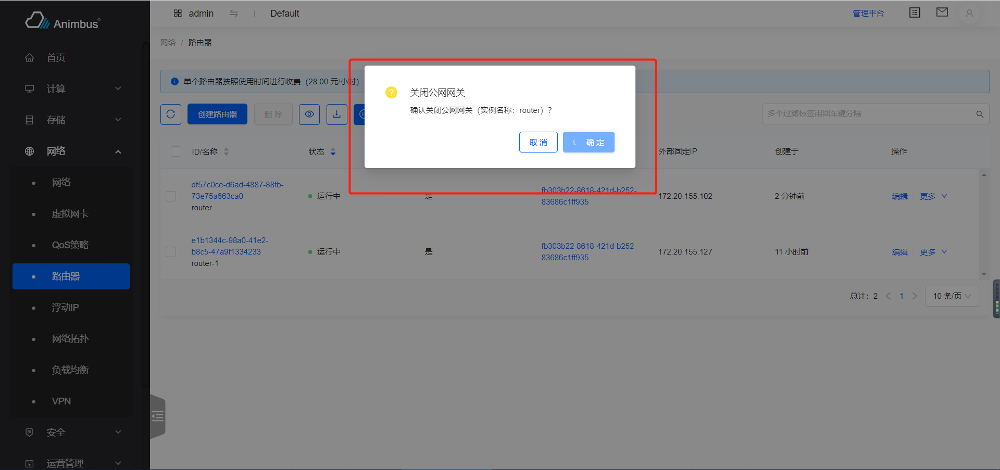

- `checkDisableAction`
  - If some data does not meet the requirements, an error will pop up when using batch operations. This function verifies that the data does not meet the operation requirements, and closes the error prompt
  - Take the locked instance as an example: `test/e2e/integration/pages/compute/instance.spec.js`
    - After locking, it no longer supports startup, shutdown, and restart operations

    ```javascript
    it('successfully lock', () => {
      cy.tableSearchText(name)
        .clickConfirmActionInMoreSub('Lock', 'Instance Status')
        .wait(10000);
      cy.tableSearchText(name)
        .selectFirst()
        .clickHeaderActionButtonByTitle('Start')
        .checkDisableAction(2000)
        .clickHeaderActionButtonByTitle('Stop')
        .checkDisableAction(2000)
        .clickHeaderActionButtonByTitle('Reboot')
        .checkDisableAction(2000);
    });
    ```

    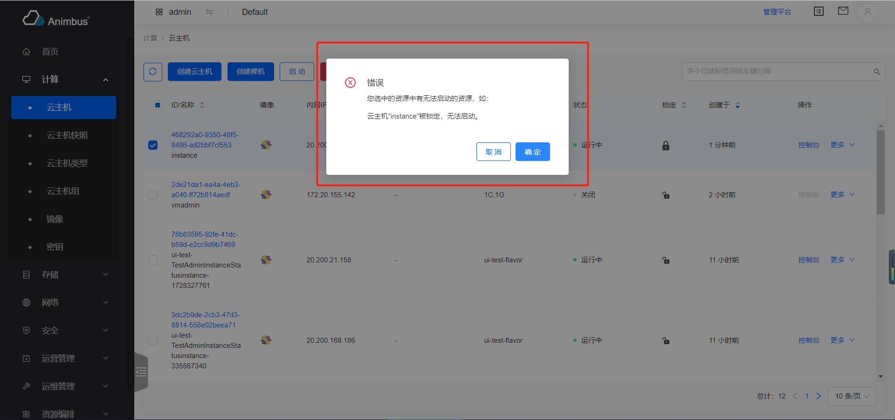

- `clickStepActionNextButton`
  - Click the Next/Confirm button of the step-by-step form
  - Take the create instance use case as an example: `test/e2e/integration/pages/compute/instance.spec.js`
    - A total of 3 clicks on the next step and 1 confirmation button

    ```javascript
    it('successfully create', () => {
      cy.clickHeaderActionButton(0)
        .url()
        .should('include', `${listUrl}/create`)
        .wait(5000)
        .formTableSelect('flavor')
        .formTableSelect('image')
        .formSelect('systemDisk')
        .formAddSelectAdd('dataDisk')
        .formSelect('dataDisk')
        .wait(2000)
        .clickStepActionNextButton()
        .wait(5000)
        .formTableSelectBySearch('networkSelect', networkName, 5000)
        .formTableSelectBySearch('securityGroup', 'default', 5000)
        .wait(2000)
        .clickStepActionNextButton()
        .formInput('name', name)
        .formRadioChoose('loginType', 1)
        .formInput('password', password)
        .formInput('confirmPassword', password)
        .wait(2000)
        .clickStepActionNextButton()
        .wait(2000)
        .clickStepActionNextButton()
        .waitFormLoading()
        .url()
        .should('include', listUrl)
        .closeNotice()
        .waitStatusActiveByRefresh();
    });
    ```

    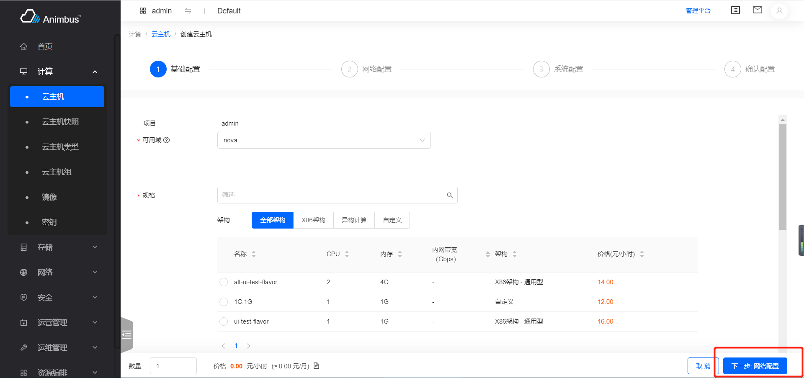

- `clickStepActionCancelButton`
  - Click the cancel button of the step-by-step form
  - Take image create instance `test/e2e/integration/pages/compute/image.spec.js`as example
    - Only verify that you can successfully enter the create instancepage, and then click the cancel button to complete the use case

    ```javascript
    it('successfully create instance with cancel', () => {
      cy.tableSearchText(name)
        .clickActionInMore('Create Instance')
        .wait(2000)
        .clickStepActionCancelButton();
    });
    ```

## Operations on form

Looking at the structure and style of the elements through the page, I found that all form items have an id, And corresponding to the `name` property of the form configuration `formItem` written during development, the `name` can also be obtained directly by viewing the `id` of the element in the page, as shown in the following figure, after the `form-item-col-` The content is `name`


- `formInput`
  - Input content of form items with `input` input box
  - Parameter `formItemName`, which is the `name` value of `formItem` in the development code
  - Parameter `value`，enter value
  - Take instance use case`test/e2e/integration/pages/compute/instance.spec.js` as an Example

    ```javascript
    it('successfully edit', () => {
      cy.tableSearchText(name)
        .clickActionInMore('Edit')
        .formInput('name', newname)
        .clickModalActionSubmitButton()
        .wait(2000);
    });
    ```

    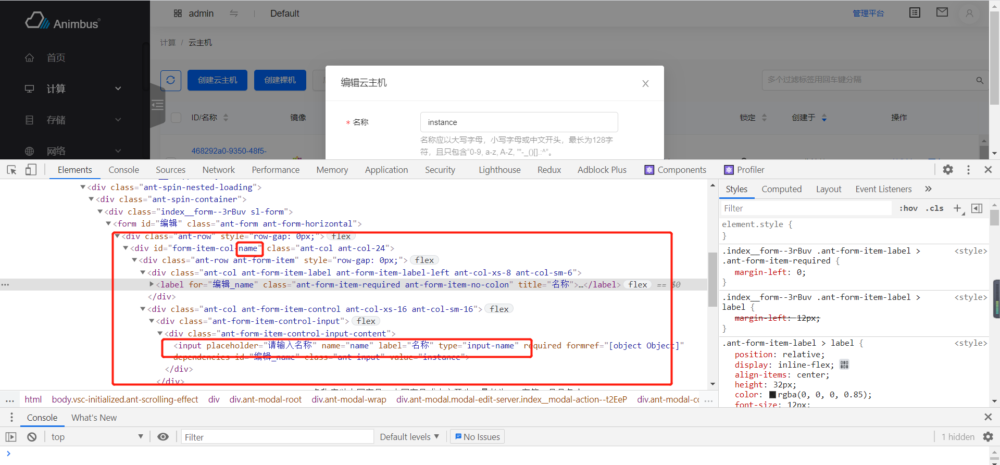

- `formJsonInput`
  - The form with the `textarea` input box enters the `json` format content
  - Parameter `formItemName`, which is the `name` value of `formItem` in the development code
  - Parameter `content`, the input object
  - Take create stack and write the parameter `test/e2e/integration/pages/heat/stack.spec.js` of type `json` as an example

    ```javascript
    it('successfully create', () => {
      const volumeJson = {
        name: volumeName,
      };
      cy.clickHeaderActionButton(0, 2000)
        .formAttachFile('content', contentFile)
        .formAttachFile('params', paramFile)
        .clickStepActionNextButton()
        .wait(2000)
        .formInput('name', name)
        .formJsonInput('volume_name_spec', volumeJson)
        .clickStepActionNextButton()
        .waitFormLoading()
        .wait(5000)
        .tableSearchSelectText('Name', name)
        .waitStatusActiveByRefresh();
    });
    ```

    

- `formCheckboxClick`
  - check `checkbox` in form
  - Parameter `formItemName`, which is the `name` value of `formItem` in the development code
  - Parameter `index`, default `0`
  - Take instance resize `test/e2e/integration/pages/compute/instance.spec.js` as an example

    ```javascript
    it('successfully resize', () => {
      cy.tableSearchText(name)
        .clickActionInMoreSub('Resize', 'Configuration Update')
        .wait(5000)
        .formTableSelect('newFlavor')
        .formCheckboxClick('option')
        .clickModalActionSubmitButton()
        .waitStatusActiveByRefresh();
    });
    ```

    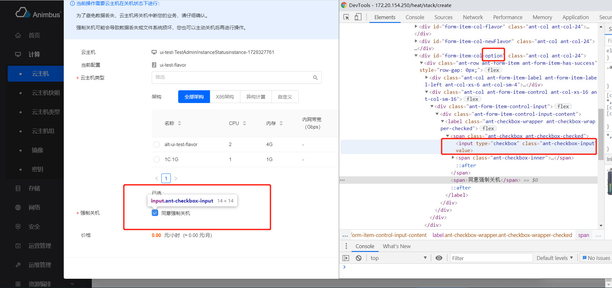

- `formTableSelectAll`
  - Click Select all checkbox of the selection type form select all item
  - Parameter `formItemName`, which is the `name` value of `formItem` in the development code
  - Take cloud hard disk type modification to access `test/e2e/integration/pages/storage/volume-type.spec.js` as an example

    ```javascript
    it('successfully manage access to projects', () => {
      cy.tableSearchText(name)
        .clickActionInMore('Manage Access')
        .formCheckboxClick('isPublic')
        .formTableSelectAll('access')
        .clickModalActionSubmitButton();
    });
    ```

    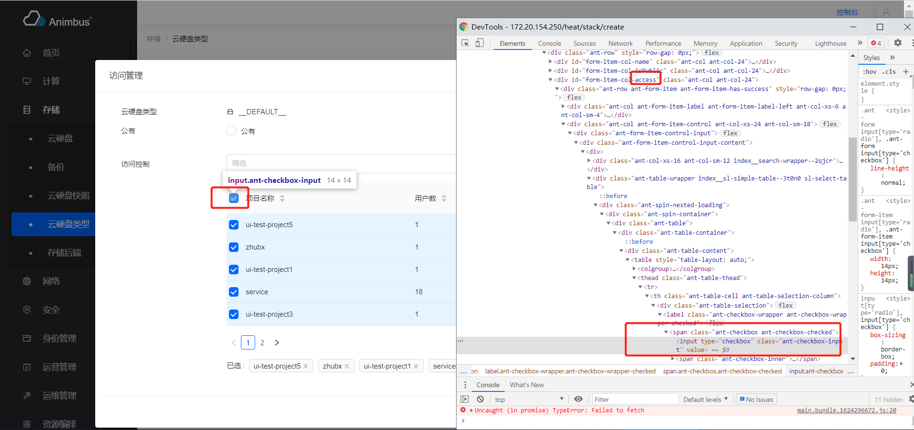

- `formTableNotSelectAll`
  - Click Select all checkbox of the selection type form cancel select all item
  - Parameter `formItemName`, which is the `name` value of `formItem` in the development code
  - Take the Host Aggregates management instance without selecting the instance as an example: `test/e2e/integration/pages/compute/aggregate.spec.js`

    ```javascript
    it('successfully manage host: no host', () => {
      cy.tableSearchText(newname)
        .clickActionInMore('Manage Host')
        .formTableNotSelectAll('hosts')
        .clickModalActionSubmitButton();
    });
    ```

    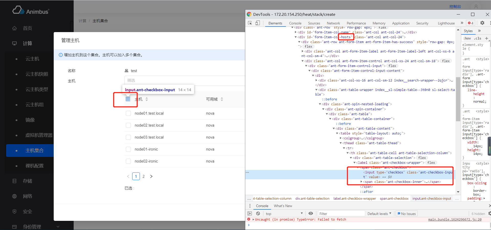

- `formTableSelect`
  - Click checkbox of the selection type form
  - Parameter `formItemName`, which is the `name` value of `formItem` in the development code
  - Parameter `value`, if you set `value`, select the entry in the table that contains the value, if you don’t set `value`, select the first entry in the table
  - Take instance attach interface select network`test/e2e/integration/pages/compute/instance.spec.js`as an example

    ```javascript
    it('successfully attach interface', () => {
      cy.tableSearchText(name)
        .clickActionInMoreSub('Attach Interface', 'Related Resources')
        .wait(5000)
        .formTableSelect('network')
        .clickModalActionSubmitButton();
    });
    ```

    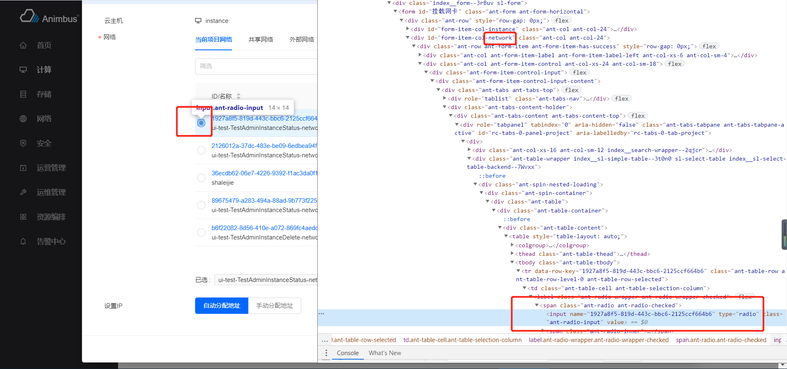

- `formTableSelectBySearch`
  - For the selection type form, first to search operation, and then select the first item in the table
  - Parameter `formItemName`, which is the `name` value of `formItem` in the development code
  - Parameter `value`, search content, generally a search for `name` in the search term
  - Parameter `waitTime`, wait time after searching, default wait 2 seconds
  - Take instance attach volume select volume `test/e2e/integration/pages/compute/instance.spec.js` as an example

    - After the operation is successful, enter the Volume list page to check the status of the volume as "used"

    ```javascript
    it('successfully attach volume', () => {
      // prepare volume
      cy.visitPage(listUrl)
        .tableSearchText(name)
        .clickActionInMoreSub('Attach Volume', 'Related Resources')
        .wait(5000)
        .formTableSelectBySearch('volume', volumeName)
        .clickModalActionSubmitButton()
        .wait(5000);

      // check attach successful
      cy.tableSearchText(name)
        .goToDetail()
        .clickDetailTab('Volumes')
        .tableSearchText(volumeName)
        .checkColumnValue(2, 'In-use');
    });
    ```

    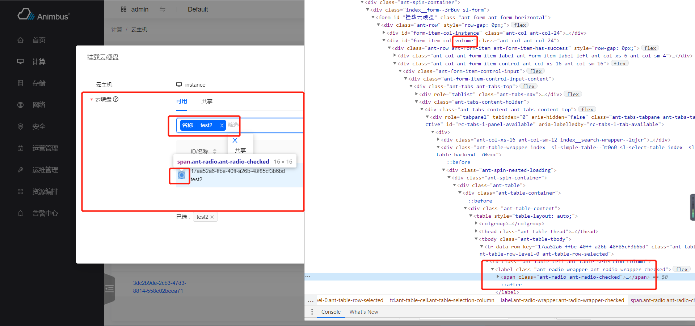

- `formTableSelectBySearchOption`
  - For the selection type form, first to search operation, and then select the first item in the table
  - Search is the selection of search item, which is different from `formTableSelectBySearch` which is based on input
  - Parameter `formItemName`, which is the `name` value of `formItem` in the development code
  - Parameter `name`， Search options name
  - Parameter `value`Search options value
  - Parameter `waitTime`，wait time after searching, default wait 2 seconds
  - Take create full backup `test/e2e/integration/pages/storage/backup.spec.js` as an example
    - Select Volume that status is in used

    ```javascript
    it('successfully create full backup', () => {
      cy.clickHeaderActionButton(0, 5000)
        .formInput('name', name)
        .formTableSelectBySearch('volume', volumeName)
        .clickModalActionSubmitButton()
        .wait(5000)
        .waitTableLoading();

      cy.clickHeaderActionButton(0, 5000)
        .formInput('name', nameIns)
        .formTableSelectBySearchOption('volume', 'Status', 'In-use')
        .clickModalActionSubmitButton();

      cy.wait(30000);
    });
    ```

    

- `formSelect`
  - Operations on form items of selector type
  - Parameter `formItemName`, which is the `name` value of `formItem` in the development code
  - Parameter `label`, the selected content, if not set, select the first option, if set, select the option corresponding to `label`
  - Take create instance group select policy `test/e2e/integration/pages/compute/server-group.spec.js`as an example

    ```javascript
    it('successfully create', () => {
      cy.clickHeaderActionButton(0)
        .formInput('name', name)
        .formSelect('policy')
        .clickModalActionSubmitButton();
    });
    ```

    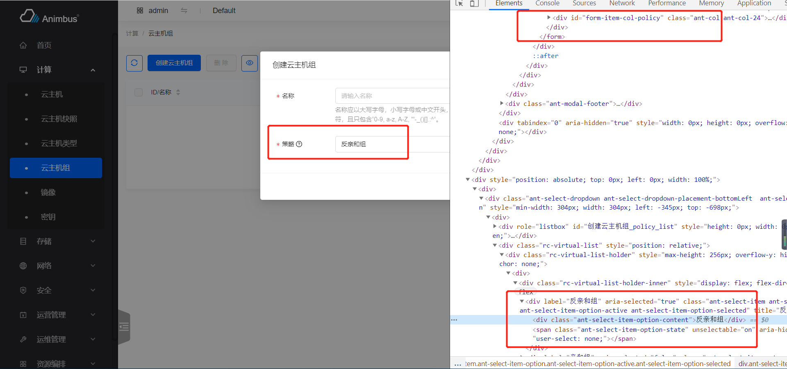

  - Take the network QoS policy to create the bandwidth limit rule and set the direction to "inbound" as an example: `test/e2e/integration/pages/network/qos-policy.spec.js`

    ```javascript
    it('successfully create bandwidth ingress limit rule', () => {
      cy.tableSearchText(name)
        .clickActionInMore('Create Bandwidth Limit Rule')
        .formSelect('direction', 'ingress')
        .clickModalActionSubmitButton();
    });
    ```

    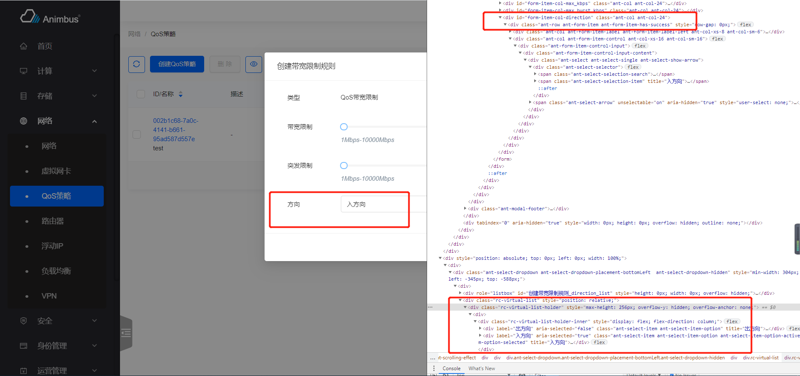

- `formRadioChoose`
  - Operations on form items of radio type
  - Parameter `formItemName`, which is the `name` value of `formItem` in the development code
  - Parameter `itemIndex`, which item is selected, the default is 0, that is, the first item is selected
  - Take create a key, select "import key" `test/e2e/integration/pages/compute/keypair.spec.js` as an example

    ```javascript
    it('successfully create by file', () => {
      cy.clickHeaderActionButton(0)
        .formRadioChoose('type', 1)
        .formInput('name', nameByFile)
        .formAttachFile('public_key', filename)
        .clickModalActionSubmitButton()
        .tableSearchText(nameByFile)
        .checkTableFirstRow(nameByFile);
    });
    ```

    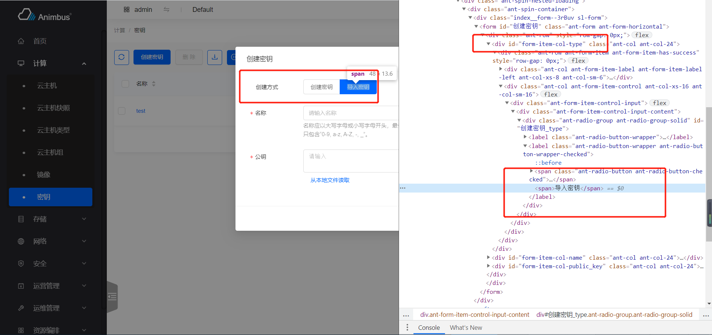

- `formAttachFile`
  - Operations on form items of AttachFile type
  - Parameter `formItemName`, which is the `name` value of `formItem` in the development code
  - The parameter `filename`, the name of the uploaded file, the file needs to be saved in the `test/e2e/fixtures` directory in advance
  - Take the creation of a key selection file as an example as an example: `test/e2e/integration/pages/compute/keypair.spec.js`

    ```javascript
    it('successfully create by file', () => {
      cy.clickHeaderActionButton(0)
        .formRadioChoose('type', 1)
        .formInput('name', nameByFile)
        .formAttachFile('public_key', filename)
        .clickModalActionSubmitButton()
        .tableSearchText(nameByFile)
        .checkTableFirstRow(nameByFile);
    });
    ```

    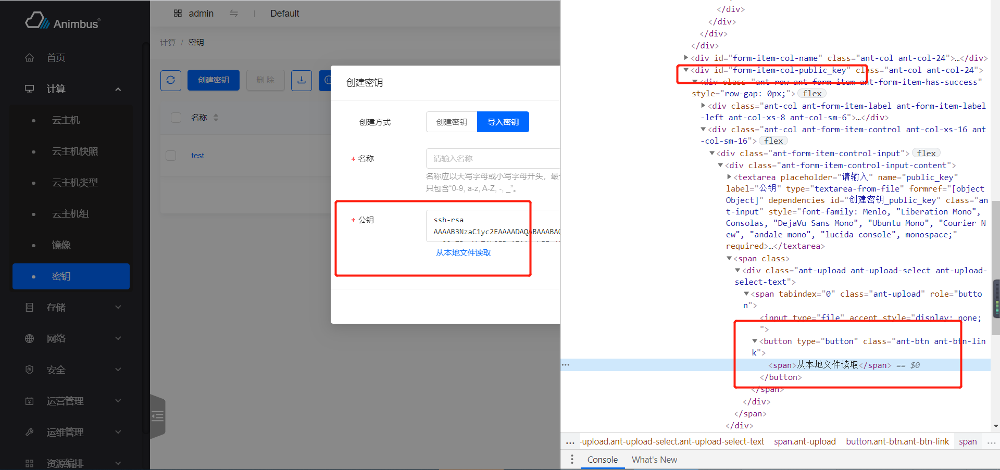

  - Take create image select file `test/e2e/integration/pages/compute/image.spec.js` as an example

    ```javascript
    it('successfully create', () => {
      cy.clickHeaderActionButton(0)
        .url()
        .should('include', `${listUrl}/create`)
        .formInput('name', name)
        .formAttachFile('file', filename)
        .formSelect('disk_format', 'QCOW2 - QEMU Emulator')
        .formSelect('os_distro', 'Others')
        .formInput('os_version', 'cirros-0.4.0-x86_64')
        .formInput('os_admin_user', 'root')
        .formSelect('usage_type', 'Common Server')
        .formText('description', name)
        .clickFormActionSubmitButton()
        .wait(2000)
        .url()
        .should('include', listUrl)
        .tableSearchText(name)
        .waitStatusActiveByRefresh();
    });
    ```

    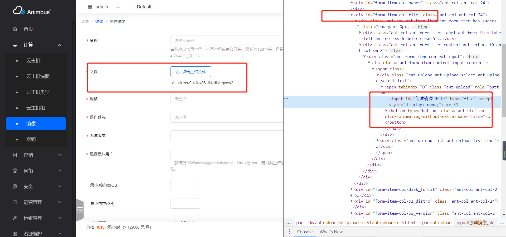

- `formAddSelectAdd`
  - Operations on form item of AddSelect type
  - Parameter `formItemName`, which is the `name` value of `formItem` in the development code
  - Take the Host Aggregates management metadata add custom metadata as an example: `test/e2e/integration/pages/compute/aggregate.spec.js`

    ```javascript
    it('successfully manage metadata', () => {
      cy.tableSearchText(name)
        .clickActionInMore('Manage Metadata')
        .wait(5000)
        .formAddSelectAdd('customs')
        .formInputKeyValue('customs', 'key', 'value')
        .formTransferLeftCheck('systems', 0)
        .clickModalActionSubmitButton();
    });
    ```

    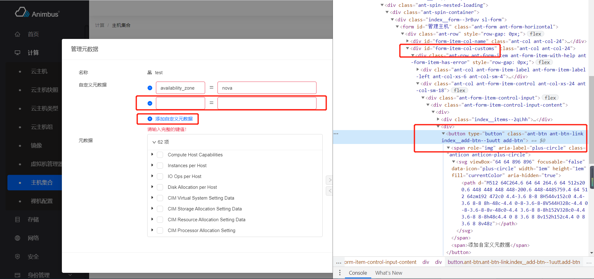

- `formSwitch`
  - Operations on form item of swith type
  - Parameter `formItemName`, which is the `name` value of `formItem` in the development code
  - Take the example of creating a network QoS policy `test/e2e/integration/pages/network/qos-policy.spec.js` with shared attributes

    ```javascript
    it('successfully create', () => {
      cy.clickHeaderActionButton(0)
        .wait(2000)
        .formInput('name', name)
        .formText('description', name)
        .formSwitch('shared')
        .clickModalActionSubmitButton();
    });
    ```

    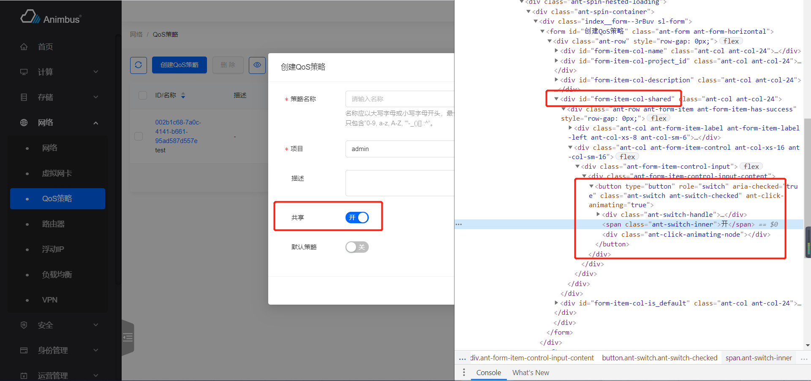

- `formButtonClick`
  - Click button on form
  - Parameter `formItemName`, which is the `name` value of `formItem` in the development code
  - Take the example of expanding/closing the "advanced option" `test/e2e/integration/pages/identity/project.spec.js` when the project update quota

    ```javascript
    it('successfully edit quota', () => {
      cy.tableSearchText(name)
        .clickActionInMore('Edit Quota')
        .formInput('instances', 11)
        .formButtonClick('more')
        .wait(2000)
        .formButtonClick('more')
        .clickModalActionSubmitButton();
    });
    ```

    

    

- `formTransfer`
  - Operation on form item of transfer type
    1. Specify the items to be selected based on the search display in the transfer on the left
    2. Select the first item
    3. Click the direction button in the middle of the transfer to make the selected content enter the transfer on the right
  - Parameter `formItemName`, which is the `name` value of `formItem` in the development code
  - Parameter `value`, search content
  - Take peoject management user `test/e2e/integration/pages/identity/project.spec.js`as an example

    ```javascript
    it('successfully manage user', () => {
      cy.tableSearchText(name)
        .clickActionInMore('Manage User')
        .formTransfer('select_user', username)
        .formTransferRight('select_user', username)
        .formSelect('select_user', 'admin')
        .clickModalActionSubmitButton();
    });
    ```

    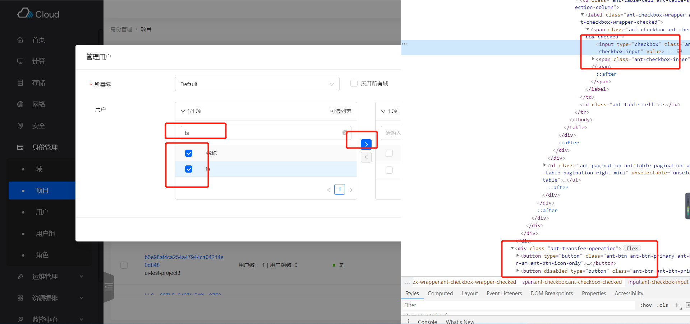

- `formTransferRight`
  - Specify the items to be selected based on the search display in the transfer on the right对右侧的穿梭框基于搜索展示指定待选条目
  - Parameter `formItemName`, which is the `name` value of `formItem` in the development code
  - Parameter `value`, search content
  - Take the user group management user as an example: `test/e2e/integration/pages/identity/user-group.spec.js`

    ```javascript
    it('successfully manage user', () => {
      cy.tableSearchText(name)
        .clickActionInMore('Manage User')
        .formTransfer('select_user', username)
        .formTransferRight('select_user', username)
        .clickModalActionSubmitButton();

      cy.tableSearchText(name)
        .goToDetail()
        .clickDetailTab('Sub Users', 'userGroup');
    });
    ```

    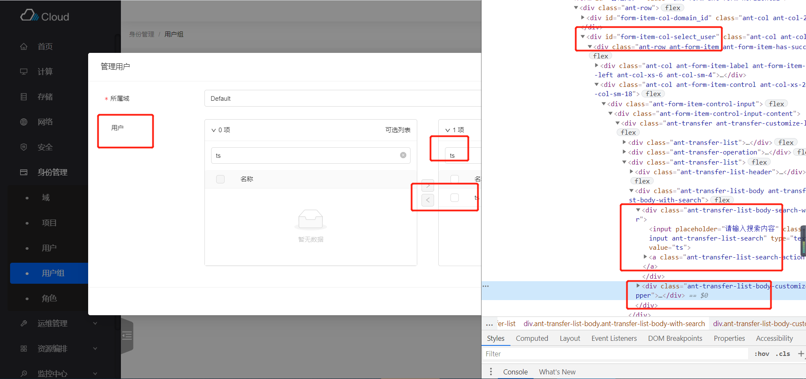

- `formTabClick`
  - Click tab in the form item with tab
  - Parameter `formItemName`, which is the `name` value of `formItem` in the development code
  - The parameter `index`, the subscript of the specified Tab
  - Take the example of editing the floating IP and switching to the sharing strategy `test/e2e/integration/pages/network/floatingip.spec.js`

    ```javascript
    it('successfully edit', () => {
      cy.clickFirstActionButton()
        .formText('description', 'description')
        .formTabClick('qos_policy_id', 1)
        .wait(5000)
        .formTableSelectBySearch('qos_policy_id', policyName)
        .clickModalActionSubmitButton()
        .wait(2000);
    });
    ```

    

- `formInputKeyValue`
  - Input operations on the form items of the `KeyValue` component, generally used in conjunction with `formAddSelectAdd`, and enter the content of the item of the added new `KeyValue` component
  - Parameter `formItemName`, which is the `name` value of `formItem` in the development code
  - Parameter `key`, the content of input on the left
  - Parameter `value`, the content of input on the right
  - Take the Host Aggregates management metadata add custom metadata as an example: `test/e2e/integration/pages/compute/aggregate.spec.js`

    ```javascript
    it('successfully manage metadata', () => {
      cy.tableSearchText(name)
        .clickActionInMore('Manage Metadata')
        .wait(5000)
        .formAddSelectAdd('customs')
        .formInputKeyValue('customs', 'key', 'value')
        .formTransferLeftCheck('systems', 0)
        .clickModalActionSubmitButton();
    });
    ```

    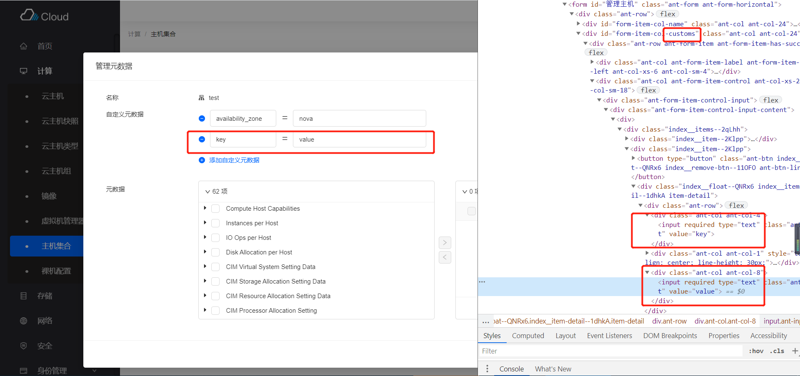

- `formTransferLeftCheck`
  - Operation of the transfer on the left
    1. Select the specified item in the transfer on the left
    2. Click the direction button in the middle of the transfer to make the selected content enter the transfer on the right
  - Parameter `formItemName`, which is the `name` value of `formItem` in the development code
  - Parameter `index`, the index of the node
  - Take the Host Aggregates management metadata add custom metadata as an example: `test/e2e/integration/pages/compute/aggregate.spec.js`

    ```javascript
    it('successfully manage metadata', () => {
      cy.tableSearchText(name)
        .clickActionInMore('Manage Metadata')
        .wait(5000)
        .formAddSelectAdd('customs')
        .formInputKeyValue('customs', 'key', 'value')
        .formTransferLeftCheck('systems', 0)
        .clickModalActionSubmitButton();
    });
    ```

    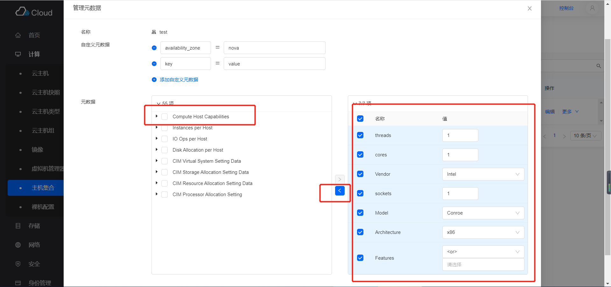

- `formTransferRightCheck`
  - Operation of the transfer on the right
    1. Select the specified item in the transfer on the right
    2. Click the direction button in the middle of the transfer to make the selected content enter the transfer on the left
  - Parameter `formItemName`, which is the `name` value of `formItem` in the development code
  - Parameter `index`, the index of the transfer table item
  - Take instance type modify the metadata `test/e2e/integration/pages/compute/flavor.spec.js` as an example

    ```javascript
    it('successfully manage metadata', () => {
      cy.clickTab('Custom')
        .tableSearchText(customName)
        .clickActionButtonByTitle('Manage Metadata')
        .wait(5000)
        .formTransferLeftCheck('systems', 0)
        .clickModalActionSubmitButton();

      // todo: remove key-value metadata
      cy.clickTab('Custom')
        .tableSearchText(customName)
        .clickActionButtonByTitle('Manage Metadata')
        .wait(5000)
        .formTransferRightCheck('systems', 0)
        .clickModalActionSubmitButton();
    });
    ```

    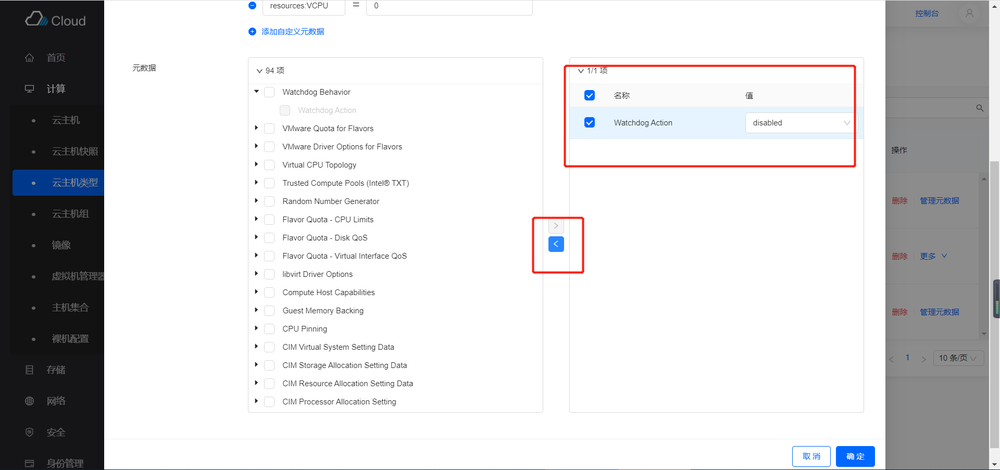

For various operations of resource operations, the functions introduced above are mainly used. For the specific compilation of functions, please see`test/e2e/support/form-commands.js`
