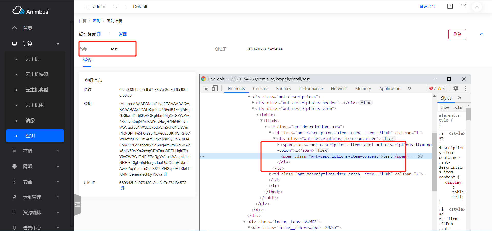
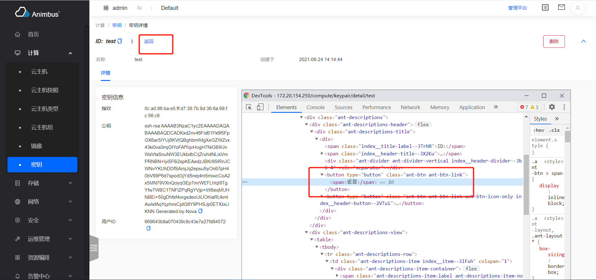
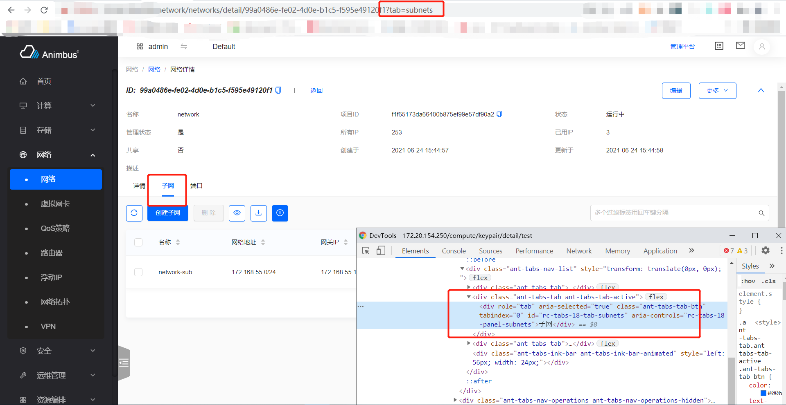

English | [简体中文](../../zh/test/3-3-E2E-detail-operation.md)

Because of the consistency of the front-end framework, we often find that there is a strong regularity when we write related use cases for detailed operations, select elements and perform operations, so we have written corresponding Cypress functions for most detailed operations. It greatly reduces the difficulty of writing test cases. The following will give a detailed description of the main table operation functions.

- `checkDetailName`
  - Verify that the header of the detail page contains the specified resource name
  - Parameter `name`, resource name
  - Take viewing key detail as an example: `test/e2e/integration/pages/compute/keypair.spec.js`

    ```javascript
    it('successfully detail', () => {
        cy.tableSearchText(name)
        .checkTableFirstRow(name)
        .goToDetail()
        .checkDetailName(name);
        cy.goBackToList(listUrl);
    });
    ```

    

- `goBackToList`
  - Click the `Back` button on the detail page to enter the list page and wait for the list to load
  - Parameter `url`, list url
    - If set, it will verify whether the returned list route meets expectations
  - Take viewing key detail as an example: `test/e2e/integration/pages/compute/keypair.spec.js`
    1. Search
    2. Verify that the first row of the form contains the specified name
    3. Enter the detail page
    4. Verify the name of the detail page
    5. Return to the list page

    ```javascript
    it('successfully detail', () => {
        cy.tableSearchText(name)
        .checkTableFirstRow(name)
        .goToDetail()
        .checkDetailName(name);
        cy.goBackToList(listUrl);
    });
    ```

    

- `goBackToList`
  - Click the `Back` button on the detail page to enter the list page and wait for the list to load
  - Parameter `url`, list url
    - If set, it will verify whether the returned list route meets expectations
  - Take viewing key detail as an example: `test/e2e/integration/pages/compute/keypair.spec.js`
    1. Search
    2. Verify that the first row of the form contains the specified name
    3. Enter the detail page
    4. Verify the name of the detail page
    5. Return to the list page

    ```javascript
    it('successfully detail', () => {
        cy.tableSearchText(name)
        .checkTableFirstRow(name)
        .goToDetail()
        .checkDetailName(name);
        cy.goBackToList(listUrl);
    });
    ```

    

- `clickDetailTab`
  - Click the designated Tab tab at the bottom of the details page and wait for the relevant resource list to load
  - Parameter `label`, the specified Tab label
  - Parameter `urlTab`, the tab attribute in the route
    - If set, it will verify whether the tab attribute in the route is as expected after switching the label
  - Parameter `waitTime`, the waiting time after switching labels
  - Take viewing network details as an example: `test/e2e/integration/pages/network/network.spec.js`
    1. Search
    2. Verify that the first row of the form contains the specified name
    3. Enter the details page
    4. Verify the name of the details page
    5. Click the subnet Tab and wait for the list to load
    6. Click the port Tab, and wait for the list to load
    5. Return to the list page

    ```javascript
    it('successfully detail', () => {
      cy.tableSearchText(name)
        .checkTableFirstRow(name)
        .goToDetail()
        .checkDetailName(name);
      cy.clickDetailTab('Subnets', 'subnets').clickDetailTab('Ports', 'ports');
      cy.goBackToList(listUrl);
    });
    ```

    

For the details page, the functions introduced above are mainly used. For the specific writing of the functions, please see`test/e2e/support/detail-commands.js`