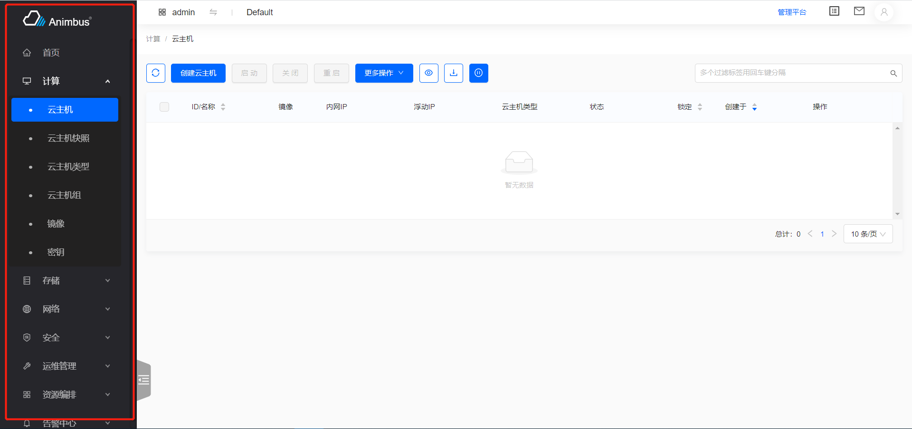
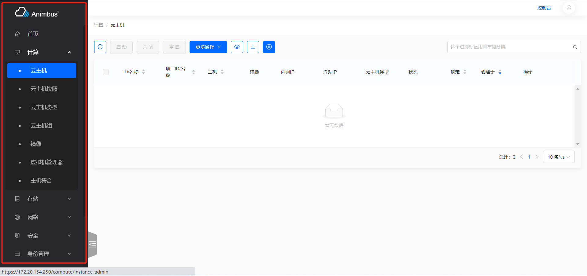

简体中文 | [English](../../en/develop/3-12-Menu-introduction.md)

# 用途

- 点击后直接跳转到相应页面
- 配置控制台的左侧菜单项

  

- 配置管理平台的左侧菜单项

  

- 支持一级菜单带图标
- 支持二级菜单展开
- 支持路由变更后菜单选中项自动切换
- 支持右侧内容中面包屑的自动处理

# 代码位置

- 控制台的菜单配置`src/layouts/menu.jsx`
- 管理平台的菜单配置`src/layouts/admin-menu.jsx`

# 如何使用

- 控制台与管理平台的菜单配置，采用相同的配置结构
- 返回一个 renderMenu 函数，函数返回一个配置数组

## 一级菜单的配置

- `path`
  - 一级菜单对应的路由
- `name`
  - 一级菜单对应的名称
  - 菜单项中显示的名称
  - 面包屑中一级菜单对应的名称
- `key`
  - 一级菜单对应的 ID 值
  - 要求具有唯一性
- `icon`
  - 一级菜单对应的图标
  - 菜单完全展开时，显示图标与名称
  - 菜单折叠时，只显示图标
- `hasBreadcrumb`
  - 页面是否展示面包屑
  - 默认展示面包屑
  - 以首页为例，`hasBreadcrumb: false`
- `hasChildren`
  - 一级菜单是否含有子菜单
  - 默认值为`true`
  - 一级菜单可以不包含二级菜单，以`首页`为例

  ```javascript
  {
    path: '/base/overview',
    name: t('Home'),
    key: '/home',
    icon: <HomeOutlined />,
    hasBreadcrumb: false,
    hasChildren: false,
  }
  ```

  - 一级菜单默认包含二级菜单，以`计算`为例

    ```javascript
    {
        path: '/compute',
        name: t('Compute'),
        key: '/compute',
        icon: <DesktopOutlined />,
        children: [...]
      }
    ```

## 二级菜单的配置

- 二级菜单配置在一级菜单的`children`中
- 详情页、创建页面等不需要展示在菜单项中的页面，配置在二级菜单的`children`中
- 以云主机类型为例

  ```javascript
  {
      path: '/compute/flavor',
      name: t('Flavor'),
      key: '/compute/flavor',
      level: 1,
      children: [
        {
          path: /^\/compute\/flavor\/detail\/.[^/]+$/,
          name: t('Flavor Detail'),
          key: 'flavor-detail',
          level: 2,
        },
      ],
    },
  ```

- `path`
  - 菜单对应的路由
- `name`
  - 菜单对应的名称
  - 菜单项中显示的名称
  - 面包屑中菜单对应的名称
- `key`
  - 菜单对应的 ID 值
  - 要求具有唯一性
- `level`
  - 二级菜单的`level=1`
  - 二级菜单的`children`中的菜单配置`level=2`
