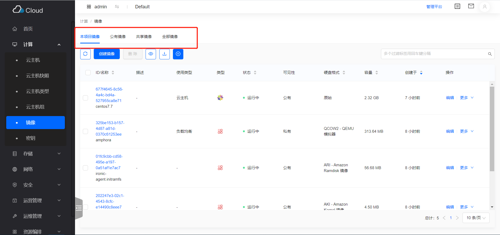

简体中文 | [English](../../en/develop/3-2-BaseTabList-introduction.md)

# 用途

- 各可切换列表页的基类

  

- 支持切换时自动处理数据展示

# BaseTabList 代码文件

- `src/containers/TabList/index.jsx`

# BaseTabList 属性与函数定义介绍

- 带有 Tab 切换的资源列表继承于 BaseTabList
- 只需要复写部分函数即可完成页面的开发
- 属性与函数分为以下四种，
  - 需要复写的属性与函数，主要包含：
    - 页面内的`Tab`配置
  - 按需复写的函数与属性，主要包含：
    - 页面内的权限配置
  - 无需复写的函数与属性，主要包含：
    - 当前页是否是管理平台页面
  - 基类中的基础函数，主要包含：
    - 渲染页面
    - 处理切换 Tab 时的路由变动
  - 更详细与全面的介绍见下

## 需要复写的属性与函数

- `tabs`:
  - 需要复写该函数
  - 用于配置页面内的 Tab
  - 每个 Tab 的配置项：
    - `title`，Tab 标签上的标题
    - `key`，每个 Tab 的唯一标识
    - `component`，每个 Tab 对应的组件，基本都是继承于`BaseList`的资源列表组件
  - 返回 Tab 配置的列表
  - 页面默认显示 Tab 列表中的第一个`component`
  - 以镜像`src/pages/compute/containers/Image/index.jsx`为例

    ```javascript
    get tabs() {
      const tabs = [
        {
          title: t('Current Project Image'),
          key: 'project',
          component: Image,
        },
        {
          title: t('Public Image'),
          key: 'public',
          component: Image,
        },
        {
          title: t('Shared Image'),
          key: 'shared',
          component: Image,
        },
      ];
      if (this.hasAdminRole) {
        tabs.push({
          title: t('All Image'),
          key: 'all',
          component: Image,
        });
      }
      return tabs;
    }
    ```

## 按需复写的属性与函数

- 以下涉及到的属性与函数，一般均不需要配置
  - 目前只在 VPN 页面(`src/pages/network/containers/VPN/index.jsx`)使用，该页面使用这些配置判定权限，以及判定失败时展示使用
- `name`
  - 整个 Tab 页面的全称
  - 以 VPN `src/pages/network/containers/VPN/index.jsx`为例

    ```javascript
    get name() {
      return t('VPN');
    }
    ```

- `checkEndpoint`
  - 是否需要验证该页面对应服务的 endpoint
  - 默认值是`false`
  - 以 VPN `src/pages/network/containers/VPN/index.jsx`为例

    ```javascript
    get checkEndpoint() {
      return true;
    }
    ```

- `endpoint`
  - 该页面对应服务的 endpoint
  - 仅在`checkEndpoint=true`时有用
  - 以 VPN `src/pages/network/containers/VPN/index.jsx`为例

    ```javascript
    get endpoint() {
      return vpnEndpoint();
    }
    ```

## 不需要复写的属性与函数
- `location`
  - 页面的路由信息
- `isAdminPage`
  - 当前页面是否是“管理平台”的页面
- `hasAdminRole`
  - 登录的用户角色是否具有管理员角色
- `getRoutePath`
  - 生成页面 Url 的函数
  - 如：需要给列表页的关联资源提供跳转功能，使用该函数，可以在控制台跳转到控制台的相应地址，在管理平台跳转到管理平台的相应地址

## 基类中的基础函数

- 建议查看代码理解，`src/containers/TabList/index.jsx`
