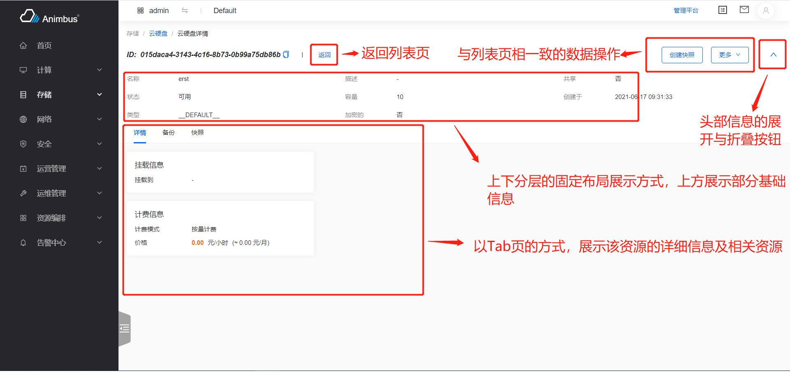

简体中文 | [English](../../en/develop/3-3-BaseDetail-introduction.md)

# 用途



- 各资源详情页的基类
- 支持返回列表页
- 支持与列表页一致的数据操作
- 支持详情页头部的展示与折叠
- 支持基于 Tab 形式展示的基本信息与相关资源信息
- 支持上下分层的展示方案
- 需要复写部分函数即可完成页面的开发

# BaseDetail 代码文件

- `src/containers/TabDetail/index.jsx`

# BaseDetail 属性与函数定义介绍

- 资源详情继承于 BaseDetail 组件
- 代码位置：`pages/xxxx/containers/XXXX/Detail/index.jsx`
- 只需要复写部分函数即可完成页面的开发
- 属性与函数分为以下四种，
  - 通常需要复写的属性与函数，主要包含：
    - 详情页的权限
    - 详情页的资源名称
    - 详情页对应的列表页
    - 详情页的操作配置
    - 详情页的上方信息配置
    - 详情页的下方 Tab 页面配置
    - 详情页对应的`store`
  - 按需复写的函数与属性，主要包含：
    - 详情页操作对应的数据
    - 获取详情数据的参数
    - 获取详情数据的函数
  - 无需复写的函数与属性，主要包含：
    - 当前页是否是管理平台页面
  - 基类中的基础函数，主要包含：
    - 渲染页面
    - 下方列表页数据变动时详情数据的自动刷新
    - 折叠/展开头部信息
  - 更详细与全面的介绍见下

## 通常需要复写的属性与函数

- `policy`:
  - 必须复写该函数 (此处填写符合openstack规范的policy)
  - 页面对应的权限，如果权限验证不通过，则无法请求数据。
  - 以云硬盘`src/pages/storage/containers/Volume/Detail/index.jsx`为例

    ```javascript
    get policy() {
      return 'volume:get';
    }
    ```

- `aliasPolicy`:
  - 可以复写该函数 (此处填写带模块前缀的自定义policy)
  - 页面对应的权限，如果权限验证不通过，则无法请求数据。
  - 以云硬盘`src/pages/storage/containers/Volume/Detail/index.jsx`为例

    ```javascript
    get aliasPolicy() {
      return 'cinder:volume:get';
    }
    ```

- `name`
  - 必须复写该函数
  - 页面资源对应的名称。
  - 以云硬盘`src/pages/storage/containers/Volume/Detail/index.jsx`为例

    ```javascript
    get name() {
      return t('volume');
    }
    ```

- `listUrl`
  - 该详情页对应的资源列表页
  - 以云硬盘`src/pages/storage/containers/Volume/Detail/index.jsx`为例

    ```javascript
    get listUrl() {
      return this.getRoutePath('volume');
    }
    ```

- `actionConfigs`
  - 配置资源的各种操作
    - 对数据的操作
    - 配置定义在资源的 actions 目录下
    - 一般直接使用与资源列表页相一致的配置即可
    - 以密钥`src/pages/compute/containers/Keypair/Detail/index.jsx`为例

      ```javascript
      import actionConfigs from '../actions';
      get actionConfigs() {
        return actionConfigs;
      }
      ```

- `detailInfos`
  - 详情页上方的信息
  - 是一个配置列表
  - 每个配置
    - `title`，必须项，标题
    - `dataIndex`，必须项，对应于数据的 Key
    - `render`，可选项，默认是基于`dataIndex`来展示内容，使用该属性，可基于`render`的结果渲染表格内容
    - `valueRender`，可选项，基于`dataIndex`及`valueRender`生成展示数据
      - `sinceTime`，处理时间，显示成"XX 小时前"
      - `keepTime`，显示剩余时间
      - `yesNo`，处理`Boolean`值，显示成“是”、“否”
      - `GBValue`，处理大小，显示成"XXXGB"
      - `noValue`，没有值时，显示成“-”
      - `bytes`，处理大小
      - `uppercase`，大写
      - `formatSize`，处理大小，显示如“2.32 GB”，“56.68 MB”
      - `toLocalTime`，处理时间，显示如“2021-06-17 04:13:07”
      - `toLocalTimeMoment`，处理时间，显示如“2021-06-17 04:13:07”
  - 以云硬盘`src/pages/storage/containers/Volume/Detail/index.jsx`为例

    ```javascript
    get detailInfos() {
      return [
        {
            title: t('Name'),
            dataIndex: 'name',
        },
        {
            title: t('Description'),
            dataIndex: 'description',
        },
        {
            title: t('Shared'),
            dataIndex: 'multiattach',
            valueRender: 'yesNo',
        },
        {
            title: t('Status'),
            dataIndex: 'status',
            render: (value) => volumeStatus[value] || value,
        },
        {
            title: t('Size'),
            dataIndex: 'size',
        },
        {
            title: t('Created At'),
            dataIndex: 'created_at',
            valueRender: 'toLocalTime',
        },
        {
            title: t('Type'),
            dataIndex: 'volume_type',
        },
        {
            title: t('Encrypted'),
            dataIndex: 'encrypted',
            valueRender: 'yesNo',
        },
      ];
    }
    ```

- `tabs`
  - 详情页下方的 Tab 配置
  - 每个 Tab 的配置项：
    - `title`，Tab 标签上的标题
    - `key`，每个 Tab 的唯一标识
    - `component`，每个 Tab 对应的组件，基本都是继承于`BaseList`的资源列表组件
  - 返回 Tab 配置的列表
  - 页面默认显示 Tab 列表中的第一个`component`
  - 通常，基础信息继承于`BaseDetail`类
  - 通常，详情页中的资源列表页直接复用资源列表即可，只需同步处理下列表页内的参数请求即可
    - 以云硬盘详情页中的备份列表`src/pages/storage/containers/Backup/index.jsx`为例

      ```javascript
      updateFetchParamsByPage = (params) => {
        if (this.inDetailPage) {
          const { id, ...rest } = params;
          return {
            volume_id: id,
            ...rest,
          };
        }
        return params;
      };
      ```

  - 以云硬盘`src/pages/storage/containers/Volume/Detail/index.jsx`为例

    ```javascript
    get tabs() {
      const tabs = [
      {
        title: t('Detail'),
        key: 'base',
        component: BaseDetail,
      },
      {
        title: t('Backup'),
        key: 'backup',
        component: Backup,
      },
      {
        title: t('Snapshot'),
        key: 'snapshot',
        component: Snapshot,
      },
      ];
      return tabs;
    }
    ```

- `init`
  - 配置 Store 的函数，在这个函数中配置用于处理数据请求的 Store
  - 一般使用的是`new XXXStore()`形式
  - 以云硬盘`src/pages/storage/containers/Volume/Detail/index.jsx`为例

    ```javascript
    init() {
      this.store = new VolumeStore();
    }
    ```

## 按需复写的属性与函数

- `fetchData`
  - 详情页中的获取数据的函数
  - 不建议重写该方法
  - 默认使用`this.store.fetchDetail`获取数据
- `updateFetchParams`
  - 更新数据请求的参数
  - 一般配合 store 中的`detailDidFetch`使用
  - 以云主机`src/pages/compute/containers/Instance/Detail/index.jsx`为例

    ```javascript
    updateFetchParams = (params) => ({
      ...params,
      isRecycleBinDetail: this.isRecycleBinDetail,
    });
    ```

## 不需要复写的属性与函数

- `params`
  - 路由带有的参数信息
  - 一般用于生成页面请求 API 时的参数
- `id`
  - 路由信息中的`id`
- `isAdminPage`
  - 当前页面是否是“管理平台”的页面
- `getRoutePath`
  - 生成页面 Url 的函数
  - 如：需要给关联资源提供跳转功能，使用该函数，可以在控制台跳转到控制台的相应地址，在管理平台跳转到管理平台的相应地址
- `routing`
  - 页面对应的路由信息
- `isLoading`
  - 当前页面是否在数据更新，更新时会显示 loading 样式
- `tab`
  - 当前展示的下方 Tab 页面信息
- `detailData`
  - 页面内展示的数据信息
  - 来源于`this.store.detail`

## 基类中的基础函数

- 建议查看代码理解，`src/containers/TabDetail/index.jsx`
