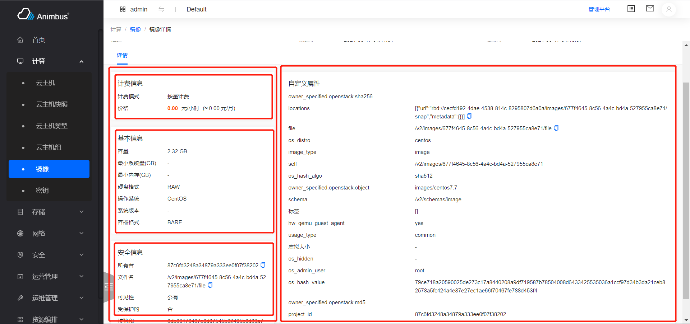

简体中文 | [English](../../en/develop/3-4-BaseDetailInfo-introduction.md)

# 用途



- 各资源详情页中详情 Tab 中组件的基类
- 左右结构展示
- 以 Card 的形式展示
- 以配置 Card 的方式即可完成页面内容的展示

# BaseDetailInfo 代码文件

- `src/containers/BaseDetail/index.jsx`

# BaseDetailInfo 属性与函数定义介绍

- 资源详情信息继承于 BaseDetailInfo
- 代码位置：`pages/xxxx/containers/XXXX/Detail/BaseDetail.jsx`
- 只需要复写部分函数即可完成页面的开发
- 属性与函数分为以下四种，
  - 通常需要复写的属性与函数，主要包含：
    - 左侧的 Card 列表
  - 按需复写的函数与属性，主要包含：
    - 右侧的 Card 列表
    - 获取数据的函数
    - 展示数据的来源
  - 无需复写的函数与属性，主要包含：
    - 当前页是否是管理平台页面
  - 基类中的基础函数，主要包含：
    - 渲染页面
  - 更详细与全面的介绍见下

## Card 的配置

- 页面中左侧、右侧的 Card 均采用相同的配置方式
- 每个 Card 的配置如下，
  - `title`，必须项，Card 的标题
  - `titleHelp`, 可选项，Card 的标题旁显示的提示信息
  - `render`，可选项，如果存在，则基于`render`渲染 Card 的内容
  - `options`，可选项，Card 中每行的配置列表，每个 option 配置如下，
    - `label`，必须项，行中的标签
    - `dataIndex`，必须项，对应于`this.detailData`中的 key，默认是基于`dataIndex`展示行内的数据
    - `render`，可选项，可基于`render`的结果渲染行内的内容
    - `valueRender`，可选项，基于`dataIndex`及`valueRender`生成行内的展示数据
      - `sinceTime`，处理时间，显示成"XX 小时前"
      - `keepTime`，显示剩余时间
      - `yesNo`，处理`Boolean`值，显示成“是”、“否”
      - `GBValue`，处理大小，显示成"XXXGB"
      - `noValue`，没有值时，显示成“-”
      - `bytes`，处理大小
      - `uppercase`，大写
      - `formatSize`，处理大小，显示如“2.32 GB”，“56.68 MB”
      - `toLocalTime`，处理时间，显示如“2021-06-17 04:13:07”
      - `toLocalTimeMoment`，处理时间，显示如“2021-06-17 04:13:07”
    - `copyable`，可选项，该行内的数据是否可复制，如可复制，会显示复制 icon
- 以密钥`src/pages/compute/containers/Keypair/Detail/BaseDetail.jsx`为例

  ```javascript
  get keypairInfoCard() {
    const options = [
    {
      label: t('Fingerprint'),
      dataIndex: 'fingerprint',
    },
    {
      label: t('Public Key'),
      dataIndex: 'public_key',
      copyable: true,
    },
    {
      label: t('User ID'),
      dataIndex: 'user_id',
    },
    ];
    return {
      title: t('Keypair Info'),
      options,
    };
  }
  ```

## 通常需要复写的属性与函数

- `leftCards`:
  - 必须复写该函数
  - 左侧展示的 Card 列表
  - 以镜像`src/pages/compute/containers/Image/Detail/BaseDetail.jsx`为例

    ```javascript
    get leftCards() {
      const cards = [this.baseInfoCard, this.securityCard];
      return this.isImageDetail ? cards : [this.InstanceCard, ...cards];
    }
    ```

- `init`
  - 配置 Store 的函数，在这个函数中配置用于处理数据请求的
    Store，如果配置了该函数，则会在展示该页面时发起数据请求，但是有时展示该页面时，并不需要额外请求，只需要使用`this.props.detail`即可
  - 一般使用的是`new XXXStore()`形式
  - 以镜像`src/pages/compute/containers/Image/Detail/BaseDetail.jsx`为例

    ```javascript
    init() {
      this.store = new ImageStore();
    }
    ```

## 按需复写的属性与函数

- `rightCards`
  - 右侧展示的 Card 列表
- `fetchData`
  - 获取 Card 数据的函数
  - 一般不需要复写该函数
- `detailData`
  - 页面 Card 的数据来源
  - 默认是`this.props.detail || toJS(this.store.detail)`
  - 一般不需要复写该函数
  - 以云硬盘的 Qos`src/pages/storage/containers/VolumeType/QosSpec/Detail/index.jsx`为例

    ```javascript
    get detailData() {
      return this.store.detail.qos_specs;
    }
    ```

## 不需要复写的属性与函数

- `id`
  - 路由信息中的`id`
- `isAdminPage`
  - 当前页面是否是“管理平台”的页面
- `getRoutePath`
  - 生成页面 Url 的函数
  - 如：需要给关联资源提供跳转功能，使用该函数，可以在控制台跳转到控制台的相应地址，在管理平台跳转到管理平台的相应地址
- `routing`
  - 页面对应的路由信息
- `isLoading`
  - 当前页面是否在数据更新，更新时会显示 loading 样式

## 基类中的基础函数

- 建议查看代码理解，`src/containers/BaseDetail/index.jsx`
