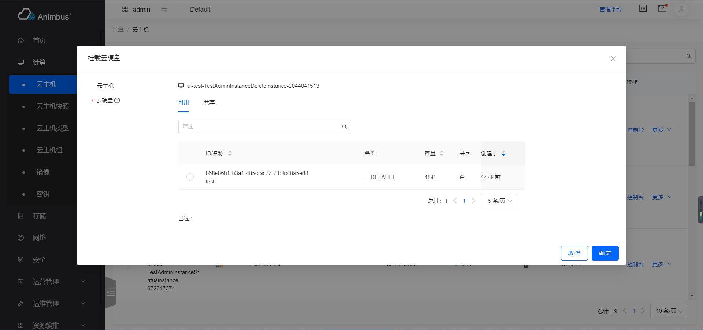

简体中文 | [English](../../en/develop/3-7-ModalAction-introduction.md)

# 用途



- 操作按钮点击后，弹窗显示表单
- 点击`确认`按钮后，会根据请求的发送情况，展示`loading`状态
- 点击`取消`按钮后，弹窗消失
- 如果请求发送成功，会在右上角展示操作成功的提示信息，该提示信息几秒后可自动消失
- 如果请求发送失败，会在表单页的右上角展示错误信息，该提示信息只有点击关闭按钮后才可消失
- 支持批量操作，在表格中选中多个条目后，可点击表格上方的操作按钮，进行批量操作

# ModalAction 代码文件

- `src/containers/Action/ModalAction/index.jsx`

# ModalAction 属性与函数定义介绍

- 弹窗型表单都继承于 ModalAction 组件
- 代码位置：`pages/xxxx/containers/XXXX/actions/xxx.jsx`
- 对于表单内容比较少的情况，通常是使用弹窗型的表单形式
- 只需要复写部分函数即可完成页面的开发
- 属性与函数分为以下四种，
  - 必须复写的属性与函数，主要包含：
    - 操作的 ID
    - 操作的标题
    - 操作对应的权限
    - 对是否禁用操作的判定
    - 表单项的配置
    - 发送请求的函数
  - 按需复写的函数与属性，主要包含：
    - 表单的默认值
    - 表单的尺寸
    - 表单中右侧标题与左侧表单主题的布局
    - 是否是异步操作
    - 资源的名称
    - 请求结果提示语中是否要展示资源名称
    - 操作按钮上的文字
  - 无需复写的函数与属性，主要包含：
    - 当前页是否是管理平台页面
  - 基类中的基础函数，主要包含：
    - 渲染页面
    - 对请求状态的展示
    - 对请求结果的展示
  - 更详细与全面的介绍见下

## 必须复写的属性与函数

- `id`
  - 静态属性
  - 资源操作的 ID
  - 需要具有唯一性，只针对资源的`actions`中的所有操作具有唯一性即可
  - 必须复写该属性
  - 以挂载云硬盘`src/pages/compute/containers/Instance/actions/AttachVolume.jsx`为例

    ```javascript
    static id = 'attach-volume';
    ```

- `title`
  - 静态属性
  - 资源操作的标题
  - 以挂载云硬盘`src/pages/compute/containers/Instance/actions/AttachVolume.jsx`为例

    ```javascript
    static title = t('Attach Volume');
    ```

- `name`
  - 该操作对应的名称
  - 在请求后提示语中使用该名称
  - 以挂载云硬盘`src/pages/compute/containers/Instance/actions/AttachVolume.jsx`为例

    ```javascript
    get name() {
      return t('Attach volume');
    }
    ```

- `policy`
  - 静态属性 (此处填写符合openstack规范的policy)
  - 操作对应的权限，如果权限验证不通过，则不会在资源列表页面显示该操作按钮
  - 以挂载云硬盘`src/pages/compute/containers/Instance/actions/AttachVolume.jsx`为例

    ```javascript
    static policy = 'os_compute_api:os-volumes-attachments:create';
    ```

- `aliasPolicy`
  - 静态属性 (此处填写带模块前缀的自定义policy)
  - 操作对应的权限，如果权限验证不通过，则不会在资源列表页面显示该操作按钮
  - 以挂载云硬盘`src/pages/compute/containers/Instance/actions/AttachVolume.jsx`为例

    ```javascript
    static aliasPolicy = 'nova:os_compute_api:os-volumes-attachments:create';
    ```

- `allowed`
  - 静态函数
  - 判定操作是否需要被禁用
  - 返回`Promise`
  - 不需用禁用的按钮，直接写作

    ```javascript
    static allowed() {
      return Promise.resolve(true);
    }
    ```

  - 参数`item`，资源列表中的条目数据，一般用在资源列表中的条目的操作判定
  - 参数`containerProps`，父级 container(即按钮所在资源列表页面)的`props`属性，一般用在详情页下相关资源的操作判定
  - 以挂载云硬盘`src/pages/compute/containers/Instance/actions/AttachVolume.jsx`为例
    - 管理平台不展示该操作按钮
    - 当云主机满足：运行中、不处于删除中、未锁定、不是裸机 时，才会展示按操作按钮

    ```javascript
    static allowed = (item, containerProps) => {
      const { isAdminPage } = containerProps;
      return Promise.resolve(
        !isAdminPage &&
          isActive(item) &&
          isNotDeleting(item) &&
          isNotLocked(item) &&
          !isIronicInstance(item)
      );
    };
    ```

- `formItems`
  - 该操作表单对应的表单项配置列表
  - 每个表单项的配置信息可参考[3-10-FormItem 介绍](3-10-FormItem-introduction.md)
  - 以挂载云硬盘`src/pages/compute/containers/Instance/actions/AttachVolume.jsx`为例
    - 表单项包含：云主机的名称展示、云硬盘的选择

    ```javascript
    get formItems() {
      return [
        {
          name: 'instance',
          label: t('Instance'),
          type: 'label',
          iconType: 'instance',
        },
        {
          name: 'volume',
          label: t('Volume'),
          type: 'volume-select-table',
          tip: multiTip,
          isMulti: false,
          required: true,
          serverId: this.item.id,
          disabledFunc: (record) => {
            const diskFormat = _get(
              record,
              'origin_data.volume_image_metadata.disk_format'
            );
            return diskFormat === 'iso';
          },
        },
      ];
    }
    ```

- `onSubmit`
  - 该操作的请求函数
  - 操作请求成功后，弹窗会消失，并显示成功提示，几秒后提示会消失
  - 操作失败后，弹窗会消失，并显示错误提示，需要手动关闭提示，提示才会消失
  - 返回`Promise`
  - 返回表单对应的`store`中的函数
  - 以挂载云硬盘`src/pages/compute/containers/Instance/actions/AttachVolume.jsx`为例

    ```javascript
    onSubmit = (values) => {
      const { volume } = values;
      const { id } = this.item;
      const volumeId = volume.selectedRowKeys[0];
      const body = {
        volumeAttachment: {
          volumeId,
        },
      };
      return this.store.attachVolume({ id, body });
    };
    ```

## 按需复写的属性与函数

- `init`
  - 初始化操作
  - 在其中定义`this.store`，`loading`状态的展示是基于`this.store.isSubmitting`
  - 在其中调用获取表单所需其他数据的函数
  - 对`this.state`中属性的更新
  - 以挂载云硬盘`src/pages/compute/containers/Instance/actions/AttachVolume.jsx`为例
    - 定义了操作对应的`store`

    ```javascript
    init() {
      this.store = globalServerStore;
    }
    ```

- `defaultValue`
  - 表单的初始值
  - 默认值是`{}`
  - 以挂载云硬盘`src/pages/compute/containers/Instance/actions/AttachVolume.jsx`为例
    - 设置了表单中，云主机名称的初始值

    ```javascript
    get defaultValue() {
      const { name } = this.item;
      const value = {
        instance: name,
      };
      return value;
    }
    ```

- `nameForStateUpdate`
  - 表单项内容变动时，更新到`this.state`中的表单键值对
  - 这些存储到`this.state`中的键值对往往会影响表单项的展示，需要配合`get formItems`中的代码使用
    - 如展开、隐藏更多配置项
    - 如某些表单项必填性的变动
  - 默认对`radio`, `more`类型的表单项的变动保存到`this.state`中
  - 以云主机挂载网卡`src/pages/compute/containers/Instance/actions/AttachInterface.jsx`为例
    - 表单中的网络的选中变更后，会更新子网列表的内容
    - 但表单中子网的选中变更后，会更新输入 IP 的判定等

    ```javascript
    get nameForStateUpdate() {
      return ['network', 'ipType', 'subnet'];
    }
    ```

- `instanceName`
  - 请求发送后，提示信息中的资源名称
  - 默认值为`this.values.name`
  - 以编辑浮动 IP`src/pages/network/containers/FloatingIp/actions/Edit.jsx`为例
    - 提示的名称是浮动 IP 的地址

    ```javascript
    get instanceName() {
      return this.item.floating_ip_address;
    }
    ```

- `isAsyncAction`
  - 当前操作是否是异步操作
  - 默认是`false`
  - 如果是异步操作，提示语为：`xxx指令已下发，实例名称：xxx 您可等待几秒关注列表数据的变更或是手动刷新数据，以获取最终展示结果。`
  - 如果是同步操作，提示语为：`xxx成功，实例名称：xxx。`
  - 以挂载云硬盘`src/pages/compute/containers/Instance/actions/AttachVolume.jsx`为例

    ```javascript
    get isAsyncAction() {
      return true;
    }
    ```

- `messageHasItemName`
  - 请求结果的提示语中，是否要包含实例名称
  - 默认值为`true`
  - 有些资源，不存在名称，则可设置该值为`false`
  - 以创建 `SNAT` `src/pages/network/containers/Router/Snat/actions/Create.jsx` 为例

    ```javascript
    get messageHasItemName() {
      return false;
    }
    ```

- `buttonText`
  - 静态属性
  - 当操作按钮上的文字与弹窗的标题不一致时，需要复用该属性
  - 以编辑镜像`src/pages/compute/containers/Image/actions/Edit.jsx`为例

    ```javascript
    static buttonText = t('Edit');
    ```

- `buttonType`
  - 静态属性
  - 按钮的类型，支持`primary`、`default`、`link`

- `isDanger`
  - 静态属性
  - 支持布尔值 `false`, `true`
  - 当按钮要强调操作危险性时，按钮或按钮上的文字一般为红色，使用`true`
  - 以禁止 Cinder 服务`src/pages/configuration/containers/SystemInfo/CinderService/actions/Disable.jsx`为例

    ```javascript
    static isDanger = true;
    ```

- `modalSize`
  - 静态函数
  - 标识弹出框的宽度：值为`small`、`middle`、`large`
  - 值与宽度的对应为：
    - `small`: 520
    - `middle`: 720
    - `large`: 1200
  - 与`getModalSize`配合使用
  - 默认值为`small`，即弹窗的宽度是 520px

    ```javascript
    static get modalSize() {
      return 'small';
    }
    ```

  - 以挂载云硬盘`src/pages/compute/containers/Instance/actions/AttachVolume.jsx`为例
    - 表单的大小是`large`

    ```javascript
    static get modalSize() {
      return 'large';
    }

    getModalSize() {
      return 'large';
    }
    ```

- `getModalSize`
  - 标识弹出框的宽度
  - 值为`small`、`middle`、`large`

- `labelCol`
  - 配置表单左侧标签的布局
  - 默认值为

    ```javascript
    get labelCol() {
      const size = this.getModalSize();
      if (size === 'large') {
        return {
          xs: { span: 6 },
          sm: { span: 4 },
        };
      }
      return {
        xs: { span: 8 },
        sm: { span: 6 },
      };
    }
    ```

  - 以编辑域`src/pages/identity/containers/Domain/actions/Edit.jsx`为例

    ```javascript
    get labelCol() {
      return {
        xs: { span: 6 },
        sm: { span: 5 },
      };
    }
    ```

- `wrapperCol`
  - 配置表单右侧内容的布局
  - 默认值为

    ```javascript
    get wrapperCol() {
      return {
        xs: { span: 16 },
        sm: { span: 16 },
      };
    }
    ```

  - 以管理云主机类型元数据`src/pages/compute/containers/Flavor/actions/ManageMetadata.jsx`为例

    ```javascript
    get wrapperCol() {
      return {
        xs: { span: 18 },
        sm: { span: 20 },
      };
    }
    ```

## 不需要复写的属性与函数

- `isAdminPage`
  - 当前页面是否是“管理平台”的页面
- `successText`
  - 请求后生成的成功提示语
- `errorText`
  - 请求失败后生成的报错提示语
- `containerProps`
  - 获取来源于按钮所在父级组件的`props`
- `item`
  - 获取操作对应的数据
- `items`
  - 获取批量操作对应的数据

## 基类中的基础函数

- `ModalAction`继承于`BaseForm`
- 建议查看代码理解，`src/components/Form/index.jsx`
