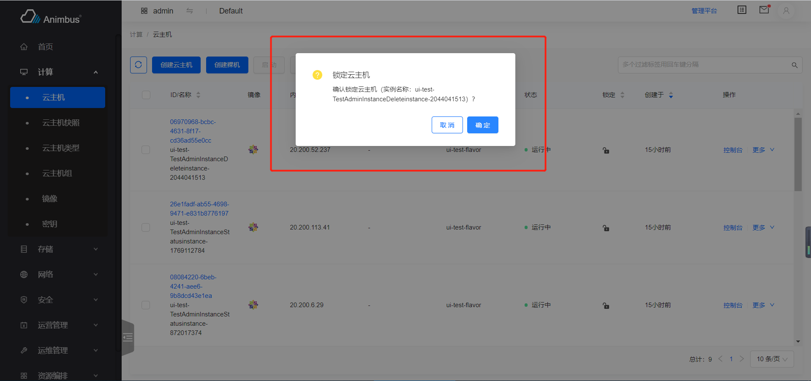

简体中文 | [English](../../en/develop/3-8-ConfirmAction-introduction.md)

# 用途



- 操作按钮点击后，显示确认类型的表单
- 点击`确认`按钮后，会根据请求的发送情况，展示`loading`状态
- 点击`取消`按钮后，弹窗消失
- 如果请求发送成功，会在右上角展示操作成功的提示信息，该提示信息几秒后可自动消失
- 如果请求发送失败，会在表单页的右上角展示错误信息，该提示信息只有点击关闭按钮后才可消失
- 支持批量操作，在表格中选中多个条目后，可点击表格上方的操作按钮，进行批量操作
- 使用批量操作时，会对批量选中的资源中不符合操作条件的资源做出提示

# ConfirmAction 代码文件

- `src/containers/Action/ConfirmAction/index.jsx`

# ConfirmAction 属性与函数定义介绍

- 确认型表单都继承于 ModalAction 组件
- 代码位置：`pages/xxxx/containers/XXXX/actions/xxx.jsx`
- 某些操作，只需要再次确认，无需用户输入更多内容即可，此时可使用该类型的组件，如：关闭云主机
- 只需要复写部分函数即可完成页面的开发
- 属性与函数分为以下四种，
  - 必须复写的属性与函数，主要包含：
    - 操作的 ID
    - 操作的标题
    - 操作对应的权限
    - 对是否禁用操作的判定
    - 发送请求的函数
  - 按需复写的函数与属性，主要包含：
    - 资源的名称
    - 请求结果提示语中是否要展示资源名称
    - 是否是异步操作
    - 操作按钮上的文字
  - 无需复写的函数与属性，主要包含：
    - 当前页是否是管理平台页面
  - 基类中的基础函数，主要包含：
    - 渲染页面
    - 对请求状态的展示
    - 对请求结果的展示
  - 更详细与全面的介绍见下

## 必须复写的属性与函数

- `id`
  - 资源操作的 ID
  - 需要具有唯一性，只针对资源的`actions`中的所有操作具有唯一性即可
  - 必须复写该属性
  - 以停止云主机`src/pages/compute/containers/Instance/actions/Stop.jsx`为例

    ```javascript
    get id() {
      return 'stop';
    }
    ```

- `title`
  - 资源操作的标题
  - 以停止云主机`src/pages/compute/containers/Instance/actions/Stop.jsx`为例

    ```javascript
    get title() {
      return t('Stop Instance');
    }
    ```

- `actionName`
  - 该操作对应的名称
  - 在请求后提示语中使用该名称
  - 以停止云主机`src/pages/compute/containers/Instance/actions/Stop.jsx`为例

    ```javascript
    get actionName() {
      return t('stop instance');
    }
    ```

- `policy`
  - 页面对应的权限，如果权限验证不通过，则不会在资源列表页面显示该操作按钮 (此处填写符合openstack规范的policy)
  - 以停止云主机`src/pages/compute/containers/Instance/actions/Stop.jsx`为例

    ```javascript
    policy = 'os_compute_api:servers:stop';
    ```
- `aliasPolicy`
  - 页面对应的权限，如果权限验证不通过，则不会在资源列表页面显示该操作按钮 (此处填写带模块前缀的自定义policy)
  - 以停止云主机`src/pages/compute/containers/Instance/actions/Stop.jsx`为例

    ```javascript
    aliasPolicy = 'nova:os_compute_api:servers:stop';
    ```

- `allowedCheckFunc`
  - 判定操作是否需要被禁用
  - 返回`Boolean`
  - 不需用禁用的按钮，直接写作

    ```javascript
    allowedCheckFunc = () => true;
    ```

  - 参数`item`，操作对应的数据
  - 以停止云主机`src/pages/compute/containers/Instance/actions/Stop.jsx`为例
    - 当云主机满足以下条件才会显示该操作按钮：处于运行中状态，控制台非锁定或是在管理平台

    ```javascript
    allowedCheckFunc = (item) => {
      if (!item) {
        return true;
      }
      return isNotLockedOrAdmin(item, this.isAdminPage) && this.isRunning(item);
    };
    ```

- `onSubmit`
  - 该操作的请求函数
  - 操作请求成功后，弹窗会消失，并显示成功提示，几秒后提示会消失
  - 操作失败后，弹窗会消失，并显示错误提示，需要手动关闭提示，提示才会消失
  - 返回`Promise`
  - 返回表单对应的`store`中的函数
  - 以停止云主机`src/pages/compute/containers/Instance/actions/Stop.jsx`为例

    ```javascript
    onSubmit = (item) => {
      const { id } = item || this.item;
      return globalServerStore.stop({ id });
    };
    ```

## 按需复写的属性与函数

- `buttonText`
  - 当操作按钮上的文字与弹窗的标题不一致时，需要复用该属性
  - 以停止云主机`src/pages/compute/containers/Instance/actions/Stop.jsx`为例
    - 弹窗上的标题是“停止云主机”，按钮上的文字是“停止”

    ```javascript
    get buttonText() {
      return t('Stop');
    }
    ```

- `buttonType`
  - 按钮的类型，支持`primary`、`danger`、`default`
  - 默认值为`default`
  - 以重置系统配置初始值 `src/pages/configuration/containers/Setting/actions/Reset.jsx` 为例

    ```javascript
    get buttonType() {
      return 'primary';
    }
    ```

- `isDanger`
  - 是否属于危险级别的按钮
  - 支持的值为：布尔值 `false`、`true`，默认值为`false`
  - 当按钮要强调操作危险性时，按钮或按钮上的文字一般为红色，使用`danger`
  - 以停止云主机`src/pages/compute/containers/Instance/actions/Stop.jsx`为例

    ```javascript
    get isDanger() {
      return true;
    }
    ```

- `passiveAction`
  - 批量操作时，如果某个资源不符合条件，会在发送请求前展示提示语，如果提示语需要以被动语态，则需要设置该属性
  - 以停止云主机`src/pages/compute/containers/Instance/actions/Stop.jsx`为例

    ```javascript
    get passiveAction() {
      return t('be stopped');
    }
    ```

- `isAsyncAction`
  - 当前操作是否是异步操作
  - 默认是`false`
  - 如果是异步操作，提示语为：`xxx指令已下发，实例名称：xxx 您可等待几秒关注列表数据的变更或是手动刷新数据，以获取最终展示结果。`
  - 如果是同步操作，提示语为：`xxx成功，实例名称：xxx。`
  - 以停止云主机`src/pages/compute/containers/Instance/actions/Stop.jsx`为例

    ```javascript
    get isAsyncAction() {
      return true;
    }
    ```

- `messageHasItemName`
  - 请求结果的提示语中，是否要包含实例名称
  - 默认值为`true`
  - 有些资源，不存在名称，则可设置该值为`false`

- `performErrorMsg`
  - 批量操作时，如果某个资源不符合条件，会在发送请求前展示提示语
  - 默认值为`无法xxx， 实例名称：xxxx。`
  - 以停止云主机`src/pages/compute/containers/Instance/actions/Stop.jsx`为例
    - 如果选中的云主机不处于运行中状态，提示`云主机\"{ name }\"状态不是运行中，无法关闭。`
    - 如果选中的云主机有处于锁定状态的，提示`云主机\"{ name }\"被锁定，无法关闭。`
    - 其他情况，皆提示`无法关闭云主机\"{ name }\"`

    ```javascript
    performErrorMsg = (failedItems) => {
      const instance = isArray(failedItems) ? failedItems[0] : failedItems;
      let errorMsg = t('You are not allowed to stop instance "{ name }".', {
        name: instance.name,
      });
      if (!this.isRunning(instance)) {
        errorMsg = t(
          'Instance "{ name }" status is not in active or suspended, can not stop it.',
          { name: instance.name }
        );
      } else if (!isNotLockedOrAdmin(instance, this.isAdminPage)) {
        errorMsg = t('Instance "{ name }" is locked, can not stop it.', {
          name: instance.name,
        });
      }
      return errorMsg;
    };
    ```

- `getNameOne`
  - 提示语中实例名称的来源
  - 默认是

    ```javascript
    getNameOne = (data) => data.name;`
    ```

  - 参数`data`为操作对应的资源数据
  - 以释放浮动 IP`src/pages/network/containers/FloatingIp/actions/Release.jsx`为例

    ```javascript
    getNameOne = (data) => data.floating_ip_address;
    ```

- `getName`
  - 不建议复写该函数
  - 建议复写`getNameOne`

- `confirmContext`
  - 确认弹窗中的提示语
  - 默认为`确认{ action }（实例名称：{name}）？`
  - 以删除云主机类型`src/pages/compute/containers/Flavor/actions/Delete.jsx`为例
    - 提示`若有云主机正在使用此 flavor，删除会导致云主机的 flavor 数据缺失，确定删除 {name} ？`

    ```javascript
    confirmContext = (data) => {
      const name = this.getName(data);
      return t(
        "If an instance is using this flavor, deleting it will cause the instance's flavor data to be missing. Are you sure to delete {name}?",
        { name }
      );
    };
    ```

- `submitErrorMsg`
  - 操作失败后的错误提示语
  - 一般不需要复写
  - 默认为`无法{action}，实例名称：{name}。`

## 不需要复写的属性与函数

- `isAdminPage`
  - 当前页面是否是“管理平台”的页面
- `submitSuccessMsg`
  - 请求后生成的成功提示语
- `submitErrorMsgBatch`
  - 批量操作请求后生成的报错提示语
- `perform`
  - 批量操作时，判定选中的数据是否可操作，如果不可操作，给出相应提示语

## 基类中的基础函数

- 建议查看代码理解，`src/containers/Action/ConfirmAction/index.jsx`
