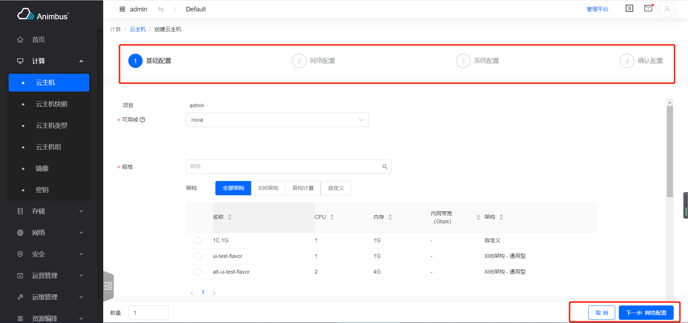
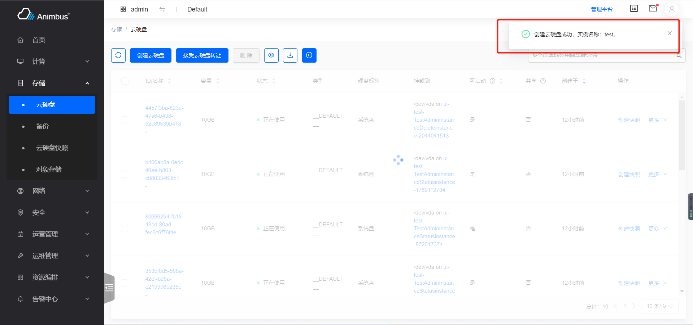

简体中文 | [English](../../en/develop/3-9-StepAction-introduction.md)

# 用途



- 操作按钮点击后，单页显示分步操作的表单
- 有独立的路由可供访问
- 一般用于创建资源，或是表单内容较多的 Form
- 支持点击`下一步`、`上一步`操作按钮
- 点击`取消`按钮后，会自动跳转到相应的资源列表页
- 如果请求发送成功，会在右上角展示操作成功的提示信息，该提示信息几秒后可自动消失

  

- 如果请求发送失败，会在表单页的右上角展示错误信息，该提示信息只有点击关闭按钮后才可消失

# StepAction 代码文件

- `src/containers/Action/StepAction/index.jsx`

# StepAction 属性与函数定义介绍

- 分步表单都继承于 StepAction 组件
- 代码位置：`pages/xxxx/containers/XXXX/actions/xxx/index.jsx`
- 只需要复写部分函数即可完成页面的开发
- 需要编写每一步的 Form
- 属性与函数分为以下四种，
  - 必须复写的属性与函数，主要包含：
    - 操作的 ID
    - 操作的标题
    - 页面对应的路径
    - 资源列表页面对应的路径
    - 操作对应的权限
    - 对是否禁用操作的判定
    - 表单项的配置
    - 发送请求的函数
    - 每步操作的配置
  - 按需复写的函数与属性，主要包含：
    - 是否具有确认信息的页面
    - 请求成功后的提示语
    - 请求失败的报错提示语
    - 对页面底部左侧数据的渲染
  - 无需复写的函数与属性，主要包含：
    - 当前页是否是管理平台页面
  - 基类中的基础函数，主要包含：
    - 渲染页面
    - 对请求状态的展示
    - 对请求结果的展示
  - 更详细与全面的介绍见下

## 必须复写的属性与函数

- `id`
  - 静态属性
  - 资源操作的 ID
  - 需要具有唯一性，只针对资源的`actions`中的所有操作具有唯一性即可
  - 必须复写该属性
  - 以创建云主机`src/pages/compute/containers/Instance/actions/StepCreate/index.jsx`为例

    ```javascript
    static id = 'instance-create';
    ```

- `title`
  - 静态属性
  - 资源操作的标题
  - 以创建云主机`src/pages/compute/containers/Instance/actions/StepCreate/index.jsx`为例

    ```javascript
    static title = t('Create Instance');
    ```

- `path`
  - 资源操作的对应的路由
  - 静态属性或静态函数
  - 静态函数时，参数为
    - 参数`item`，资源列表中的条目数据
    - 参数`containerProps`，父级 container(即按钮所在资源列表页面)的`props`属性
    - 以创建云主机`src/pages/compute/containers/Instance/actions/StepCreate/index.jsx`为例
      - 在云主机列表页点击创建云主机按钮，页面跳转到`/compute/instance/create`
      - 在云主机组详情页中点击创建云主机按钮，页面跳转到`/compute/instance/create?servergroup=${detail.id}`

      ```javascript
      static path = (_, containerProps) => {
        const { detail, match } = containerProps || {};
        if (!detail || isEmpty(detail)) {
          return '/compute/instance/create';
        }
        if (match.path.indexOf('/compute/server') >= 0) {
          return `/compute/instance/create?servergroup=${detail.id}`;
        }
      };
      ```

  - 静态属性，以创建云主机类型`src/pages/compute/containers/Flavor/actions/StepCreate/index.jsx`为例

    ```javascript
    static path = '/compute/flavor-admin/create';
    ```

- `policy`
  - 静态属性 (此处填写符合openstack规范的policy)
  - 页面对应的权限，如果权限验证不通过，则不会在资源列表页面显示该操作按钮
  - 以创建云主机`src/pages/compute/containers/Instance/actions/StepCreate/index.jsx`为例

    ```javascript
    static policy = [
      'os_compute_api:servers:create',
      'os_compute_api:os-availability-zone:list',
    ];
    ```
- `aliasPolicy`
  - 静态属性 (此处填写带模块前缀的自定义policy)
  - 页面对应的权限，如果权限验证不通过，则不会在资源列表页面显示该操作按钮
  - 以创建云主机`src/pages/compute/containers/Instance/actions/StepCreate/index.jsx`为例

    ```javascript
    static aliasPolicy = [
      'nova:os_compute_api:servers:create',
      'nova:os_compute_api:os-availability-zone:list',
    ];
    ```

- `allowed`
  - 静态函数
  - 判定操作是否需要被禁用
  - 返回`Promise`
  - 不需用禁用的按钮，直接写作

    ```javascript
    static allowed() {
      return Promise.resolve(true);
    }
    ```

- `name`
  - 该操作对应的名称
  - 在请求后提示语中使用该名称
  - 以创建云主机`src/pages/compute/containers/Instance/actions/StepCreate/index.jsx`为例

    ```javascript
    get name() {
      return t('Create instance');
    }
    ```

- `listUrl`
  - 该操作对应的资源列表页
  - 操作请求成功后，会自动进入到资源列表页
  - 以创建云主机`src/pages/compute/containers/Instance/actions/StepCreate/index.jsx`为例
    - 在镜像列表页的条目操作中，点击创建云主机并操作成功后，返回到镜像列表页
    - 在云硬盘列表页的条目操作中，点击创建云主机并操作成功后，返回到云硬盘列表页
    - 在云主机组详情页，点击创建云主机并操作成功后，返回到云主机详情页中
    - 在云主机列表页中，点击创建云主机并操作成功后，返回到云主机列表页

    ```javascript
    get listUrl() {
      const { image, volume, servergroup } = this.locationParams;
      if (image) {
        return '/compute/image';
      }
      if (volume) {
        return '/storage/volume';
      }
      if (servergroup) {
        return `/compute/server-group/detail/${servergroup}`;
      }
      return '/compute/instance';
    }
    ```

- `steps`
  - 每一步的配置
  - 每个配置项
    - `title`，每一步的标题
    - `component`，每一步表单对应的组件，继承于`BaseForm`(`src/components/Form`)
  - 以创建云主机`src/pages/compute/containers/Instance/actions/StepCreate/index.jsx`为例
    - 包含 4 步：基础配置、网络配置、系统配置、确认配置

    ```javascript
    get steps() {
      return [
        {
          title: t('Base Config'),
          component: BaseStep,
        },
        {
          title: t('Network Config'),
          component: NetworkStep,
        },
        {
          title: t('System Config'),
          component: SystemStep,
        },
        {
          title: t('Confirm Config'),
          component: ConfirmStep,
        },
      ];
    }
    ```

- `onSubmit`
  - 该操作的请求函数
  - 操作请求成功后，会自动进入到资源列表页
  - 操作失败后，会在表单页显示错误提示
  - 返回`Promise`
  - 返回表单对应的`store`中的函数

## 按需复写的属性与函数

- `init`
  - 初始化操作
  - 在其中定义`this.store`，`loading`状态的展示是基于`this.store.isSubmitting`
  - 在其中调用获取表单所需其他数据的函数
  - 对`this.state`中属性的更新
  - 以创建云主机`src/pages/compute/containers/Instance/actions/StepCreate/index.jsx`为例
    - 获取配额信息

    ```javascript
    init() {
      this.store = globalServerStore;
      this.projectStore = globalProjectStore;
      this.getQuota();
    }
    ```

- `instanceName`
  - 请求发送后，提示信息中的资源名称
  - 默认值为`this.values.name`
  - 以创建云主机`src/pages/compute/containers/Instance/actions/StepCreate/index.jsx`为例
    - 如果是批量创建云主机，则按`${name}-${index + 1}`的形式展示名称

    ```javascript
    get instanceName() {
      const { name, count = 1 } = this.values || {};
      if (count === 1) {
        return this.unescape(name);
      }
      return this.unescape(
        new Array(count)
          .fill(count)
          .map((_, index) => `${name}-${index + 1}`)
          .join(', ')
      );
    }
    ```

- `renderFooterLeft`
  - 对表单底部左侧内部的渲染
  - 默认返回`null`
  - src/pages/compute/containers/Instance/actions/StepCreate/index.jsx
    - 展示批量创建的数量
    - 基于输入的数量与剩余配额判定当前表单是否正确

    ```javascript
    renderFooterLeft() {
      const { data } = this.state;
      const { count = 1, source: { value: sourceValue } = {} } = data;
      const configs = {
        min: 1,
        max: sourceValue === 'bootableVolume' ? 1 : 100,
        precision: 0,
        onChange: this.onCountChange,
        formatter: (value) => `$ ${value}`.replace(/\D/g, ''),
      };
      return (
        <div>
          <span>{t('Count')}</span>
          <InputNumber
            {...configs}
            value={count}
            className={classnames(styles.input, 'instance-count')}
          />
          {this.renderBadge()}
        </div>
      );
    }
    ```

- `successText`
  - 操作成功的提示信息
- `errorText`
  - 错误信息的展示
  - 一般不需要复写
- `renderFooterLeft`
  - 表单底部左侧的渲染函数

## 不需要复写的属性与函数

- `values`
  - 表单验证成功后，更新的表单值
- `isAdminPage`
  - 当前页面是否是“管理平台”的页面
- `getRoutePath`
  - 生成页面 Url 的函数
  - 如：需要给关联资源提供跳转功能，使用该函数，可以在控制台跳转到控制台的相应地址，在管理平台跳转到管理平台的相应地址

## 基类中的基础函数

- `StepAction`继承于`StepForm`
- 建议查看代码理解，`src/components/StepForm/index.jsx`
