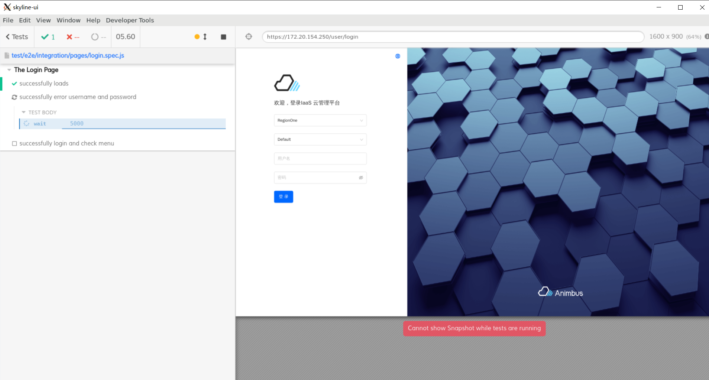
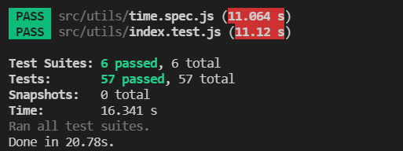

简体中文 | [English](../../en/test/1-ready-to-work.md)

# 两种测试

我们提供了两种类型的测试

- E2E 测试
  - 侧重于功能点测试
  - 能提供代码覆盖率数据
  - 使用`Cypress`框架
  - 测试结果保存到便于预览的静态页面中
- 单元测试
  - 侧重于基础函数测试
  - 使用`Jest`框架

# E2E 测试

## 搭建 E2E 测试环境

在 Centos，Windows 的 wsl2 中均成功搭建过 E2E 测试环境

- node 环境
  - package.json 中要求：`"node": ">=10.22.0"`
  - 验证 nodejs 版本

    ```shell
    node -v
    ```

- yarn
  - 安装 yarn

    ```shell
    npm install -g yarn
    ```

- 安装依赖包
  - 在项目根目录下执行，即`package.json`同级，需要耐心等待安装完成

    ```shell
    yarn install
    ```

- 安装系统依赖
  - `Ubuntu/Debian`

    ```shell
    sudo apt-get install libgtk2.0-0 libgtk-3-0 libgbm-dev libnotify-dev libgconf-2-4 libnss3 libxss1 libasound2 libxtst6 xauth xvfb
    ```

  - `CentOS`

    ```shell
    yum install -y xorg-x11-server-Xvfb gtk2-devel gtk3-devel libnotify-devel GConf2 nss libXScrnSaver alsa-lib
    ```

- 调整访问路径、账号等信息
  - E2E 的配置文件存放于`test/e2e/config/config.yaml`，在其中配置了
    - `baseUrl`，测试访问路径
    - `env`，环境变量
      - `switchToAdminProject`，登录后是否需要切换到`admin`项目下
      - `username`，访问控制台的用户名，需要具有控制台操作权限的用户
      - `password`，访问控制台的密码
      - `usernameAdmin`，访问管理平台的用户名，需要具有管理平台操作权限的用户
      - `passwordAdmin`，访问管理平台的密码
    - `testFiles`，测试文件列表
  - 可以通过直接修改`config.yaml`中的相应数值完成配置变更
  - 也可以通过`local_config.yaml`完成配置变更
    - 复制`test/e2e/config/config.yaml`到`test/e2e/config/local_config.yaml`中
    - 修改`local_config.yaml`中的相应变量
    - 对于变量的取值，优先级为：`local_config.yaml` > `config.yaml`

## 命令行运行 E2E

```shell
yarn run test:e2e
```


## GUI 运行 E2E

```shell
yarn run test:e2e:open
```

Cypress 提供了 GUI




## E2E 测试结果

测试运行结束后，访问`test/e2e/report/merge-report.html`即可查看


## E2E 代码覆盖率测试结果

测试运行结束后，访问`coverage/lcov-report/index.html`即可查看

> 注意：代码覆盖率，需要 E2E 访问的`baseUrl`对应的前端包，是具有可检测代码覆盖率版本的`dist`包

```shell
yarn run build:test
```

以上述方式打包的文件，就是具有可测试代码覆盖率的前端包

以下，给出前端访问带有代码覆盖率功能的前端包的 nginx 配置

```nginx
server {
  listen 0.0.0.0:8088 default_server;

  root /path/to/skyline-console/dist;
  index index.html;
  server_name _;
  location / {
    try_files $uri $uri/ /index.html;
  }

  location /api {
    proxy_pass http://<backend_address>;
  }
}
```

# 单元测试

## 命令行运行单元测试

```shell
yarn run test:unit
```

## 单元测试结果

直接在命令行控制台中即可查看运行结果


