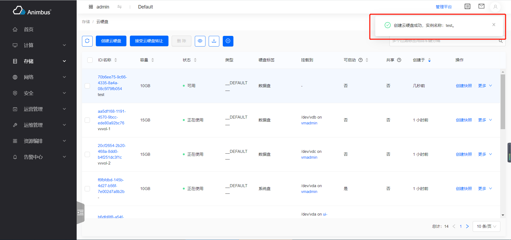
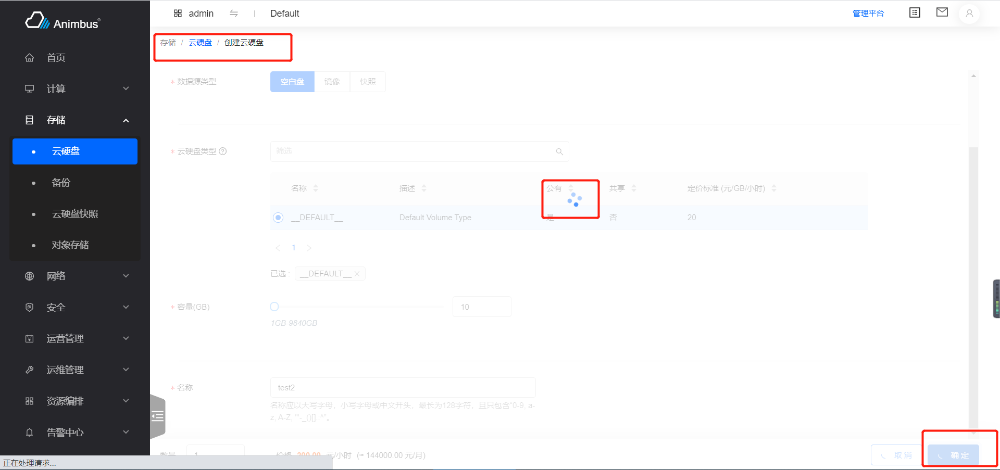
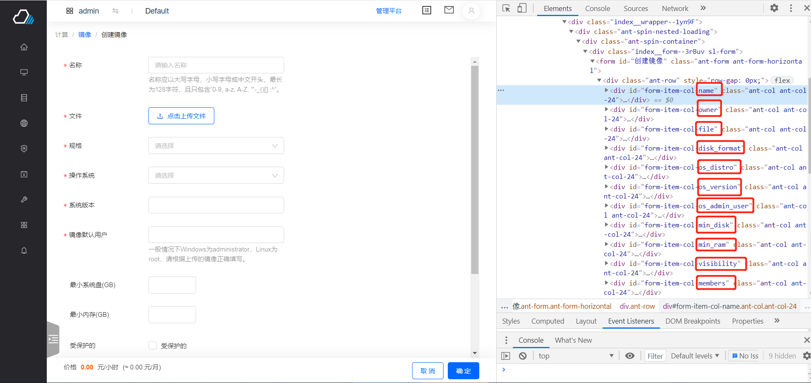
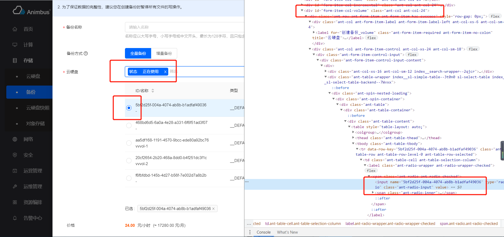
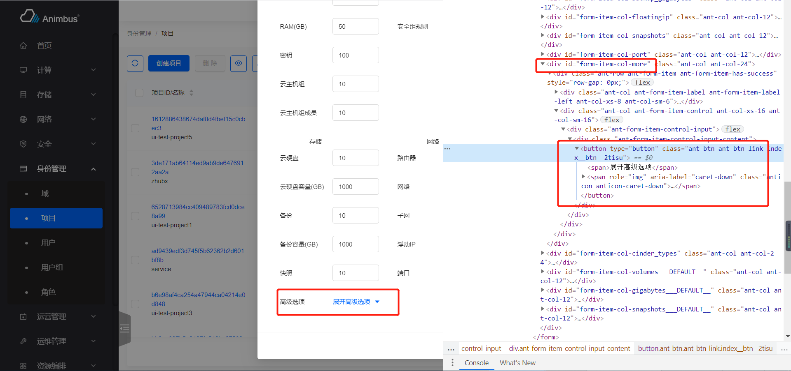

简体中文 | [English](../../en/test/3-1-E2E-form-operation.md)

因为前端框架使用的一致性，我们在编写表单操作的相关用例，选取元素并进行操作时，往往会发现有很强的规律性，所以我们对大多数表单操作都编写了相应的 Cypress 函数，极大的减少了编写测试用例的难度，以下会对主要使用的表单操作函数做出详细的说明。

> 注意：编写的函数均以能完整完成对一个表单项的操作为原则

## 点击按钮的操作

- `closeNotice`
  - 关闭操作后右上角的操作成功的提示信息

  

- `waitFormLoading`
  - 等待表单请求完成
  - 表单填写并验证通过后，点击确认按钮，会向服务端发起相应请求，这时表单项的确认按钮会处于`Loading`的状态
  - 使用该函数，而不是`cy.wait(seconds)`，能更有效的保证同步请求已经处理完全，从而保证后续用例的先决条件

  

- `clickFormActionSubmitButton`
  - 点击确认型表单的确认按钮，并等待请求完成

  

- `clickModalActionSubmitButton`
  - 点击弹窗型表单的确认按钮，并等待请求完成

  

- `clickModalActionCancelButton`
  - 点击弹窗型表单的取消按钮
- `clickConfirmActionSubmitButton`
  - 点击确认型表单的确认按钮，等待请求完成，并关闭请求成功的提示信息
  - 参数`waitTime`，关闭提示信息后的等待时间

  

- `checkDisableAction`
  - 某些数据不符合要求时，使用批量操作，会弹出报错，该函数验证该数据的确不合操作要求，并关闭报错提示
  - 以锁定状态的云主机`test/e2e/integration/pages/compute/instance.spec.js`为例
    - 锁定后不再支持启动、关闭、重启操作

    ```javascript
    it('successfully lock', () => {
      cy.tableSearchText(name)
        .clickConfirmActionInMoreSub('Lock', 'Instance Status')
        .wait(10000);
      cy.tableSearchText(name)
        .selectFirst()
        .clickHeaderActionButtonByTitle('Start')
        .checkDisableAction(2000)
        .clickHeaderActionButtonByTitle('Stop')
        .checkDisableAction(2000)
        .clickHeaderActionButtonByTitle('Reboot')
        .checkDisableAction(2000);
    });
    ```

    

- `clickStepActionNextButton`
  - 点击分步表单的下一步/确认按钮
  - 以创建云主机用例`test/e2e/integration/pages/compute/instance.spec.js`为例
    - 共需要点击 3 次下一步，1 次确认按钮

    ```javascript
    it('successfully create', () => {
      cy.clickHeaderActionButton(0)
        .url()
        .should('include', `${listUrl}/create`)
        .wait(5000)
        .formTableSelect('flavor')
        .formTableSelect('image')
        .formSelect('systemDisk')
        .formAddSelectAdd('dataDisk')
        .formSelect('dataDisk')
        .wait(2000)
        .clickStepActionNextButton()
        .wait(5000)
        .formTableSelectBySearch('networkSelect', networkName, 5000)
        .formTableSelectBySearch('securityGroup', 'default', 5000)
        .wait(2000)
        .clickStepActionNextButton()
        .formInput('name', name)
        .formRadioChoose('loginType', 1)
        .formInput('password', password)
        .formInput('confirmPassword', password)
        .wait(2000)
        .clickStepActionNextButton()
        .wait(2000)
        .clickStepActionNextButton()
        .waitFormLoading()
        .url()
        .should('include', listUrl)
        .closeNotice()
        .waitStatusActiveByRefresh();
    });
    ```

    

- `clickStepActionCancelButton`
  - 点击分步表单的取消按钮
  - 以镜像创建云主机用例`test/e2e/integration/pages/compute/image.spec.js`为例
    - 只验证能成功进入到创建云主机页面，然后点击取消按钮完成该用例

    ```javascript
    it('successfully create instance with cancel', () => {
      cy.tableSearchText(name)
        .clickActionInMore('Create Instance')
        .wait(2000)
        .clickStepActionCancelButton();
    });
    ```

## 对表单项的操作

通过页面查看元素的结构、样式等，发现，所有的表单项，都具有`id`，而且对应于开发时编写的表单配置`formItem`的`name`属性，也可直接通过查看页面内元素的`id`获取`name`，如下图所示，`form-item-col-`之后的内容便是`name`



- `formInput`
  - 带有`input`输入框的表单项输入内容
  - 参数`formItemName`，即开发代码中`formItem`的`name`值
  - 参数`value`，输入的内容
  - 以编辑云主机用例`test/e2e/integration/pages/compute/instance.spec.js`为例

    ```javascript
    it('successfully edit', () => {
      cy.tableSearchText(name)
        .clickActionInMore('Edit')
        .formInput('name', newname)
        .clickModalActionSubmitButton()
        .wait(2000);
    });
    ```

    

- `formJsonInput`
  - 带有`textarea`输入框的表单项输入`json`格式内容
  - 参数`formItemName`，即开发代码中`formItem`的`name`值
  - 参数`content`，输入的对象
  - 以创建堆栈，编写`json`型的参数`test/e2e/integration/pages/heat/stack.spec.js`为例

    ```javascript
    it('successfully create', () => {
      const volumeJson = {
        name: volumeName,
      };
      cy.clickHeaderActionButton(0, 2000)
        .formAttachFile('content', contentFile)
        .formAttachFile('params', paramFile)
        .clickStepActionNextButton()
        .wait(2000)
        .formInput('name', name)
        .formJsonInput('volume_name_spec', volumeJson)
        .clickStepActionNextButton()
        .waitFormLoading()
        .wait(5000)
        .tableSearchSelectText('Name', name)
        .waitStatusActiveByRefresh();
    });
    ```

    

- `formCheckboxClick`
  - 点击表单项中的`checkbox`
  - 参数`formItemName`，即开发代码中`formItem`的`name`值
  - 参数`index`，默认为`0`
  - 以云主机修改配置`test/e2e/integration/pages/compute/instance.spec.js`为例

    ```javascript
    it('successfully resize', () => {
      cy.tableSearchText(name)
        .clickActionInMoreSub('Resize', 'Configuration Update')
        .wait(5000)
        .formTableSelect('newFlavor')
        .formCheckboxClick('option')
        .clickModalActionSubmitButton()
        .waitStatusActiveByRefresh();
    });
    ```

    

- `formTableSelectAll`
  - 对表格选择类型的表单项做全选操作
  - 参数`formItemName`，即开发代码中`formItem`的`name`值
  - 以云硬盘类型修改访问`test/e2e/integration/pages/storage/volume-type.spec.js`为例

    ```javascript
    it('successfully manage access to projects', () => {
      cy.tableSearchText(name)
        .clickActionInMore('Manage Access')
        .formCheckboxClick('isPublic')
        .formTableSelectAll('access')
        .clickModalActionSubmitButton();
    });
    ```

    

- `formTableNotSelectAll`
  - 对表格选择类型的表单项做取消全选操作
  - 参数`formItemName`，即开发代码中`formItem`的`name`值
  - 以主机集合管理主机时不选择主机`test/e2e/integration/pages/compute/aggregate.spec.js`为例

    ```javascript
    it('successfully manage host: no host', () => {
      cy.tableSearchText(newname)
        .clickActionInMore('Manage Host')
        .formTableNotSelectAll('hosts')
        .clickModalActionSubmitButton();
    });
    ```

    

- `formTableSelect`
  - 对表格选择类型的表单项做选择操作
  - 参数`formItemName`，即开发代码中`formItem`的`name`值
  - 参数`value`，如果设置`value`，则选择表格中含有该值的条目，如果不设置`value`，则选择表格中的第一个条目
  - 以云主机挂载网卡选择网络`test/e2e/integration/pages/compute/instance.spec.js`为例

    ```javascript
    it('successfully attach interface', () => {
      cy.tableSearchText(name)
        .clickActionInMoreSub('Attach Interface', 'Related Resources')
        .wait(5000)
        .formTableSelect('network')
        .clickModalActionSubmitButton();
    });
    ```

    

- `formTableSelectBySearch`
  - 对表格选择类型的表单项，先做搜索操作，然后选择条目中的第一条
  - 参数`formItemName`，即开发代码中`formItem`的`name`值
  - 参数`value`，搜索内容，一般是对搜索项中`名称`的搜索
  - 参数`waitTime`，搜索后等待时间，不设置，等待 2 秒钟
  - 以云主机挂载云硬盘选择云硬盘`test/e2e/integration/pages/compute/instance.spec.js`为例

    - 操作成功后，进入云硬盘列表页查看云硬盘的状态为“已使用”

    ```javascript
    it('successfully attach volume', () => {
      // prepare volume
      cy.visitPage(listUrl)
        .tableSearchText(name)
        .clickActionInMoreSub('Attach Volume', 'Related Resources')
        .wait(5000)
        .formTableSelectBySearch('volume', volumeName)
        .clickModalActionSubmitButton()
        .wait(5000);

      // check attach successful
      cy.tableSearchText(name)
        .goToDetail()
        .clickDetailTab('Volumes')
        .tableSearchText(volumeName)
        .checkColumnValue(2, 'In-use');
    });
    ```

    

- `formTableSelectBySearchOption`
  - 对表格选择类型的表单项，先做搜索操作，然后选择条目中的第一条
  - 搜索是对搜索项的选择，不同于`formTableSelectBySearch`是基于输入
  - 参数`formItemName`，即开发代码中`formItem`的`name`值
  - 参数`name`，搜索项的名称
  - 参数`value`，搜索项对应的值
  - 参数`waitTime`，搜索后的等待时间，默认为 2 秒
  - 以创建全量备份`test/e2e/integration/pages/storage/backup.spec.js`为例
    - 选择状态为使用中的云硬盘

    ```javascript
    it('successfully create full backup', () => {
      cy.clickHeaderActionButton(0, 5000)
        .formInput('name', name)
        .formTableSelectBySearch('volume', volumeName)
        .clickModalActionSubmitButton()
        .wait(5000)
        .waitTableLoading();

      cy.clickHeaderActionButton(0, 5000)
        .formInput('name', nameIns)
        .formTableSelectBySearchOption('volume', 'Status', 'In-use')
        .clickModalActionSubmitButton();

      cy.wait(30000);
    });
    ```

    

- `formSelect`
  - 对选择器类型的表单项的操作
  - 参数`formItemName`，即开发代码中`formItem`的`name`值
  - 参数`label`，选中的内容，如果不设置，选中第一个选项，如果设置，选择`label`对应的选项
  - 以创建云主机组选择策略`test/e2e/integration/pages/compute/server-group.spec.js`为例

    ```javascript
    it('successfully create', () => {
      cy.clickHeaderActionButton(0)
        .formInput('name', name)
        .formSelect('policy')
        .clickModalActionSubmitButton();
    });
    ```

    

  - 以网络 QoS 策略创建带宽限制规则时设置方向为“入方向”`test/e2e/integration/pages/network/qos-policy.spec.js`为例

    ```javascript
    it('successfully create bandwidth ingress limit rule', () => {
      cy.tableSearchText(name)
        .clickActionInMore('Create Bandwidth Limit Rule')
        .formSelect('direction', 'ingress')
        .clickModalActionSubmitButton();
    });
    ```

    

- `formRadioChoose`
  - 对单选类型的表单项的操作
  - 参数`formItemName`，即开发代码中`formItem`的`name`值
  - 参数`itemIndex`，选中第几项，默认为 0，即选择第一项
  - 以创建密钥选择“导入密钥”`test/e2e/integration/pages/compute/keypair.spec.js`为例

    ```javascript
    it('successfully create by file', () => {
      cy.clickHeaderActionButton(0)
        .formRadioChoose('type', 1)
        .formInput('name', nameByFile)
        .formAttachFile('public_key', filename)
        .clickModalActionSubmitButton()
        .tableSearchText(nameByFile)
        .checkTableFirstRow(nameByFile);
    });
    ```

    

- `formAttachFile`
  - 对上传文件的表单项的操作
  - 参数`formItemName`，即开发代码中`formItem`的`name`值
  - 参数`filename`，上传文件的名称，文件需要预先保存在`test/e2e/fixtures`目录下
  - 以创建密钥选择文件为例`test/e2e/integration/pages/compute/keypair.spec.js`为例

    ```javascript
    it('successfully create by file', () => {
      cy.clickHeaderActionButton(0)
        .formRadioChoose('type', 1)
        .formInput('name', nameByFile)
        .formAttachFile('public_key', filename)
        .clickModalActionSubmitButton()
        .tableSearchText(nameByFile)
        .checkTableFirstRow(nameByFile);
    });
    ```

    

  - 以创建镜像选择文件为例`test/e2e/integration/pages/compute/image.spec.js`为例

    ```javascript
    it('successfully create', () => {
      cy.clickHeaderActionButton(0)
        .url()
        .should('include', `${listUrl}/create`)
        .formInput('name', name)
        .formAttachFile('file', filename)
        .formSelect('disk_format', 'QCOW2 - QEMU Emulator')
        .formSelect('os_distro', 'Others')
        .formInput('os_version', 'cirros-0.4.0-x86_64')
        .formInput('os_admin_user', 'root')
        .formSelect('usage_type', 'Common Server')
        .formText('description', name)
        .clickFormActionSubmitButton()
        .wait(2000)
        .url()
        .should('include', listUrl)
        .tableSearchText(name)
        .waitStatusActiveByRefresh();
    });
    ```

    

- `formAddSelectAdd`
  - 对可增加条目的表单项的操作
  - 参数`formItemName`，即开发代码中`formItem`的`name`值
  - 以主机集合管理元数据时，添加新的自定义元数据`test/e2e/integration/pages/compute/aggregate.spec.js`为例

    ```javascript
    it('successfully manage metadata', () => {
      cy.tableSearchText(name)
        .clickActionInMore('Manage Metadata')
        .wait(5000)
        .formAddSelectAdd('customs')
        .formInputKeyValue('customs', 'key', 'value')
        .formTransferLeftCheck('systems', 0)
        .clickModalActionSubmitButton();
    });
    ```

    

- `formSwitch`
  - 对开关型的表单项的点击操作
  - 参数`formItemName`，即开发代码中`formItem`的`name`值
  - 以创建具有共享属性的网络 QoS 策略`test/e2e/integration/pages/network/qos-policy.spec.js`为例

    ```javascript
    it('successfully create', () => {
      cy.clickHeaderActionButton(0)
        .wait(2000)
        .formInput('name', name)
        .formText('description', name)
        .formSwitch('shared')
        .clickModalActionSubmitButton();
    });
    ```

    

- `formButtonClick`
  - 对表单项中的按钮的点击操作
  - 参数`formItemName`，即开发代码中`formItem`的`name`值
  - 以项目更改配额时展开/关闭“高级选项”`test/e2e/integration/pages/identity/project.spec.js`为例

    ```javascript
    it('successfully edit quota', () => {
      cy.tableSearchText(name)
        .clickActionInMore('Edit Quota')
        .formInput('instances', 11)
        .formButtonClick('more')
        .wait(2000)
        .formButtonClick('more')
        .clickModalActionSubmitButton();
    });
    ```

    

    

- `formTransfer`
  - 对穿梭框类型的表单操作
    1. 对左侧的穿梭框基于搜索展示指定待选条目
    2. 选中待选条目的第一条
    3. 点击穿梭框中间的方向按钮，使得选中内容进入到右侧穿梭框中
  - 参数`formItemName`，即开发代码中`formItem`的`name`值
  - 参数`value`，搜索内容
  - 以项目管理用户`test/e2e/integration/pages/identity/project.spec.js`为例

    ```javascript
    it('successfully manage user', () => {
      cy.tableSearchText(name)
        .clickActionInMore('Manage User')
        .formTransfer('select_user', username)
        .formTransferRight('select_user', username)
        .formSelect('select_user', 'admin')
        .clickModalActionSubmitButton();
    });
    ```

    

- `formTransferRight`
  - 对右侧的穿梭框基于搜索展示指定待选条目
  - 参数`formItemName`，即开发代码中`formItem`的`name`值
  - 参数`value`，搜索内容
  - 以用户组管理用户为例`test/e2e/integration/pages/identity/user-group.spec.js`为例

    ```javascript
    it('successfully manage user', () => {
      cy.tableSearchText(name)
        .clickActionInMore('Manage User')
        .formTransfer('select_user', username)
        .formTransferRight('select_user', username)
        .clickModalActionSubmitButton();

      cy.tableSearchText(name)
        .goToDetail()
        .clickDetailTab('Sub Users', 'userGroup');
    });
    ```

    

- `formTabClick`
  - 点击带有 Tab 的表单项中的 Tab
  - 参数`formItemName`，即开发代码中`formItem`的`name`值
  - 参数`index`，指定的 Tab 的下标
  - 以编辑浮动 IP，切换到共享策略为例`test/e2e/integration/pages/network/floatingip.spec.js`为例

    ```javascript
    it('successfully edit', () => {
      cy.clickFirstActionButton()
        .formText('description', 'description')
        .formTabClick('qos_policy_id', 1)
        .wait(5000)
        .formTableSelectBySearch('qos_policy_id', policyName)
        .clickModalActionSubmitButton()
        .wait(2000);
    });
    ```

    

- `formInputKeyValue`
  - 对`KeyValue`组件的表单项进行输入操作，一般是配合`formAddSelectAdd`使用，对添加的新的`KeyValue`组件的条目，输入内容
  - 参数`formItemName`，即开发代码中`formItem`的`name`值
  - 参数`key`，左侧 input 输入的内容
  - 参数`value`，右侧 input 输入的内容
  - 以主机集合管理元数据时，添加新的自定义元数据`test/e2e/integration/pages/compute/aggregate.spec.js`为例

    ```javascript
    it('successfully manage metadata', () => {
      cy.tableSearchText(name)
        .clickActionInMore('Manage Metadata')
        .wait(5000)
        .formAddSelectAdd('customs')
        .formInputKeyValue('customs', 'key', 'value')
        .formTransferLeftCheck('systems', 0)
        .clickModalActionSubmitButton();
    });
    ```

    

- `formTransferLeftCheck`
  - 对左侧的穿梭框的操作
    1. 选中左侧穿梭框中的指定节点
    2. 点击穿梭框中间的方向按钮，使得选中内容进入到右侧穿梭框中
  - 参数`formItemName`，即开发代码中`formItem`的`name`值
  - 参数`index`，节点的下标
  - 以主机集合管理元数据时，添加新的自定义元数据`test/e2e/integration/pages/compute/aggregate.spec.js`为例

    ```javascript
    it('successfully manage metadata', () => {
      cy.tableSearchText(name)
        .clickActionInMore('Manage Metadata')
        .wait(5000)
        .formAddSelectAdd('customs')
        .formInputKeyValue('customs', 'key', 'value')
        .formTransferLeftCheck('systems', 0)
        .clickModalActionSubmitButton();
    });
    ```

    

- `formTransferRightCheck`
  - 对右侧的穿梭框的操作
    1. 选中右侧穿梭框中的节点
    2. 点击穿梭框中间的方向按钮，使得选中内容进入到左侧穿梭框中
  - 参数`formItemName`，即开发代码中`formItem`的`name`值
  - 参数`index`，节点的下标
  - 以云主机类型，修改元数据`test/e2e/integration/pages/compute/flavor.spec.js`为例

    ```javascript
    it('successfully manage metadata', () => {
      cy.clickTab('Custom')
        .tableSearchText(customName)
        .clickActionButtonByTitle('Manage Metadata')
        .wait(5000)
        .formTransferLeftCheck('systems', 0)
        .clickModalActionSubmitButton();

      // todo: remove key-value metadata
      cy.clickTab('Custom')
        .tableSearchText(customName)
        .clickActionButtonByTitle('Manage Metadata')
        .wait(5000)
        .formTransferRightCheck('systems', 0)
        .clickModalActionSubmitButton();
    });
    ```

    

对资源操作的各种操作，主要用到了上方介绍的函数，函数的具体编写，请查看`test/e2e/support/form-commands.js`
