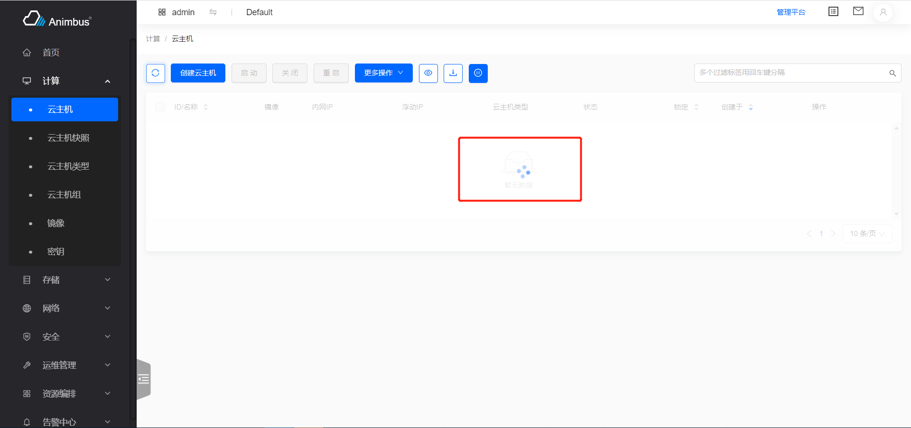
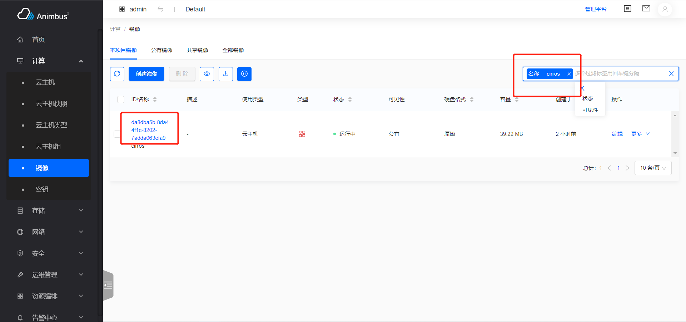
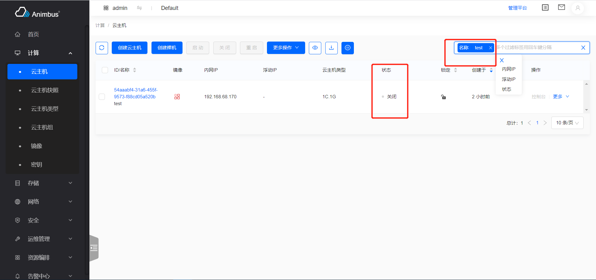
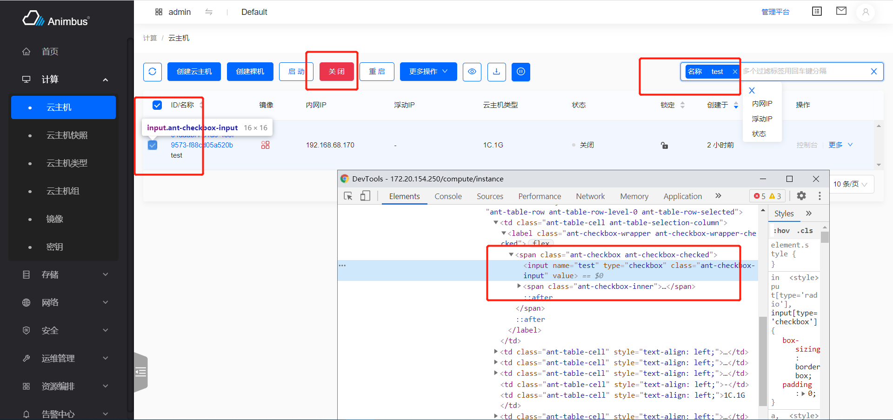
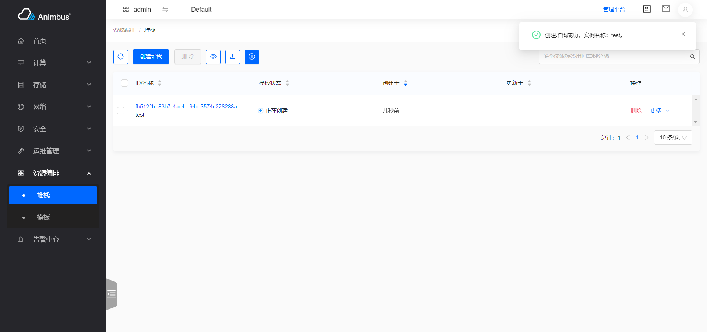
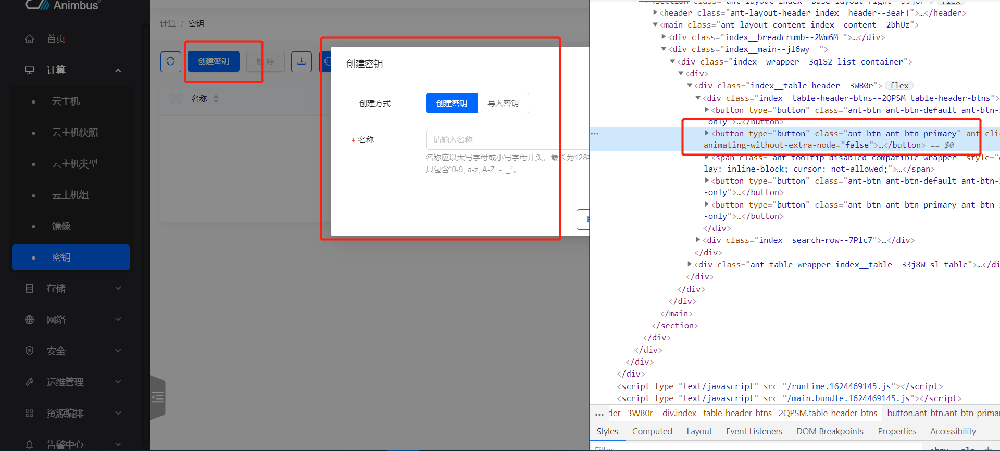
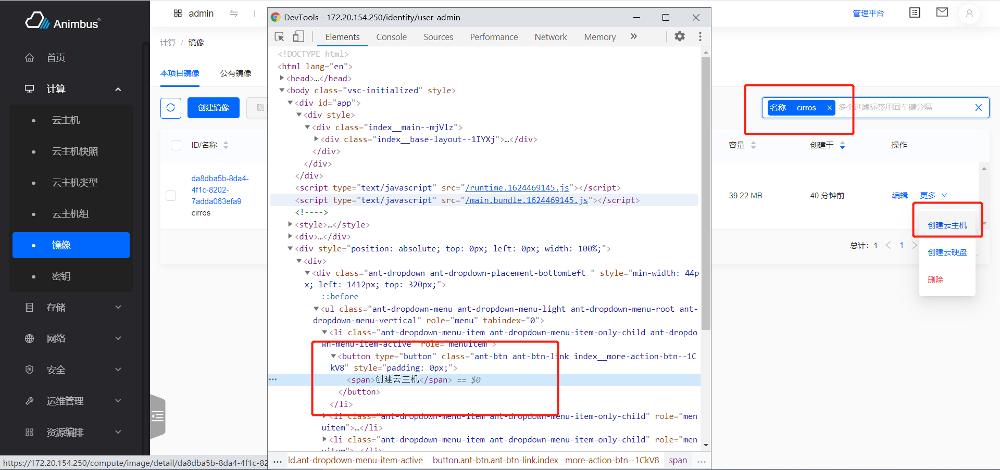
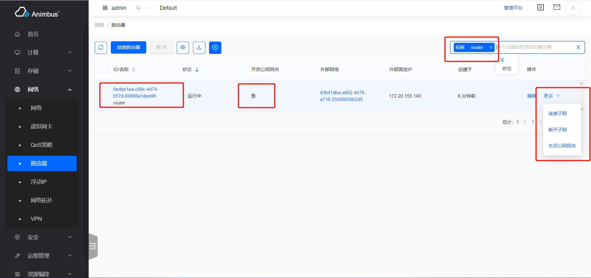
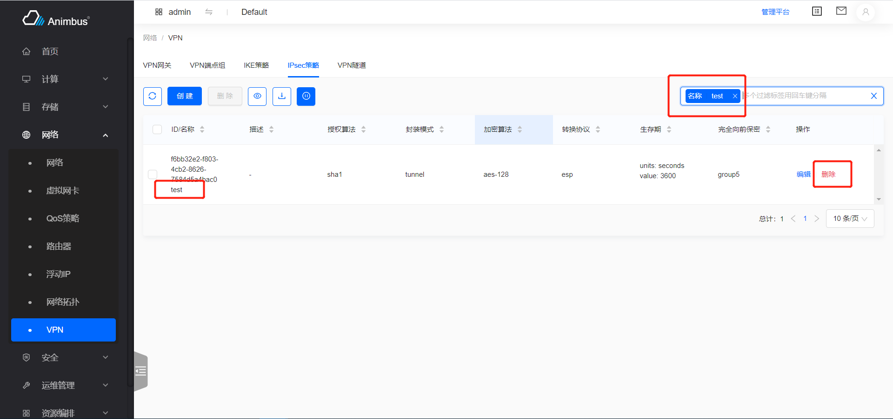

简体中文 | [English](../../en/test/3-2-E2E-table-operation.md)

因为前端框架使用的一致性，我们在编写表单操作的相关用例，选取元素并进行操作时，往往会发现有很强的规律性，所以我们对大多数表格操作都编写了相应的 Cypress 函数，极大的减少了编写测试用例的难度，以下会对主要使用的表格操作函数做出详细的说明。

## 对表格整体的操作

主要包含：等待列表加载完成

- `waitTableLoading`
  - 等待列表加载完成
  - 列表在加载过程中，会有`loading`状态展示，等待该状态结束

  

- `checkTableFirstRow`
  - 验证表格第一行是否包含指定内容，一般用于创建后验证创建资源是否存在
  - 参数`name`，第一行需要包含的内容，一般用于验证名称是否存在
  - 以查看密钥详情`test/e2e/integration/pages/compute/keypair.spec.js`为例
    - 创建后，检查密钥是否存在，验证成功后进入详情页

    ```javascript
    it('successfully detail', () => {
      cy.tableSearchText(name)
        .checkTableFirstRow(name)
        .goToDetail()
        .checkDetailName(name);
      cy.goBackToList(listUrl);
    });
    ```

    

- `tableSearchText`
  - 在表格上方的搜索栏中输入内容，并等待搜索完成
  - 参数`str`，搜索的内容，一般是搜索名称
  - 通过搜索，使得待操作的资源位于表格中的第一行，以便进行后续的操作
  - 以查看密钥详情`test/e2e/integration/pages/compute/keypair.spec.js`为例
    1. 创建后，使用名称搜索密钥，并等待搜索完成
    2. 检查表格中第一行是否包含指定名称的资源
    3. 进入详情页，检查名称是否与预期一致
    4. 返回列表页

    ```javascript
    it('successfully detail', () => {
      cy.tableSearchText(name)
        .checkTableFirstRow(name)
        .goToDetail()
        .checkDetailName(name);
      cy.goBackToList(listUrl);
    });
    ```

    

- `tableSimpleSearchText`
  - 在表格上方的搜索栏中输入内容，并等待搜索完成
  - 有些表格使用的是简单搜索，搜索项只支持输入文字，此时搜索框使用的组件与`tableSearchText`中的搜索框组件不一样
  - 参数`str`，搜索的内容，一般是搜索名称
  - 通过搜索，使得待操作的资源位于表格中的第一行，以便进行后续的操作
  - 以搜索系统信息中的服务`test/e2e/integration/pages/configuration/system.spec.js`为例

    ```javascript
    it('successfully services', () => {
      cy.tableSimpleSearchText('nova');
    });
    ```

    

- `tableSearchSelect`
  - 使用表格上方的搜索栏中的选择项进行搜索，并等待搜索完成
    1. 点击输入框，在待选搜索项中选择搜索项
    2. 点击选中搜索类别下的选择项
    3. 等待搜索完成
  - 参数`name`，搜索项的名称
  - 参数`value`，搜索项对应的选择项的标签
  - 通过搜索，使得待操作的资源位于表格中的第一行，以便进行后续的操作
  - 以浮动IP绑定云主机`test/e2e/integration/pages/network/floatingip.spec.js`为例
    1. 在浮动IP表格中，搜索`状态`为`停止`的浮动IP
    2. 对表格中的第一个资源点击`关联`操作
    3. 完成绑定云主机的操作

    ```javascript
    it('successfully associate instance', () => {
      cy.tableSearchSelect('Status', 'Down')
        .clickActionInMore('Associate')
        .wait(5000)
        .formTableSelectBySearch('instance', instanceName)
        .wait(5000)
        .formTableSelect('port')
        .clickModalActionSubmitButton();
    });
    ```

    

    

    

- `tableSearchSelectText`
  - 使用表格上方的搜索栏进行搜索，并等待搜索完成
    1. 点击输入框，在待选搜索项中选择搜索项
    2. 输入搜索内容，回车
    3. 等待搜索完成
  - 不选择搜索项时直接输入，是对第一个支持输入的搜索项进行搜索
  - 参数`name`，搜索项的名称
  - 参数`value`，输入的内容
  - 通过搜索，使得待操作的资源位于表格中的第一行，以便进行后续的操作
  - 以创建堆栈`test/e2e/integration/pages/heat/stack.spec.js`为例
    1. 创建后，进入资源列表页
    2. 在列表页使用名称搜索
    3. 等待资源的状态可用

    ```javascript
    it('successfully create', () => {
      const volumeJson = {
        name: volumeName,
      };
      cy.clickHeaderActionButton(0, 2000)
        .formAttachFile('content', contentFile)
        .formAttachFile('params', paramFile)
        .clickStepActionNextButton()
        .wait(2000)
        .formInput('name', name)
        .formJsonInput('volume_name_spec', volumeJson)
        .clickStepActionNextButton()
        .waitFormLoading()
        .wait(5000)
        .tableSearchSelectText('Name', name)
        .waitStatusActiveByRefresh();
    });
    ```

    

    

    

- `checkEmptyTable`
  - 验证表格为空表格
  - 一般用于删除资源后验证
  - 以删除路由器`test/e2e/integration/pages/network/router.spec.js`为例
    1. 关闭外网网关
    2. 删除
    3. 搜索
    4. 验证表格为空表格，即删除成功

    ```javascript
    it('successfully close external gateway and delete', () => {
      cy.tableSearchText(newname)
        .clickConfirmActionInMore('Close External Gateway')
        .clickConfirmActionInMore('Delete')
        .tableSearchText(newname)
        .checkEmptyTable();
    });
    ```

- `goToDetail`
  - 访问第一行资源的详情页，并等待详情页加载完成
  - 参数`index`，链接所在列的下标，默认为`1`
  - 参数`waitTime`，详情页加载完后等待的时间
  - 以镜像`test/e2e/integration/pages/compute/image.spec.js`为例
    1. 搜索
    2. 进入详情页
    3. 验证详情名称
    4. 返回列表页

    ```javascript
    it('successfully detail', () => {
      cy.tableSearchText(name).goToDetail();
      cy.checkDetailName(name);
      cy.goBackToList(listUrl);
    });
    ```

    

    

- `checkColumnValue`
  - 验证第一行指定列的内容是否符合预期
  - 参数`columnIndex`，指定列的下标
  - 参数`value`，预期的值
  - 以云主机`test/e2e/integration/pages/compute/image.spec.js`为例
    1. 搜索
    2. 关闭云主机
    3. 验证云主机的状态为`关闭`
    4. 验证批量操作中的`关闭`操作不可用

    ```javascript
    it('successfully stop', () => {
      cy.tableSearchText(name)
        .clickConfirmActionInMoreSub('Stop', 'Instance Status')
        .wait(10000)
        .tableSearchText(name)
        .checkColumnValue(6, 'Shutoff')
        .selectFirst()
        .clickHeaderActionButtonByTitle('Stop')
        .checkDisableAction(2000);
    });
    ```

    

- `selectFirst`
  - 选中表格中第一行，以便做后续的批量操作
  - 以云主机`test/e2e/integration/pages/compute/image.spec.js`为例
    1. 搜索
    2. 关闭云主机
    3. 验证云主机的状态为`关闭`
    4. 选中第一行
    5. 点击批量操作中的`关闭`按钮
    6. 弹出错误提示

    ```javascript
    it('successfully stop', () => {
      cy.tableSearchText(name)
        .clickConfirmActionInMoreSub('Stop', 'Instance Status')
        .wait(10000)
        .tableSearchText(name)
        .checkColumnValue(6, 'Shutoff')
        .selectFirst()
        .clickHeaderActionButtonByTitle('Stop')
        .checkDisableAction(2000);
    });
    ```

    

- `selectAll`
  - 选中表格中所有条目，以便做后续的批量操作
  - 通常是为了清空数据使用

- `waitStatusActiveByRefresh`
  - 每`5`秒点击表格上方的刷新按钮，直到资源状态变为可用状态
  - 资源在创建或变更后，往往需要一定的时间才能变为可用状态，之后才能进行后续操作
  - 以创建堆栈`test/e2e/integration/pages/heat/stack.spec.js`为例

    ```javascript
    it('successfully create', () => {
      const volumeJson = {
        name: volumeName,
      };
      cy.clickHeaderActionButton(0, 2000)
        .formAttachFile('content', contentFile)
        .formAttachFile('params', paramFile)
        .clickStepActionNextButton()
        .wait(2000)
        .formInput('name', name)
        .formJsonInput('volume_name_spec', volumeJson)
        .clickStepActionNextButton()
        .waitFormLoading()
        .wait(5000)
        .tableSearchSelectText('Name', name)
        .waitStatusActiveByRefresh();
    });
      ```

    

    

## 对按钮的操作

主要包含
  - 位于表单上方的主按钮操作（一般创建操作）、批量操作
  - 位于表单每一行的行操作
### 表单上方按钮的操作

表格上方的按钮一般包含：刷新、创建、批量操作按钮、配置表格列表项、下载
- `clickHeaderActionButton`
  - 点击表格上方的按钮，
  - 参数`buttonIndex`，表格上方按钮的下标
  - 参数`waitTime`，点击后的等待时间，默认为 2 秒
  - 一般，创建按钮的下标是 1
  - 以创建密钥用例`test/e2e/integration/pages/compute/keypair.spec.js`为例

    ```javascript
    it('successfully create', () => {
      cy.clickHeaderActionButton(0)
        .formInput('name', name)
        .clickModalActionSubmitButton()
        .wait(5000);
    });
    ```

    

- `clickHeaderActionButtonByTitle`
  - 通过名称点击表格上方的按钮，一般用于批量操作按钮的点击
  - 参数`title`，表格上方按钮上的文字
  - 参数`waitTime`，点击后的等待时间，默认为 2 秒
  - 以关闭状态下的云主机无法进行关闭操作`test/e2e/integration/pages/compute/instance.spec.js`为例
    - 点击表单顶部的关闭按钮

    ```javascript
    it('successfully stop', () => {
      cy.tableSearchText(name)
        .clickConfirmActionInMoreSub('Stop', 'Instance Status')
        .wait(10000)
        .tableSearchText(name)
        .checkColumnValue(6, 'Shutoff')
        .selectFirst()
        .clickHeaderActionButtonByTitle('Stop')
        .checkDisableAction(2000);
    });
    ```

    

- `clickHeaderConfirmButtonByTitle`
  - 该函数会完成
    1. 通过名称点击表格上方的按钮，页面弹出确认操作提示
    2. 点击`确认`按钮
  - 参数`title`，表格上方按钮上的文字
  - 参数`waitTime`，点击后的等待时间，默认为 2 秒
  - 以释放浮动IP`test/e2e/integration/pages/network/floatingip.spec.js`为例
    - 全选停止状态的浮动IP，并批量释放

    ```javascript
    it('successfully delete', () => {
      cy.tableSearchSelect('Status', 'Down')
        .selectAll()
        .clickHeaderConfirmButtonByTitle('Release');
    });
    ```

    
### 表单第一行的行操作

- `clickFirstActionButton`
  - 点击表单第一行的操作列中的第一个按钮，一般用于对弹窗型操作按钮
  单页型操作按钮的点击
  - 以编辑用户`test/e2e/integration/pages/identity/user.spec.js`为例

    ```javascript
    it('successfully edit', () => {
      cy.tableSearchText(name)
        .clickFirstActionButton()
        .formInput('name', newname)
        .clickModalActionSubmitButton();
    });
    ```

    

- `clickActionButtonByTitle`
  - 根据标题点击第一行中的操作
  - 以编辑、启动服务`test/e2e/integration/pages/configuration/system.spec.js`为例
    - 当服务启动时，点击`禁用`按钮
    - 当服务停止时，点击`启用`按钮

    ```javascript
    it('successfully disable compute services', () => {
      cy.clickTab(computeServicesTab)
        .tableSearchText('nova-compute')
        .clickActionButtonByTitle('Disable')
        .formText('disabled_reason', reason)
        .clickModalActionSubmitButton();
    });

    it('successfully enable compute services', () => {
      cy.clickTab(computeServicesTab)
        .tableSearchSelect('Service Status', 'Disabled')
        .clickActionButtonByTitle('Enable')
        .clickConfirmActionSubmitButton();
    });
    ```

    

    

- `clickActionInMore`
  - 根据标题点击第一行中`更多`中的操作
  - 以点击镜像的创建云主机按钮`test/e2e/integration/pages/compute/image.spec.js`为例

    ```javascript
    it('successfully create instance with cancel', () => {
      cy.tableSearchText(name)
        .clickActionInMore('Create Instance')
        .wait(2000)
        .clickStepActionCancelButton();
    });
    ```

    

- `clickActionInMoreSub`
  - 根据标题点击第一行操作的子菜单下的操作
  - 参数`title`，按钮的标题
  - 参数`subMenu`，子菜单的标题
  - 以云主机点击`关联资源`下的`挂载网卡` `test/e2e/integration/pages/compute/image.spec.js`为例

    ```javascript
    it('successfully attach interface', () => {
      cy.tableSearchText(name)
        .clickActionInMoreSub('Attach Interface', 'Related Resources')
        .wait(5000)
        .formTableSelect('network')
        .clickModalActionSubmitButton();
    });
    ```

    

- `checkActionDisabledInFirstRow`
  - 验证指定名称的资源的指定操作不可用
    1. 基于指定名称搜索资源
    2. 验证搜索结果的第一行中的操作列`更多`中不存在指定操作
  - 参数`title`，操作的名称
  - 参数`name`，资源的名称
  - 资源处于某些状态后，某些操作是需要被禁用的，行操作列表中的第一个操作，如果不可操作，则处于`禁用`状态，而`更多`中的操作，如果不可用，则不展示
  - 以路由器`test/e2e/integration/pages/network/router.spec.js`为例
    1. 创建路由器时开启公网网关
    2. 验证路由器不可删除，即不存在`删除`按钮

    ```javascript
    it('successfully disable delete', () => {
      cy.checkActionDisabledInFirstRow('Delete', name);
    });
    ```

    

- `clickFirstActionDisabled`
  - 验证表格中第一行的操作中的第一个操作不可用
  - 资源处于某些状态后，某些操作是需要被禁用的，行操作列表中的第一个操作，如果不可操作，则处于`禁用`状态，而`更多`中的操作，如果不可用，则不展示
  - 以云主机组`test/e2e/integration/pages/compute/server-group.spec.js`为例
    1. 在云主机组下创建云主机
    2. 验证含有云主机的云主机组不可删除
    3. 删除云主机后，云主机组删除成功

    ```javascript
    it('successfully delete', () => {
      cy.clickFirstActionDisabled();
      cy.forceDeleteInstance(instanceName);
      cy.wait(5000);
      cy.visitPage(listUrl)
        .tableSearchText(name)
        .clickConfirmActionInFirst()
        .checkEmptyTable();
    });
    ```

    

- `clickConfirmActionInFirst`
  - 完成表格中第一行的第一个操作按钮对应的操作
    1. 点击表格中第一行的第一个操作按钮，该操作是一个确认型操作
    2. 点击`确认`按钮，并等待请求完成，关闭请求成功的提示信息
  - 参数`waitTime`，关闭操作成功提示后的等待时间
  - 以云主机组`test/e2e/integration/pages/compute/server-group.spec.js`为例
    1. 在云主机组下创建云主机
    2. 验证含有云主机的云主机组不可删除
    3. 删除云主机后，云主机组删除成功

    ```javascript
    it('successfully delete', () => {
      cy.clickFirstActionDisabled();
      cy.forceDeleteInstance(instanceName);
      cy.wait(5000);
      cy.visitPage(listUrl)
        .tableSearchText(name)
        .clickConfirmActionInFirst()
        .checkEmptyTable();
    });
    ```

    

    

- `clickConfirmActionButton`
  - 完成表格中第一行的列出的操作按钮中对应的操作
    1. 点击表格中第一行的指定操作，该操作是一个确认型操作
    2. 点击`确认`按钮，并等待请求完成，关闭请求成功的提示信息
  - 参数`title`，指定操作的名称
  - 参数`waitTime`，关闭操作提示成功后的等待时间
  - 以删除VPN IPsec策略`test/e2e/integration/pages/compute/server-group.spec.js`为例

    ```javascript
    it('successfully delete ipsec policy', () => {
      cy.clickTab('IPsec Policy')
        .tableSearchText(ipsecPolicy)
        .clickConfirmActionButton('Delete');
    });
    ```

    

- `clickConfirmActionInMore`
  - 完成表格中第一行的`更多`中对应的操作
    1. 点击表格中第一行的`更多`中指定操作，该操作是一个确认型操作
    2. 点击`确认`按钮，并等待请求完成，关闭请求成功的提示信息
  - 参数`title`，指定操作的名称
  - 参数`waitTime`，关闭操作提示成功后的等待时间
  - 以删除路由器`test/e2e/integration/pages/network/router.spec.js`为例
    1. 搜索
    2. 完成`更多`中的`关闭公网网关`操作
    2. 完成`更多`中的`删除`操作

    ```javascript
    it('successfully close external gateway and delete', () => {
      cy.tableSearchText(newname)
        .clickConfirmActionInMore('Close External Gateway')
        .clickConfirmActionInMore('Delete')
        .tableSearchText(newname)
        .checkEmptyTable();
    });
    ```

    

    

- `clickConfirmActionInMoreSub`
  - 完成表格中第一行的`更多`中指定子菜单下对应的操作
    1. 点击表格中第一行的`更多`中指定子菜单下的指定操作，该操作是一个确认型操作
    2. 点击`确认`按钮，并等待请求完成，关闭请求成功的提示信息
  - 参数`title`，指定操作的名称
  - 参数`subMenu`，指定子菜单的名称
  - 参数`waitTime`，关闭操作提示成功后的等待时间
  - 以锁定云主机`test/e2e/integration/pages/compute/instance.spec.js`为例

    ```javascript
    it('successfully lock', () => {
      cy.tableSearchText(name)
        .clickConfirmActionInMoreSub('Lock', 'Instance Status')
        .wait(10000);
      cy.tableSearchText(name)
        .selectFirst()
        .clickHeaderActionButtonByTitle('Start')
        .checkDisableAction(2000)
        .clickHeaderActionButtonByTitle('Stop')
        .checkDisableAction(2000)
        .clickHeaderActionButtonByTitle('Reboot')
        .checkDisableAction(2000);
    });
    ```

    

对表格操作的各种操作，主要用到了上方介绍的函数，函数的具体编写，请查看`test/e2e/support/table-commands.js`
